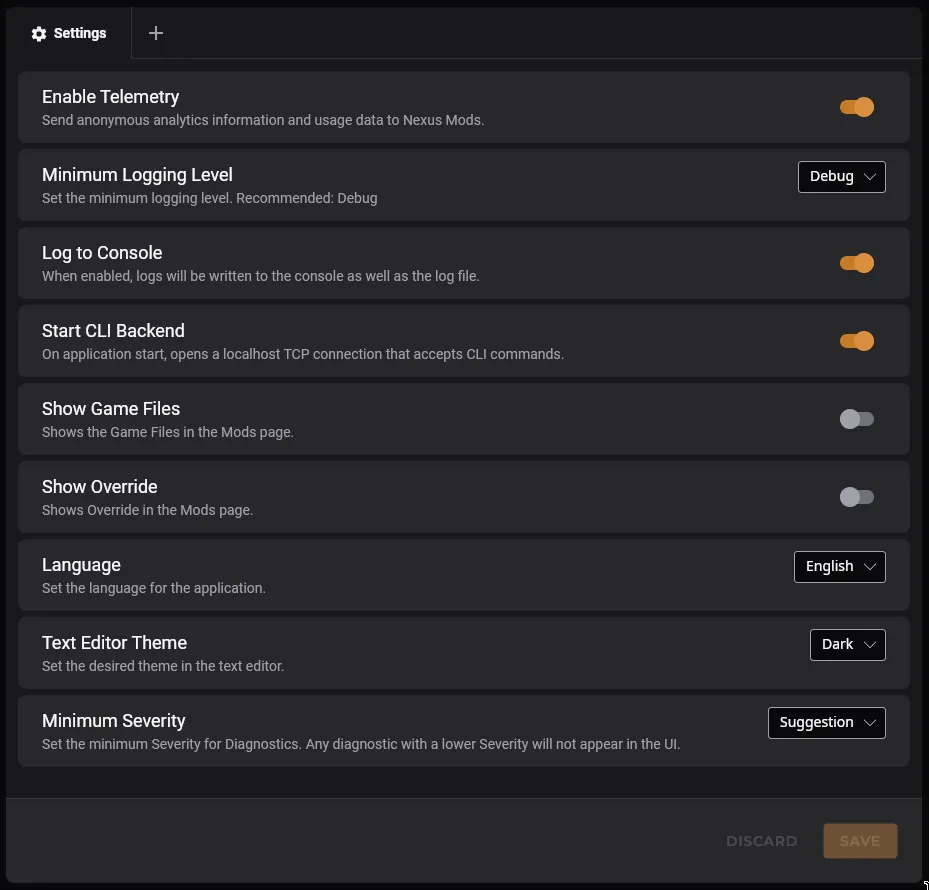
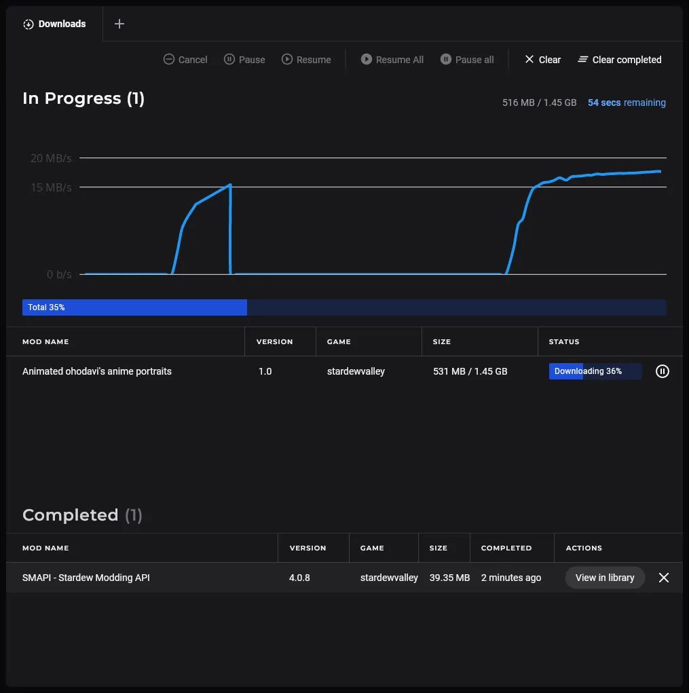
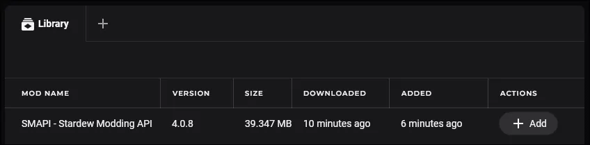

# Changelog

## Unreleased

### New Features

This release is packed with new features. Configs generated by the game are now ingested into the correct mod, and can be edited using our new Text Editor ([#1358](https://github.com/Nexus-Mods/NexusMods.App/pull/1358), [#1346](https://github.com/Nexus-Mods/NexusMods.App/pull/1346)):

The text editor uses [AvaloniaEdit](https://github.com/avaloniaui/avaloniaedit) and comes with syntax highlighting and many features you'd expect a code editor to have. You can even change the theme in the toolbar directly or using our new Settings UI ([#396](https://github.com/Nexus-Mods/NexusMods.App/issues/396), [#920](https://github.com/Nexus-Mods/NexusMods.App/issues/920)):

Settings have been in the works for a long time, and we've finally developed a system to easily create settings and allow users to change them. The UI will be expanded with sections, a search bar, and many more features in the future.

Our Downloads Page received a lot of attention in this release as well. It now contains a very nice and sleek download speed chart, and a list of completed downloads ([#1297](https://github.com/Nexus-Mods/NexusMods.App/pull/1297), [#1397](https://github.com/Nexus-Mods/NexusMods.App/pull/1397)):

Clicking the "View in library" button will take you to our new Mods Library. Here you can see a list of all mods you've downloaded and installed. You can also quickly add a mod to your Loadout ([#1268](https://github.com/Nexus-Mods/NexusMods.App/pull/1268), [#1347](https://github.com/Nexus-Mods/NexusMods.App/pull/1347)):

The biggest change we've done is completely overhauling our internal data model and moving *almost* everything to our custom build database called [MnemonicDB](https://github.com/Nexus-Mods/NexusMods.MnemonicDB). The immediate benefit of this change is better faster, the long term benefit is having a reliable database with migrations and opportunities for new and awesome features without being bogged down by our previous data model.

One notable change that the new data model brought to the App is reified deletes.

### Other Changes

- Starting the App for the first time will open a warning about the state of the release. This overlay can be opened again by clicking the help icon in the top bar ([#1390](https://github.com/Nexus-Mods/NexusMods.App/pull/1390)).
- Navigating panels has been made easier. You can now right-click buttons that would create panels, to open up a context menu. Similar to browsers, combinations like Ctrl+Click or Shift+Click also work.  
- This Changelog can now be viewed directly in the App ([#1258](https://github.com/Nexus-Mods/NexusMods.App/pull/1258)).
- Stardew Valley saves are no longer managed by the App ([#1344](https://github.com/Nexus-Mods/NexusMods.App/pull/1344)).
- Two new SMAPI diagnostics for minimum supported SMAPI version and minimum supported game version ([#1265](https://github.com/Nexus-Mods/NexusMods.App/pull/1265)).
- Game Files and the Override Mod are hidden by default, this is controlled using a setting ([#1286](https://github.com/Nexus-Mods/NexusMods.App/pull/1286), [#1341](https://github.com/Nexus-Mods/NexusMods.App/pull/1341)).
- Stardew Valley has a new image ([#1393](https://github.com/Nexus-Mods/NexusMods.App/pull/1393)).
- Logging to the console can be now enabled in the settings, it's disabled by default ([#1351](https://github.com/Nexus-Mods/NexusMods.App/pull/1351)).
- The CLI and how we handle multiple processes has been reworked ([#1345](https://github.com/Nexus-Mods/NexusMods.App/pull/1345)).
- Package maintainers can choose to disable the bundled 7z binary ([#1308](https://github.com/Nexus-Mods/NexusMods.App/pull/1308)).
- Loadouts can be removed and games can be unmanaged ([#1259](https://github.com/Nexus-Mods/NexusMods.App/pull/1259), [#1279](https://github.com/Nexus-Mods/NexusMods.App/pull/1279)).
- Added an uninstaller ([#1383](https://github.com/Nexus-Mods/NexusMods.App/pull/1383)).

### Fixes

- Tons of UI fixes and small visual improvements ([#1283](https://github.com/Nexus-Mods/NexusMods.App/pull/1283), [#1298](https://github.com/Nexus-Mods/NexusMods.App/pull/1298), [#1309](https://github.com/Nexus-Mods/NexusMods.App/pull/1309), [#1332](https://github.com/Nexus-Mods/NexusMods.App/pull/1332)).
- Telemetry has been reworked and fixed ([#1293](https://github.com/Nexus-Mods/NexusMods.App/pull/1293)).

### External Contributors

- [@Patriot99](https://github.com/Patriot99): [#1250](https://github.com/Nexus-Mods/NexusMods.App/pull/1250), [#1314](https://github.com/Nexus-Mods/NexusMods.App/pull/1314), [#1374](https://github.com/Nexus-Mods/NexusMods.App/pull/1374), [#1399](https://github.com/Nexus-Mods/NexusMods.App/pull/1399)
- [@DioKiriie](https://github.com/DioKiriie): [#1329](https://github.com/Nexus-Mods/NexusMods.App/pull/1329)

## [v0.4.1](https://github.com/Nexus-Mods/NexusMods.App/releases/tag/v0.4.1) - 2024-04-17

### New Features

The highlight of this PR is the new Apply Diff View ([#1202](https://github.com/Nexus-Mods/NexusMods.App/pull/1202)). You can now preview the changes made to disk before applying the Loadout:

Stardew Valley received three new diagnostics ([#1171](https://github.com/Nexus-Mods/NexusMods.App/pull/1171), [#1168](https://github.com/Nexus-Mods/NexusMods.App/issues/1168)). These diagnostics use the current game version and a [compatibility matrix](https://github.com/erri120/smapi-versions) to figure out if the currently installed SMAPI version is compatible:

This also includes our first "suggestion" diagnostic. This diagnostic will only appear if you have no mods installed, and it will recommend a supported SMAPI version:

### Other Changes

- A new settings backend was added in preparation for a settings UI. See [#1182](https://github.com/Nexus-Mods/NexusMods.App/issues/1182) for more details.
- The App will now use two logging files, `nexusmods.app.main.log` and `nexusmods.app.slim.log`, instead of one `nexusmods.app.log` to prevent log collisions between processes ([#1167](https://github.com/Nexus-Mods/NexusMods.App/pull/1167)).
- The default logging level has been changed from `Information` to `Debug` for Release builds to make it easier to debug issues ([#1209](https://github.com/Nexus-Mods/NexusMods.App/pull/1209)).

### Fixes

- Fixed icons clipping in the left menu ([#1165](https://github.com/Nexus-Mods/NexusMods.App/issues/1165), [#1169](https://github.com/Nexus-Mods/NexusMods.App/pull/1169)).
- Windows: Fixed Stardew Valley not launching with a console ([#1135](https://github.com/Nexus-Mods/NexusMods.App/issues/1135), [#1205](https://github.com/Nexus-Mods/NexusMods.App/pull/1205)).
- Linux: Fixed NXM protocol registration when using an AppImage ([#1149](https://github.com/Nexus-Mods/NexusMods.App/issues/1149), [#1150](https://github.com/Nexus-Mods/NexusMods.App/issues/1150)).
- Linux: Fixed whitespaces in desktop entry files ([#1150](https://github.com/Nexus-Mods/NexusMods.App/issues/1150), [#1152](https://github.com/Nexus-Mods/NexusMods.App/pull/1152)).
- Linux: Fixed various issues related to launching the game through Steam ([#1206](https://github.com/Nexus-Mods/NexusMods.App/pull/1206), [#1151](https://github.com/Nexus-Mods/NexusMods.App/issues/1151)).

### External Contributors

- [@Patriot99](https://github.com/Patriot99): [#1163](https://github.com/Nexus-Mods/NexusMods.App/pull/1163), [#1203](https://github.com/Nexus-Mods/NexusMods.App/pull/1203)

## 0.4 to 0.0.1

This is the end of the CHANGELOG. All previous releases used an auto-generated changelog in the GitHub release.
