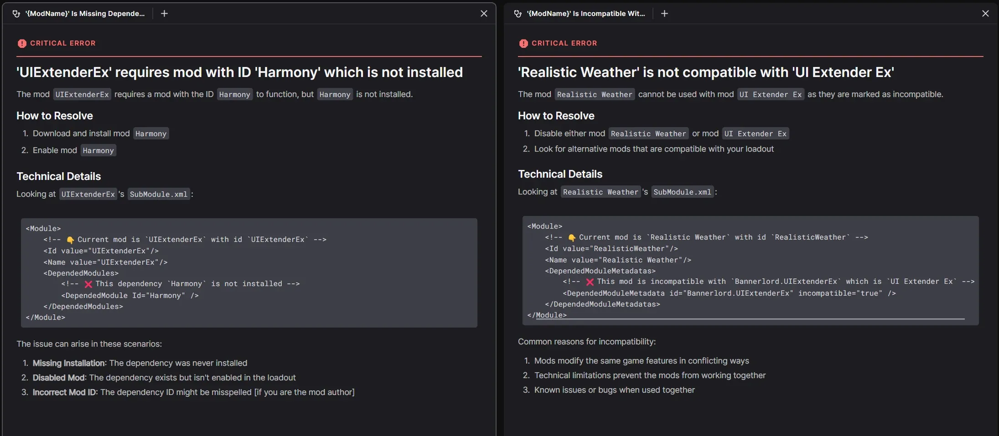

# v0.7.3 - 2024-02-03
The release adds collections to the Library, introduces thumbnails for mods, and includes significant usability improvements for the left menu. 

## Collections in the Library
**Important: If you are updating from 0.7.1, you will need to remove and re-add any collections to your library.**

Collections are now available at the top of the Library. The new section appears once you have at least one collection installed and can be collapsed. In addition, installed collections can be easily toggled on and off from the left menu. 

All collections downloaded from Nexus Mods will be in a read-only state when added to your loadout which ensures you get the full experience the curator intended. In future, users will be able to make copies of existing collections to edit them. 

We've also made improvements to the experience of downloading and installing collections by adding more useful information to the Collection Download page and the Collection tiles in the library. 

As an added bonus, a button will show in the UI when a collection has been updated allowing the latest revision to be downloaded - mod updates are coming soon! 

## Workspace Improvements
We've made several improvements to the behaviour of the left menu in your Workspaces:
* The left menu has been reorganised with the Library at the top, the mods in your loadout in the middle, and the extra utilities at the bottom. 
* Pages in the left menu will now show active/selected states based on which panels/tabs are open and in view. 
* Tooltips have been added to the left menu items so you can always see the full name. 

## Mod Thumbnails
We've added the mod page image as a thumbnail in the Library, My Mods, and Collection Download pages. It's a small change, but we think it makes a big difference. 

## Technical Changes
* Added a new error pop-up when the app encounters an unexpected error. This can be turned off in the Settings. 
* Added CLI commands to allows users to delete files from the hidden Override folder where this has compromised their setup. 

## Bug Fixes
* Fixed Health Checks not refreshing properly when the Loadout changes.
* Fixed an issue when installing Baldur's Gate 3 Script Extender on Linux.

## Known Issues
* On Windows, a Command Prompt window will appear behind the app while it is running. 
* When viewing a read-only collection, it is still possible to toggle individual mods on and off, but this does not affect your loadout. 
* Stardew Valley (Native Linux version) is not detected when installed via Heroic Launcher on Linux. The Windows version of the game can be used instead until this issue is fixed. 
* Bundled mods included with collections do not appear in the UI but are still applied to your game. 
* The success rating for collections does not show the correct value. 
* The game version is not checked when adding a collection meaning you can install outdated mods without being warned. 
* The "Switch View" option does not persist in the Library/Installed Mods view.
* The "Load Order" heading toggle does not persist in the Load Order view. 

# v0.7.2 - 2024-01-21
This release includes style updates for the Games, Loadouts and Health Check pages along with several important bug fixes. 

## UI Improvements 
We've given several of the core app pages a face lift to match our latest branding changes. This includes the Games, Loadouts, and Health Check pages. You'll start to notice more stylised icons throughout the app. 

## File Conflicts
A small, but important improvement to File Conflicts has been included in this release. In previous versions, when two mods provide files with the same name, the conflict winner would be chosen at random. We didn't feel this made a lot of sense so now the mod most recently added to the loadout will always win the conflict. To adjust the priority of mods you can now remove the more important mods from the loadout and re-add them. This is a temporary solution which we work on building a UI for conflict management. 

## Bannerlord Software Extender support
Bannerlord players can now install and manage Bannerlord Software Extender (BLSE) with the app. The game will also be started with BLSE when configured. In addition, we've added some Health Checks diagnostics which show up when:

* Bannerlord Software Extender is installed but the `BLSE.LoadingInterceptor` or `BLSE.AssemblyResolver` dependencies are missing.
* Bannerlord Software Extender is installed but Harmony is missing.

On Linux, the app will now start BLSE with the `/forcenetcore` argument to avoid any potential issues related to the users's WINE or Proton setup. 

## Technical Changes
* Free users will now see a modal prompting them to upgrade to Premium when clicking the "Download all" buttons for Collections. Downloading mods individually is still possible. 
* When a loadout is removed, the associated Workspace data is now cleaned up.
* Reduced the number of log messages to make troubleshooting issues easier. 

## Bugfixes
* Fixed an issue where collections that include bundled mods would never be installable as it would always show pending downloads.
* Fixed an issue where users in timezones 6 or more hours ahead of UTC would be unable to download collections.

## Known Issues
* Stardew Valley (Native Linux version) is not detected when installed via Heroic Launcher on Linux. The Windows version of the game can be used instead until this issue is fixed. 
* Bundled mods included with collections do not appear in the UI but are still applied to your game. 
* The success rating for collections is not showing the correct value. 
* The game version is not checked when adding a collection meaning you can install outdated mods without being warned. 
* The Collections (WIP) page is not filtered by game. 
* The "Switch View" option does not persist in the Library/Installed Mods view.
* The "Load Order" heading toggle does not persist in the Load Order view. 

# v0.7.1 - 2024-12-17
This release includes styling for the Load Order view, the ability to install and remove collections for all users and several improvements to the analytics we collect that will help inform our design decisions. 

## Load Order Styling 
We've given the load order page for Cyberpunk 2077 REDmods a facelift and it's now much closer to the designs we're working towards.

You can re-order entries with the up and down arrows (no drag and drop yet!) and see which REDmods have been disabled in the Installed Mods view. You can also flip the load order using the table header to have the winning REDmod at the top of the list rather than the bottom. 

We'd love to hear what you think of this design! 

## Collections - Basic User Flow
**Important: Any collections you have added to the app in version 0.7.0 or earlier should be removed as they may not install properly.**

The Collections experience in the app is starting to take shape! While it's still very much a work in progress, both free and Premium users can now download and install collections for all supported games. 

We've also fixed up downloading off-site files for Collections. When you add these files to the library, the Collection will now automatically mark them as installed (provided you pick the exact file the curator used!).

Try it out by opening a new tab and selecting the "Collections (WIP)" page, then download a collection from the website.

In our testing the app is up to 25x faster than Vortex at installing collections (depending on your internet speed and hardware) - which is amazing! 

## App Updates
We've made it possible to update the app without completely removing all your mods and games. You can update from 0.7.0 to 0.7.1 and keep your mods, games and other settings. This means that if you want to be an early adopter, you can keep your mod list intact as we release new versions! 

## Technical Changes
* Protontricks running via Flatpak is now supported (Linux).
* The (optional) analytics we collect from within the app have been improved to give us a better idea of how you use the app, with you having to tell us directly.

## Bugfixes
* Fixed an issue counting the mods a user has installed when sending analytics.
* Added a placeholder to the Games view when no games have been detected.
* When enabling the Xbox Game Pass support option in settings, the app now correctly prompts a restart. 
* Fixed an issue where the first row of the Library/Installed Mods would sometimes be misaligned with the table headers (this was part of an Avalonia update).

# Known Issues
* Stardew Valley (Native Linux version) is not detected when installed via Heroic Launcher on Linux. The Windows version of the game can be used instead until this issue is fixed. 
* When installing Collections that include bundled mods, it is not possible to fully download the collection due to a counting error. A fix for this is planned for the next release.   
* Bundled mods included with collections do not appear in the UI but are still applied to your game. 
* The success rating for collections is not showing the correct value. 
* The game version is not checked when adding a collection meaning you can install outdated mods without being warned. 
* The Library and Collections (WIP) pages are not filtered by game. 
* The "Switch View" option does not persist in the Library/Installed Mods view.
* The "Load Order" heading toggle does not persist in the Load Order view. 

# v0.7.0 - 2024-11-27

**Important: To update the app, you must completely uninstall the old version, including all mods.** [Why do I have to uninstall everything to update the app?](https://nexus-mods.github.io/NexusMods.App/users/faq/#why-do-i-have-to-uninstall-everything-to-update-the-app)

This release includes initial support for Mount & Blade II: Bannerlord, a basic implementation of REDmod load order for Cyberpunk 2077 and several UI refinements.

## Mount & Blade II: Bannerlord 
This version adds basic support for Bannerlord. All modules can be easily installed and managed. We've also added several advanced [Health Check diagnostics](https://nexus-mods.github.io/NexusMods.App/users/games/Bannerlord/#loadout-health-check) to allow players to understand common issues in their setup, with more planned for the future when we add load order support!

A huge thank you to [Aragas](https://www.nexusmods.com/mountandblade2bannerlord/users/2355906) for all his help during development of this feature!

## Collections Download Page
**Important: While we upgrade the Collections UI, some features that worked in earlier versions will be temporarily unavailable.**

We've further refined the Collections download page which unlocks the ability for non-Premium users to use the Collections feature and provides Premium users with the ability to see the list of mods included in a collection before downloading. As this page is still a work in progress, some of the UI buttons may not work as expected yet. 

## EXPERIMENTAL - Cyberpunk 2077 REDmod Load Order
Users can now manage the order of REDmods installed for Cyberpunk 2077 through the new "Load Orders (WIP)" page that can be accessed from the New Tab menu. 

Please note, this page is currently very basic and has not yet been styled. 

## Features
* Baldur's Gate 3: Added [diagnostics](https://nexus-mods.github.io/NexusMods.App/users/games/BaldursGate3/#loadout-health-check) relating to BG3 Script Extender. 
* Updated the My Games page design to better showcase the games you have managed, detected and available in the app but not detected. 
* Updated the design of tabs in the Workspace system to make them more compact.
* General polish to areas of the UI such as Health Check. 

## Technical Changes
* We've added a framework for data migrations which gets us a step closer to allowing users to update the app without resetting everything. 
* The app has been upgraded to use .NET 9. This allows us to take advantage of the latest performance improvements and security fixes. 

## Bugfixes
* Fixed an issue where the app would prompt the user to log in to Nexus Mods when starting up, even if they are already logged in. 

## Known Issues
* Users may be unable to launch Bannerlord on the Steam Deck when using Flatpak installations of Protontricks as they are currently unsupported. A fix for this is being prepared for the next release.
* The Collections feature is able to download all required files but will not install them. Mods can be manually installed from the Library but this will not import the collection configuration options. This feature will be re-implemented in the future.
* Any non-Nexus Mods file in a collection that requires the user to browse an external website can be installed into the library manually but will not be recognised as part of the collection.
* The game version is not checked when adding a collection meaning you can install outdated mods without being warned. 
* Once a collection is added to the app, it cannot be removed.
* The first row of the My Mods or Library tables will sometimes be misaligned with the headers. Scrolling or adjusting any column width will correct this. 
* The Library and Collections (WIP) pages are not filtered by game. 
* The "Switch View" option does not persist in the Library/Installed Mods view.

# v0.6.3 - 2024-11-06

**Important: To update the app, you must completely uninstall the old version, including all mods.** [Why do I have to uninstall everything to update the app?](https://nexus-mods.github.io/NexusMods.App/users/faq/#why-do-i-have-to-uninstall-everything-to-update-the-app)

This release includes further improvements to Baldur's Gate 3 support, updated UI styles and lots of bug fixes.

## Baldur's Gate 3 Improvements
We are continuing to add features to support modding Baldur's Gate 3. In this update, we've focused on improving the Health Check diagnostics presented to the user and begun the back-end work to provide load ordering:
* Added a Health Check diagnostic for outdated dependencies.
* Added a Health Check diagnostic for invalid PAK files.
* Improved the missing dependencies diagnostic message.
* Additional metadata is being parsed from the PAK files.
* Added support for serialising and deserialising modsettings.lsx to support load ordering in a future update.

## Features
* Collections requiring non-Nexus Mods files that can be directly downloaded are now supported. 
* Added the framework for a new Collection Download page which will show which mods are installed or missing from the library.
* Standardised all "Button" components used across the app. 
* Added a new "Alerts" component to the app for dismiss-able notices. 

## Technical Changes
* Migrated several backend functions from Nexus Mods API v1 to v2.
* Cleared out lots of unused code related to earlier prototypes of the My Mods and Library pages. 

## Bugfixes
* Starting Baldur's Gate 3 on GOG (Windows) will now open the Larian Launcher rather than defaulting to the Vulkan version of the game. 
* Fixed a bug where Stardew Valley mods that used BOM characters in the manifest.json could not be read properly.
* Selecting multiple mods to delete with Shift + Click will now delete all selected mods. 
* The badge next the the Library in the left menu will now properly decrease when items are deleted.
* Mods in a collection can now be correctly downloaded from hidden mod pages.
* Added missing tooltips to several buttons in the UI. 
* Fixed the "Running..." text getting stuck on the Play button.
* Fixed an issue with the list-games CLI verb showing all games instead of the detected installations.
* The main window will now pop into focus when the user successfully logs in. 

## Known Issues
* Installing a collection which includes mods where the user must browse an external website to obtain the file(s) will fail with no error message. This is not supported in the current build.
* Trying to install a collection as a non-Premium user will fail with no error message. This is not supported in the current build. 
* The game version is not checked when adding a collection meaning you can install outdated mods without being warned. 
* Once a collection is added to the app, it cannot be removed from the left menu.
* Collections allow users to modify the included mods but do not allow you to reset them to the original state. 
* The first row of the My Mods or Library tables will sometimes be misaligned with the headers. Scrolling or adjusting any column width will correct this. 
* The "Switch View" option does not persist in the Library/Installed Mods view.

# v0.6.2 - 2024-10-16

**Important: To update the app, you must completely uninstall the old version, including all mods.** [Why do I have to uninstall everything to update the app?](https://nexus-mods.github.io/NexusMods.App/users/faq/#why-do-i-have-to-uninstall-everything-to-update-the-app)

This release adds initial support for Baldur's Gate 3, detects GOG games installed through the Heroic Launcher on Linux and further develops the Collections feature.

*If you are installing the app outside of the default location (Local App Data), the uninstallers for all previous versions may not work correctly.* [How to manually reset your installation](https://nexus-mods.github.io/NexusMods.App/users/Uninstall/#manual-uninstall-fallback).

## Baldur's Gate 3 
This version of the app adds Baldur's Gate 3 as the third supported game ([#2122](https://github.com/Nexus-Mods/NexusMods.App/pull/2122)). Currently, all common mod types will be installed correctly. Installations on Steam and GOG can be detected on Windows or Linux. 

The app will display a diagnostic message if a PAK file lists a dependency in the meta.lsx file that is not currently installed. We plan to improve the available data shown to the users in future releases. 

The current implementation does not include load order support. You will need to go to "Mod Manager" from the main menu and enable your mods to have them take effect in the game. Load order support is planned for a future release. 

*Note: When launching the GOG version of the game, the app will currently default to the Vulkan version. A choice between Vulkan and DX11 will be added in a future release. If you require the DX11 version, please launch from GOG Galaxy (Windows), Heroic Launcher (Linux) or via bg3_dx11.exe.*

## Heroic Launcher
Linux users can now manage GOG games installed or imported using the [Heroic Launcher](https://heroicgameslauncher.com/) ([#2103](https://github.com/Nexus-Mods/NexusMods.App/pull/2103)). Due to technical limitations, we've disabled REDmod deployment for Cyberpunk 2077 using Heroic, but it's possible to have the launcher run this process when starting the game. [Automated deployment for REDmods in Heroic](https://nexus-mods.github.io/NexusMods.App/users/games/Cyberpunk2077/#automated-deployment-for-redmods).

## Collections
**Important: Collections support is still an experimental feature and may not work as expected. Please check the Known Issues section if you choose to install a collection.**

In this build, we've made further updates to the process of downloading and installing collections. The feature does not have parity with Vortex yet so cannot be used to install a collection fully. 

The changes we've made include:
* Updated the card design for collections (Above).
* Added support for FOMOD presets and binary patching during installation.

## Updating Mods
We're starting work on showing when a mod has an update in the app. The backend to enable this feature is mostly complete and we will be adding the UI elements to support it in an upcoming release. 

## Known Issues
* Most collection installations will not complete successfully. This is due to several features that have not yet been implemented. 
* The game version is not checked when adding a collection meaning you can install outdated mods without being warned. 
* Trying to install a collection with an unsupported type of mod (e.g. non-Nexus Mods files) will fail with no error message. This is not supported in the current build.
* Trying to install a collection as a non-Premium user will fail with no error message. This is not supported in the current build. 
* Once a collection is added to the app, it cannot be removed from the left menu.
* Collections allow users to modify the included mods but do not allow you to reset them to the original state. 
* The first row of the My Mods or Library tables will sometimes be misaligned with the headers. Scrolling or adjusting any column width will correct this. 
* The "Switch View" option does not persist in the Library/Installed Mods view.

## Bugfixes
* The app will now uninstall correctly when installed outside of the default directory on Windows. 
* The correct WINE prefix will now be used for games on Linux. 
* When the numerical badges in the left menu show 3 or more digits, the width of the badge will expand correctly.
* Fixed an issue where batch actions would not work correctly when adding/removing/deleting mods from the Library or Loadout pages. 
* The app will no longer re-download the user's avatar image every time a request is made to the Nexus Mods API. 

## External Contributors
* [@MistaOmega](https://github.com/MistaOmega): [#2118](https://github.com/Nexus-Mods/NexusMods.App/pull/2118), [#2119](https://github.com/Nexus-Mods/NexusMods.App/pull/2119), [#2128](https://github.com/Nexus-Mods/NexusMods.App/pull/2128), [#2130](https://github.com/Nexus-Mods/NexusMods.App/pull/2130)
* [@Patriot99](https://github.com/Patriot99): [#2145](https://github.com/Nexus-Mods/NexusMods.App/pull/2145)
* [@Michael-Kowata](https://github.com/Michael-Kowata): [#2163](https://github.com/Nexus-Mods/NexusMods.App/pull/2163)

[View the release on GitHub](https://github.com/Nexus-Mods/NexusMods.App/releases/tag/v0.6.2)

# v0.6.1 - 2024-09-24

**Important: To update the app, you must completely uninstall the old version, including all mods.** [Why do I have to uninstall everything to update the app?](https://nexus-mods.github.io/NexusMods.App/users/faq/#why-do-i-have-to-uninstall-everything-to-update-the-app)

This release adds a very basic implementation of downloading Collections, updates the UI to the new tree view and includes some enhancements when interacting with Windows applications via Linux. 

## New UI for My Mods and Library
The My Mods and Library pages have been completely reworked to use the new tree view. Mods are now grouped by the mod page on Nexus Mods, meaning if download several files from the same page they will be grouped together. A "Switch View" option has been added to the toolbar to toggle these groupings on or off. We are continuing to work towards to designs shown in the [previous changelog](./docs/changelog-assets/1b28e2fad5b5a6431a72c286d1bcd3fd.webp).

## EXPERIMENTAL - Collections
**Important: The feature is unfinished and not considered stable. It will not accurately install complex collections and is currently only functional for Premium users.**

We've included a very early implementation of the Collections feature in this release. It's incomplete and will not install collections as the user has set them up in Vortex. Currently, only mods from Nexus Mods can be installed - anything from external websites or bundled with the collection will not install as expected. 

Collections will appear as a separate list of mods in the left menu. Users can view all mods in the loadout from the new "Installed Mods" option at the top of the left menu. 

To start out, this will only be available to Premium users, but we are working on the free user journey separately which requires considerably more UI elements to be created. This will be available in a future release.

## Cyberpunk 2077 Enhancements
As a further enhancement to support for Cyberpunk 2077, we will now detect if the REDmod DLC is missing and prompt the user to install it if required. 

We've also fixed the issue which prevented REDmod from deploying automatically on Linux. This work also sets up a framework for running Windows apps and tools on a Linux system using [Protontricks](https://github.com/Matoking/protontricks) ([#1989](https://github.com/Nexus-Mods/NexusMods.App/pull/1989)).

## Known Issues
* When batch selecting mods in My Mods and using the remove button the app will occasionally fail to remove mods that are not currently visible in the UI due to scrolling. 
* Trying to install a collection with an unsupported type of mod (e.g. Bundled or External) will fail with no error message. This is not supported in the current build.
* Trying to install a collection as a non-Premium user will fail with no error message. This is not supported in the current build. 
* Once a collection is added to the app, it cannot be removed from the left menu.
* Collections allow users to modify the included mods but do not allow you to reset them to a the original state. 
* The first row of the My Mods or Library tables will sometimes be misaligned with the headers. Scrolling or adjusting any column width will correct this. 
* The "Switch View" option does not persist.

## Other Features
* The name of the active loadout will now appear in the top bar ([#1953](https://github.com/Nexus-Mods/NexusMods.App/pull/1953)).
* The app now has a minimum window size of `360x360` to prevent it being resized to unusable dimensions ([#1947](https://github.com/Nexus-Mods/NexusMods.App/pull/1947)).

## Bugfixes
* Stardew Valley: Fixed enabled mods showing up as disabled in the diagnostics ([#1923](https://github.com/Nexus-Mods/NexusMods.App/pull/1953)).
* Linux: Fixed the game not launching when running through Steam ([#1917](https://github.com/Nexus-Mods/NexusMods.App/pull/1917)).

## Technical Changes 
* Added a system for storing and displaying images in the app. 

## External Contributors
* [@Patriot99](https://github.com/Patriot99): [#1896](https://github.com/Nexus-Mods/NexusMods.App/pull/1896)
* [@LoulouNoLegend](https://github.com/LoulouNoLegend): [#1997](https://github.com/Nexus-Mods/NexusMods.App/pull/1997), [#1998](https://github.com/Nexus-Mods/NexusMods.App/pull/1998), [#1999](https://github.com/Nexus-Mods/NexusMods.App/pull/1999)

[View the release on GitHub](https://github.com/Nexus-Mods/NexusMods.App/releases/tag/v0.6.1)

# v0.6.0 - 2024-09-03

**Important: To update the app, you must completely uninstall the old version, including all mods.** [Why do I have to uninstall everything to update the app?](https://nexus-mods.github.io/NexusMods.App/users/faq/#why-do-i-have-to-uninstall-everything-to-update-the-app)

This release enhances support for Cyberpunk 2077, adds multiple Loadouts per game and implements the back-end changes to support our new "Loadout items" data model. 

## Cyberpunk 2077 Improvements

This version further refines the modding experience for Cyberpunk 2077 players by adding additional diagnostics to the Health Check and automatically running REDmod - if necessary - before starting the game. [Cyberpunk 2077 Features](https://nexus-mods.github.io/NexusMods.App/users/games/Cyberpunk2077/).

*Note: It is not currently possible for the app to run REDmod automatically on Linux - Windows users are unaffected. If you are using REDmods on Linux, you may need to manually run the REDmod.exe file located at `tools\redmod\bin\redmod.exe` before launching the game.*

## Multiple Loadouts
Loadouts offer a convenient way to have manage several different mod setups for a single game. Players can easily swap between simple or complex mod setups by creating multiple loadouts. In this release players can create, copy and delete loadouts for any supported game. [You can learn more about loadouts here.](https://nexus-mods.github.io/NexusMods.App/users/features/Loadouts/)

Your mod configuration files for Stardew Valley are synced to the current loadout, so you can have different mod settings for different lists of mods. 

## EXPERIMENTAL - Tree views for My Mods and Library
We're still working on the new "tree view" for the My Mods and Library pages, but you can preview them in this version by enabling the "Enable tree UI for Library and My Mods" toggle in the app settings. The image below is the current design we are working towards and does not represent what is available in the app. 

Please be aware that these pages are unfinished and are not stable enough to fully replace the current views, but we are working hard on improving them and hope to start using them in the next release. 

## Known issues
* The Downloads page is not working and currently shows a placeholder progress bar.
* Cyberpunk 2077 - REDmods are not automatically deployed on Linux.

## Other Features
* Updated the My Games page with new tile designs.
* Game tiles now show a store icon to indicate where the game was downloaded from. 
* It is now possible to delete mods from your Library. 
* Within a [Workspace](https://nexus-mods.github.io/NexusMods.App/users/features/Workspaces/) the active panel is now highlighted in the UI.
* All panels and tabs in Workspace now have a history, allowing the user to navigate forward or backward using the new arrows on the top toolbar. 
* The fonts used in the UI have been updated to Inter in line with our new design system. 

## Bugfixes
* Fixed the game icon in the spine flickering when updating a loadout. 
* Reworded the "Update available" pop-up to make it more clear that updating the app requires a full reset of your mod setup. 
* Fixed an issue where Steam games would fail to launch on Ubuntu. 

## Technical Changes
* Downloading files now uses a new "Jobs" system to make them easier to manage. 
* We are continuing our backend work to convert from "Mods" to "Loadout items". [Forum Post: What even is a "mod" anyway?](https://forums.nexusmods.com/topic/13495763-nexus-mods-app-1-august-progress-update/)
* The synchronizer for handling loadout states has been reworked to provide much more robust coverage of edge cases.
* Added generic support for path-based diagnostic checks when checking for missing dependencies. 

## External Contributors

* [@Patriot99](https://github.com/Patriot99): Polish translation updates.

[View the release on GitHub](https://github.com/Nexus-Mods/NexusMods.App/releases/tag/v0.6.0)

# v0.5.3 - 2024-07-11

This release makes some refinements to the Stardew Valley modding experience based on user feedback, improves various UI elements and includes a number of back-end bugfixes.

## Fixes

* Fixed the "SMAPI is disabled"-diagnostic for multiple SMAPI installations ([#1674](https://github.com/Nexus-Mods/NexusMods.App/pull/1674)).
* Fixed Loadout disappearing when applying ([#1737](https://github.com/Nexus-Mods/NexusMods.App/pull/1737)).
* Fixed un-managing a game removing all Loadouts instead of just the ones for the current game ([#1738](https://github.com/Nexus-Mods/NexusMods.App/pull/1738)).
* Fixed sorting in the Mod Library and the "Completed Downloads"-section ([#1690](https://github.com/Nexus-Mods/NexusMods.App/pull/1690)).
* Fixed SVGs not loading and rendering properly in the markdown viewer ([#1661](https://github.com/Nexus-Mods/NexusMods.App/pull/1661)).
* Fixed SVGs throughout the App ([#1622](https://github.com/Nexus-Mods/NexusMods.App/pull/1622), [#1681](https://github.com/Nexus-Mods/NexusMods.App/pull/1681)).
* Fixed not disposing services on close correctly ([#1679](https://github.com/Nexus-Mods/NexusMods.App/pull/1679)).
* Windows: Fixed log file creation failing due to illegal character in path ([#1728](https://github.com/Nexus-Mods/NexusMods.App/pull/1728)). Thanks, [@ZeeWanderer](https://github.com/ZeeWanderer)!
* Linux: Fixed protocol registration ([#1691](https://github.com/Nexus-Mods/NexusMods.App/pull/1691), [#1689](https://github.com/Nexus-Mods/NexusMods.App/pull/1689), [#1683](https://github.com/Nexus-Mods/NexusMods.App/pull/1683)).
* Linux: Upgraded [GameFinder](https://github.com/erri120/GameFinder) to fix an issue with not being able to find Steam installed as a Flatpak or Snap ([#1720](https://github.com/Nexus-Mods/NexusMods.App/pull/1720)).

## Cyberpunk 2077 - EXTREMELY EXPERIMENTAL

This version of the app adds Cyberpunk 2077 to the Games section ([#1719](https://github.com/Nexus-Mods/NexusMods.App/pull/1719)). We are now actively working on supporting this game but the implementation is still **very experimental** and may not work for all types of mod. Further improvements are planned for future updates.

## Other Features

* Added support for ignoring game assets when backing up the game files. For Cyberpunk 2077, this can result in 98.75% less disk space used: 1 GB instead of 80 GB ([#1713](https://github.com/Nexus-Mods/NexusMods.App/pull/1713)).
* The logs directory can be opened from the help menu in the top bar ([#1675](https://github.com/Nexus-Mods/NexusMods.App/pull/1675)).

## Miscellaneous

* Improved user documentation for [Workspaces](https://nexus-mods.github.io/NexusMods.App/users/features/Workspaces/), [Health Checks](https://nexus-mods.github.io/NexusMods.App/users/features/HealthCheck/) and [Stardew Valley](https://nexus-mods.github.io/NexusMods.App/users/games/StardewValley/).
* Reworked protocol registration to set the App as the default on startup ([#1691](https://github.com/Nexus-Mods/NexusMods.App/pull/1691)).
* Reworked out data model to use our new source generator ([#1626](https://github.com/Nexus-Mods/NexusMods.App/pull/1626)).
* Reworked out synchronizer to a simpler 3-way merge approach. ([#1707](https://github.com/Nexus-Mods/NexusMods.App/pull/1707)).
* Began working on adding Loadout Items, Library Items, and reworking Downloads ([#1336](https://github.com/Nexus-Mods/NexusMods.App/issues/1336)).
* This release contains some major changes for package maintainers. See the new [docs](https://nexus-mods.github.io/NexusMods.App/developers/Contributing/#for-package-maintainers) for details.

## External Contributors

* [@ZeeWanderer](https://github.com/ZeeWanderer): [#1728](https://github.com/Nexus-Mods/NexusMods.App/pull/1728), [#1746](https://github.com/Nexus-Mods/NexusMods.App/pull/1746)

[View the release on GitHub](https://github.com/Nexus-Mods/NexusMods.App/releases/tag/v0.5.3)

# v0.5.2 - 2024-06-19

This is a minor release containing many UI improvement and bugfixes. To illustrate all of these changes, here are before and after screenshots of version 0.5.1 and 0.5.2:

Notably is the redesign of the Spine buttons ([#1539](https://github.com/Nexus-Mods/NexusMods.App/pull/1539)), the rework of the TopBar ([#1580](https://github.com/Nexus-Mods/NexusMods.App/pull/1580), [#1621](https://github.com/Nexus-Mods/NexusMods.App/pull/1621)), and the many improvements to the Settings page including a redesign of the toggle switches ([#1549](https://github.com/Nexus-Mods/NexusMods.App/pull/1549)), the combo boxes ([#1549](https://github.com/Nexus-Mods/NexusMods.App/pull/1546)), and the addition of sections ([#1618](https://github.com/Nexus-Mods/NexusMods.App/pull/1618)). The settings page will continue to evolve over time, but this is already a big step forward.

We've added a banner to the new tab-page to better promote the panel system. You can dismiss the banner manually, or it will be dismissed automatically, if you add a new panel ([#1584](https://github.com/Nexus-Mods/NexusMods.App/pull/1584), [#1595](https://github.com/Nexus-Mods/NexusMods.App/pull/1595)):

## Other Changes

* Improved the Mod Library design and usability. Mods can now be added from the library and the installation status will switch if the mod has already been installed ([#1543](https://github.com/Nexus-Mods/NexusMods.App/pull/1543)).
* New messages have been added to the Mod Library and the Mods page when they are empty ([#1617](https://github.com/Nexus-Mods/NexusMods.App/pull/1617)).
* Xbox Game Pass has been disabled until we find a solution to deal with protected Xbox Store binaries. See [#1476](https://github.com/Nexus-Mods/NexusMods.App/issues/1476) and [#1477](https://github.com/Nexus-Mods/NexusMods.App/issues/1477) for details.
* Missing dependency diagnostic for SMAPI Mods will now show the mod name ([#1650](https://github.com/Nexus-Mods/NexusMods.App/pull/1650)).
* Changed the default open page behavior for the settings page to always open in the "Home" workspace as a new panel ([#1598](https://github.com/Nexus-Mods/NexusMods.App/pull/1598)).
* After logging in via Nexus Mods, the App window will move to the foreground to signal completion of the login process ([#1544](https://github.com/Nexus-Mods/NexusMods.App/pull/1544)).
* The line in the download speed graph will automatically be hidden after 5 seconds of inactivity ([#1597](https://github.com/Nexus-Mods/NexusMods.App/pull/1597)).
* Both the diff and mod file tree will auto-expand the root nodes for better usability ([#1593](https://github.com/Nexus-Mods/NexusMods.App/pull/1593)).
* Renamed "Diagnostics" to "Health Check" ([#1586](https://github.com/Nexus-Mods/NexusMods.App/pull/1586)).
* New [documentation](https://nexus-mods.github.io/NexusMods.App/) has been created for both users and developers ([#1624](https://github.com/Nexus-Mods/NexusMods.App/pull/1624)).
* The updated documentation also includes a new section for package maintainers. Thanks to [@l0b0](https://github.com/l0b0), [@MattSturgeon](https://github.com/MattSturgeon) and [Abzie](https://aur.archlinux.org/account/Abzie) we have the first packages appearing for both NixOS and Arch:

## Fixes

* Linux: Fixed the Launch button. Steam and the Game will now start correctly ([#1533](https://github.com/Nexus-Mods/NexusMods.App/pull/1533) and [#1151](https://github.com/Nexus-Mods/NexusMods.App/issues/1151)).
* ToolTip styles have finally been fixed and should appear correctly ([#1566](https://github.com/Nexus-Mods/NexusMods.App/pull/1566), [#1592](https://github.com/Nexus-Mods/NexusMods.App/pull/1592)).
* Fixed an issue where broken data can result in having no panels ([#1599](https://github.com/Nexus-Mods/NexusMods.App/pull/1599), [#1526](https://github.com/Nexus-Mods/NexusMods.App/pull/1526)).

## External Contributors

* [@Patriot99](https://github.com/Patriot99): [#1500](https://github.com/Nexus-Mods/NexusMods.App/pull/1500), [#1564](https://github.com/Nexus-Mods/NexusMods.App/pull/1564), [#1590](https://github.com/Nexus-Mods/NexusMods.App/pull/1590), [#1613](https://github.com/Nexus-Mods/NexusMods.App/pull/1613), [#1614](https://github.com/Nexus-Mods/NexusMods.App/pull/1614), [#1627](https://github.com/Nexus-Mods/NexusMods.App/pull/1627)

[View the release on GitHub](https://github.com/Nexus-Mods/NexusMods.App/releases/tag/v0.5.2)

# v0.5.1 - 2024-06-03

This is a minor release containing bugfixes and small UI improvements.

## Fixes

* Fixed link in the metrics opt-in overlay ([#1523](https://github.com/Nexus-Mods/NexusMods.App/pull/1523), [#1524](https://github.com/Nexus-Mods/NexusMods.App/pull/1524)).
* Fixed the infinite loading screen when previewing apply changes ([#1502](https://github.com/Nexus-Mods/NexusMods.App/pull/1502)).
* Fixed the uninstaller ([#1503](https://github.com/Nexus-Mods/NexusMods.App/pull/1503), [#1504](https://github.com/Nexus-Mods/NexusMods.App/pull/1504)).
* Fixed a silent exception when using an uninitialized value ([#1493](https://github.com/Nexus-Mods/NexusMods.App/pull/1493)).
* Various UI fixes and improvements ([#1495](https://github.com/Nexus-Mods/NexusMods.App/pull/1495), [#1517](https://github.com/Nexus-Mods/NexusMods.App/pull/1517)).

[View the release on GitHub](https://github.com/Nexus-Mods/NexusMods.App/releases/tag/v0.5.1)

# v0.5.0 - 2024-05-29

## New Features

This release is packed with new features. Configs generated by the game are now ingested into the correct mod, and can be edited using our new Text Editor ([#1358](https://github.com/Nexus-Mods/NexusMods.App/pull/1358), [#1346](https://github.com/Nexus-Mods/NexusMods.App/pull/1346)):

The text editor uses [AvaloniaEdit](https://github.com/avaloniaui/avaloniaedit) and comes with syntax highlighting and many features you'd expect a code editor to have. You can even change the theme in the toolbar directly or using our new Settings UI ([#396](https://github.com/Nexus-Mods/NexusMods.App/issues/396), [#920](https://github.com/Nexus-Mods/NexusMods.App/issues/920)):

Settings have been in the works for a long time, and we've finally developed a system to easily create settings and allow users to change them. The UI will be expanded with sections, a search bar, and many more features in the future.

Our Downloads Page received a lot of attention in this release as well. It now contains a very nice and sleek download speed chart, and a list of completed downloads ([#1297](https://github.com/Nexus-Mods/NexusMods.App/pull/1297), [#1397](https://github.com/Nexus-Mods/NexusMods.App/pull/1397)):

Clicking the "View in library" button will take you to our new Mods Library. Here you can see a list of all mods you've downloaded and installed. You can also quickly add a mod to your Loadout ([#1268](https://github.com/Nexus-Mods/NexusMods.App/pull/1268), [#1347](https://github.com/Nexus-Mods/NexusMods.App/pull/1347)):

The biggest change we've done is completely overhauling our internal data model and moving *almost* everything to our custom build database called [MnemonicDB](https://github.com/Nexus-Mods/NexusMods.MnemonicDB). The immediate benefit of this change is better faster, the long term benefit is having a reliable database with migrations and opportunities for new and awesome features without being bogged down by our previous data model.

One notable change that the new data model brought to the App is reified deletes.

## Other Changes

* Starting the App for the first time will open a warning about the state of the release. This overlay can be opened again by clicking the help icon in the top bar ([#1390](https://github.com/Nexus-Mods/NexusMods.App/pull/1390)).
* Navigating panels has been made easier. You can now right-click buttons that would create panels, to open up a context menu. Similar to browsers, combinations like Ctrl+Click or Shift+Click also work ([#1266](https://github.com/Nexus-Mods/NexusMods.App/pull/1266)).
* This Changelog can now be viewed directly in the App ([#1258](https://github.com/Nexus-Mods/NexusMods.App/pull/1258)).
* Stardew Valley saves are no longer managed by the App ([#1344](https://github.com/Nexus-Mods/NexusMods.App/pull/1344)).
* Added new Stardew Valley diagnostics:
  - Minimum supported SMAPI version ([#1265](https://github.com/Nexus-Mods/NexusMods.App/pull/1265)).
  - Minimum supported Game version ([#1265](https://github.com/Nexus-Mods/NexusMods.App/pull/1265)).
  - Mod overwrites game files ([#1481](https://github.com/Nexus-Mods/NexusMods.App/pull/1481)).
* Stardew Valley has a new image ([#1393](https://github.com/Nexus-Mods/NexusMods.App/pull/1393)).
* The "Library" and "Diagnostics" entry on the left menu now show badges with counts for new archives and active diagnostics ([#1452](https://github.com/Nexus-Mods/NexusMods.App/pull/1452)).
* Added a message to an empty Loadout ([#1464](https://github.com/Nexus-Mods/NexusMods.App/pull/1464)).
* Updated mod names for failed installations ([#1468](https://github.com/Nexus-Mods/NexusMods.App/pull/1468)).
* Game Files and the Override Mod are hidden by default, this is controlled using a setting ([#1286](https://github.com/Nexus-Mods/NexusMods.App/pull/1286), [#1341](https://github.com/Nexus-Mods/NexusMods.App/pull/1341)).
* Restrict release build to only having one Loadout ([#1416](https://github.com/Nexus-Mods/NexusMods.App/pull/1416)).
* Restrict release build to only show Stardew Valley ([#1401](https://github.com/Nexus-Mods/NexusMods.App/pull/1401)).
* The CLI and how we handle multiple processes has been reworked ([#1345](https://github.com/Nexus-Mods/NexusMods.App/pull/1345)).
* Logging to the console can be now enabled in the settings, it's disabled by default ([#1351](https://github.com/Nexus-Mods/NexusMods.App/pull/1351)).
* A console window will no longer appear on Windows when starting the App ([#1410](https://github.com/Nexus-Mods/NexusMods.App/pull/1410)).
* Package maintainers can choose to disable the bundled 7z binary ([#1308](https://github.com/Nexus-Mods/NexusMods.App/pull/1308)).
* Loadouts can be removed and games can be un-managed ([#1259](https://github.com/Nexus-Mods/NexusMods.App/pull/1259), [#1279](https://github.com/Nexus-Mods/NexusMods.App/pull/1279)).
* Added an uninstaller ([#1383](https://github.com/Nexus-Mods/NexusMods.App/pull/1383)).

## Fixes

* Tons of UI fixes and small visual improvements.
* The login overlay has been fixed and will now appear correctly again ([#1402](https://github.com/Nexus-Mods/NexusMods.App/pull/1402)).
* Telemetry has been reworked and fixed ([#1293](https://github.com/Nexus-Mods/NexusMods.App/pull/1293)).

## External Contributors

* [@Patriot99](https://github.com/Patriot99): [#1250](https://github.com/Nexus-Mods/NexusMods.App/pull/1250), [#1314](https://github.com/Nexus-Mods/NexusMods.App/pull/1314), [#1374](https://github.com/Nexus-Mods/NexusMods.App/pull/1374), [#1399](https://github.com/Nexus-Mods/NexusMods.App/pull/1399), [#1418](https://github.com/Nexus-Mods/NexusMods.App/pull/1418), [#1437](https://github.com/Nexus-Mods/NexusMods.App/pull/1437), [#1443](https://github.com/Nexus-Mods/NexusMods.App/pull/1443), [#1460](https://github.com/Nexus-Mods/NexusMods.App/pull/1460)
* [@DioKiriie](https://github.com/DioKiriie): [#1329](https://github.com/Nexus-Mods/NexusMods.App/pull/1329)

[View the release on GitHub](https://github.com/Nexus-Mods/NexusMods.App/releases/tag/v0.5.0)

# [v0.4.1](https://github.com/Nexus-Mods/NexusMods.App/releases/tag/v0.4.1) - 2024-04-17

## New Features

The highlight of this PR is the new Apply Diff View ([#1202](https://github.com/Nexus-Mods/NexusMods.App/pull/1202)). You can now preview the changes made to disk before applying the Loadout:

Stardew Valley received three new diagnostics ([#1171](https://github.com/Nexus-Mods/NexusMods.App/pull/1171), [#1168](https://github.com/Nexus-Mods/NexusMods.App/issues/1168)). These diagnostics use the current game version and a [compatibility matrix](https://github.com/erri120/smapi-versions) to figure out if the currently installed SMAPI version is compatible:

This also includes our first "suggestion" diagnostic. This diagnostic will only appear if you have no mods installed, and it will recommend a supported SMAPI version:

## Other Changes

* A new settings backend was added in preparation for a settings UI. See [#1182](https://github.com/Nexus-Mods/NexusMods.App/issues/1182) for more details.
* The App will now use two logging files, `nexusmods.app.main.log` and `nexusmods.app.slim.log`, instead of one `nexusmods.app.log` to prevent log collisions between processes ([#1167](https://github.com/Nexus-Mods/NexusMods.App/pull/1167)).
* The default logging level has been changed from `Information` to `Debug` for Release builds to make it easier to debug issues ([#1209](https://github.com/Nexus-Mods/NexusMods.App/pull/1209)).

## Fixes

* Fixed icons clipping in the left menu ([#1165](https://github.com/Nexus-Mods/NexusMods.App/issues/1165), [#1169](https://github.com/Nexus-Mods/NexusMods.App/pull/1169)).
* Windows: Fixed Stardew Valley not launching with a console ([#1135](https://github.com/Nexus-Mods/NexusMods.App/issues/1135), [#1205](https://github.com/Nexus-Mods/NexusMods.App/pull/1205)).
* Linux: Fixed NXM protocol registration when using an AppImage ([#1149](https://github.com/Nexus-Mods/NexusMods.App/issues/1149), [#1150](https://github.com/Nexus-Mods/NexusMods.App/issues/1150)).
* Linux: Fixed whitespace in desktop entry files ([#1150](https://github.com/Nexus-Mods/NexusMods.App/issues/1150), [#1152](https://github.com/Nexus-Mods/NexusMods.App/pull/1152)).
* Linux: Fixed various issues related to launching the game through Steam ([#1206](https://github.com/Nexus-Mods/NexusMods.App/pull/1206), [#1151](https://github.com/Nexus-Mods/NexusMods.App/issues/1151)).

## External Contributors

* [@Patriot99](https://github.com/Patriot99): [#1163](https://github.com/Nexus-Mods/NexusMods.App/pull/1163), [#1203](https://github.com/Nexus-Mods/NexusMods.App/pull/1203)

[View the release on GitHub](https://github.com/Nexus-Mods/NexusMods.App/releases/tag/v0.4.1)

# 0.4 to 0.0.1

This is the end of the CHANGELOG. All previous releases used an auto-generated changelog in the GitHub release.
