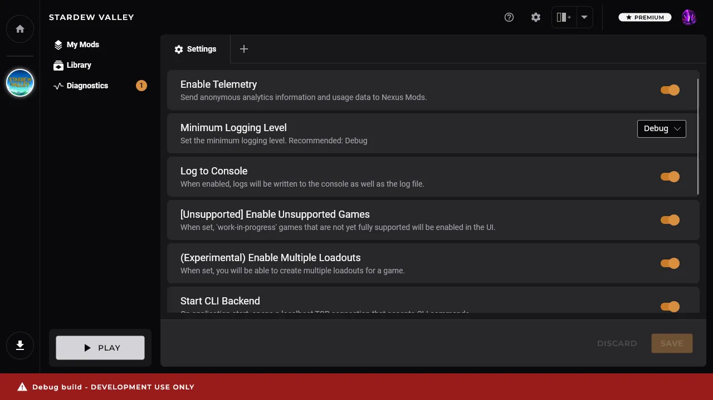

# Changelog

## [v0.6.0](https://github.com/Nexus-Mods/NexusMods.App/releases/tag/v0.6.0) - 2024-08-29

# Caution: To update the app, you must completely uninstall the old version, including all mods. [Learn More.](https://nexus-mods.github.io/NexusMods.App/users/faq/#why-do-i-have-to-uninstall-everything-to-update-the-app)

This release enhances support for Cyberpunk 2077, adds multiple Loadouts per game and implements the back-end changes to support our new "Loadout items" data model. 

### Cyberpunk 2077 Improvements

**IMPORTANT: It is not currently possible for the app to run REDmod automatically on Linux - Windows users are unaffected. If you are using REDmods on Linux, you may need to manually run the REDmod.exe file located at `tools\redmod\bin\redmod.exe` before launching the game.**

This version further refines the modding experience for Cyberpunk 2077 players by adding additional diagnostics to the Health Check and automatically running REDmod - if necessary - before starting the game. [Learn More](https://nexus-mods.github.io/NexusMods.App/users/games/Cyberpunk2077/).

### Multiple Loadouts
Loadouts offer a convenient way to have manage several different mod setups for a single game. Players can easily swap between simple or complex mod setups by creating multiple loadouts. In this release players can create, copy and delete loadouts for any supported game. [You can learn more about this feature here.](https://nexus-mods.github.io/NexusMods.App/users/features/Loadouts/)

Your mod configuration files for Stardew Valley are synced to the current loadout, so you can have different mod settings for different lists of mods. 

### EXPERIMENTAL - Tree views for My Mods and Library
We're still working on the new "tree view" for the My Mods and Library pages, but you can preview them in this version by enabling the "Enable tree UI for Library and My Mods" toggle in the app settings. The image below is the current design we are working towards and does not represent what is available in the app. 

Please be aware that these pages are unfinished and are not stable enough to fully replace the current views, but we are working hard on improving them and hope to start using them in the next release. 

### Known issues
- The Downloads page is not working and currently shows a placeholder progress bar.
- Cyberpunk 2077 - REDmods are not automatically deployed on Linux.

### Other Features
- Updated the My Games page with new tile designs.
- Game tiles now show a store icon to indicate where the game was downloaded from. 
- It is now possible to delete mods from your Library. 
- Within a [Workspace](https://nexus-mods.github.io/NexusMods.App/users/features/Workspaces/) the active panel is now highlighted in the UI.
- All panels and tabs in Workspace now have a history, allowing the user to navigate forward or backward using the new arrows on the top toolbar. 
- The fonts used in the UI have been updated to Inter in line with our new design system. 

### Bugfixes
- Fixed the game icon in the spine flickering when updating a loadout. 
- Reworded the "Update available" pop-up to make it more clear that updating the app requires a full reset of your mod setup. 
- Fixed an issue where Steam games would fail to launch on Ubuntu. 

### Technical Changes
- Downloading files now uses a new "Jobs" system to make them easier to manage. 
- We are continuing our backend work to convert from "Mods" to "Loadout items". [More Info](https://forums.nexusmods.com/topic/13495763-nexus-mods-app-1-august-progress-update/)
- The synchronizer for handling loadout states has been reworked to provide much more robust coverage of edge cases.
- Added generic support for path-based diagnostic checks when checking for missing dependencies. 

### External Contributors

- [@Patriot99](https://github.com/Patriot99): Polish translation updates.

## [v0.5.3](https://github.com/Nexus-Mods/NexusMods.App/releases/tag/v0.5.3) - 2024-07-11

This release makes some refinements to the Stardew Valley modding experience based on user feedback, improves various UI elements and includes a number of back-end bugfixes.

### Fixes

- Fixed the "SMAPI is disabled"-diagnostic for multiple SMAPI installations ([#1674](https://github.com/Nexus-Mods/NexusMods.App/pull/1674)).
- Fixed Loadout disappearing when applying ([#1737](https://github.com/Nexus-Mods/NexusMods.App/pull/1737)).
- Fixed un-managing a game removing all Loadouts instead of just the ones for the current game ([#1738](https://github.com/Nexus-Mods/NexusMods.App/pull/1738)).
- Fixed sorting in the Mod Library and the "Completed Downloads"-section ([#1690](https://github.com/Nexus-Mods/NexusMods.App/pull/1690)).
- Fixed SVGs not loading and rendering properly in the markdown viewer ([#1661](https://github.com/Nexus-Mods/NexusMods.App/pull/1661)).
- Fixed SVGs throughout the App ([#1622](https://github.com/Nexus-Mods/NexusMods.App/pull/1622), [#1681](https://github.com/Nexus-Mods/NexusMods.App/pull/1681)).
- Fixed not disposing services on close correctly ([#1679](https://github.com/Nexus-Mods/NexusMods.App/pull/1679)).
- Windows: Fixed log file creation failing due to illegal character in path ([#1728](https://github.com/Nexus-Mods/NexusMods.App/pull/1728)). Thanks, [@ZeeWanderer](https://github.com/ZeeWanderer)!
- Linux: Fixed protocol registration ([#1691](https://github.com/Nexus-Mods/NexusMods.App/pull/1691), [#1689](https://github.com/Nexus-Mods/NexusMods.App/pull/1689), [#1683](https://github.com/Nexus-Mods/NexusMods.App/pull/1683)).
- Linux: Upgraded [GameFinder](https://github.com/erri120/GameFinder) to fix an issue with not being able to find Steam installed as a Flatpak or Snap ([#1720](https://github.com/Nexus-Mods/NexusMods.App/pull/1720)).

### Cyberpunk 2077 - EXTREMELY EXPERIMENTAL

This version of the app adds Cyberpunk 2077 to the Games section ([#1719](https://github.com/Nexus-Mods/NexusMods.App/pull/1719)). We are now actively working on supporting this game but the implementation is still **very experimental** and may not work for all types of mod. Further improvements are planned for future updates.

### Other Features

- Added support for ignoring game assets when backing up the game files. For Cyberpunk 2077, this can result in 98.75% less disk space used: 1 GB instead of 80 GB ([#1713](https://github.com/Nexus-Mods/NexusMods.App/pull/1713)).
- The logs directory can be opened from the help menu in the top bar ([#1675](https://github.com/Nexus-Mods/NexusMods.App/pull/1675)).

### Miscellaneous

- Improved user documentation for [Workspaces](https://nexus-mods.github.io/NexusMods.App/users/features/Workspaces/), [Health Checks](https://nexus-mods.github.io/NexusMods.App/users/features/HealthCheck/) and [Stardew Valley](https://nexus-mods.github.io/NexusMods.App/users/games/StardewValley/).
- Reworked protocol registration to set the App as the default on startup ([#1691](https://github.com/Nexus-Mods/NexusMods.App/pull/1691)).
- Reworked out data model to use our new source generator ([#1626](https://github.com/Nexus-Mods/NexusMods.App/pull/1626)).
- Reworked out synchronizer to a simpler 3-way merge approach. ([#1707](https://github.com/Nexus-Mods/NexusMods.App/pull/1707)).
- Began working on adding Loadout Items, Library Items, and reworking Downloads ([#1336](https://github.com/Nexus-Mods/NexusMods.App/issues/1336)).
- This release contains some major changes for package maintainers. See the new [docs](https://nexus-mods.github.io/NexusMods.App/developers/Contributing/#for-package-maintainers) for details.

### External Contributors

- [@ZeeWanderer](https://github.com/ZeeWanderer): [#1728](https://github.com/Nexus-Mods/NexusMods.App/pull/1728), [#1746](https://github.com/Nexus-Mods/NexusMods.App/pull/1746)

## [v0.5.2](https://github.com/Nexus-Mods/NexusMods.App/releases/tag/v0.5.2) - 2024-06-19

This is a minor release containing many UI improvement and bugfixes. To illustrate all of these changes, here are before and after screenshots of version 0.5.1 and 0.5.2:

Notably is the redesign of the Spine buttons ([#1539](https://github.com/Nexus-Mods/NexusMods.App/pull/1539)), the rework of the TopBar ([#1580](https://github.com/Nexus-Mods/NexusMods.App/pull/1580), [#1621](https://github.com/Nexus-Mods/NexusMods.App/pull/1621)), and the many improvements to the Settings page including a redesign of the toggle switches ([#1549](https://github.com/Nexus-Mods/NexusMods.App/pull/1549)), the combo boxes ([#1549](https://github.com/Nexus-Mods/NexusMods.App/pull/1546)), and the addition of sections ([#1618](https://github.com/Nexus-Mods/NexusMods.App/pull/1618)). The settings page will continue to evolve over time, but this is already a big step forward.

We've added a banner to the new tab-page to better promote the panel system. You can dismiss the banner manually, or it will be dismissed automatically, if you add a new panel ([#1584](https://github.com/Nexus-Mods/NexusMods.App/pull/1584), [#1595](https://github.com/Nexus-Mods/NexusMods.App/pull/1595)):

### Other Changes

- Improved the Mod Library design and usability. Mods can now be added from the library and the installation status will switch if the mod has already been installed ([#1543](https://github.com/Nexus-Mods/NexusMods.App/pull/1543)).
- New messages have been added to the Mod Library and the Mods page when they are empty ([#1617](https://github.com/Nexus-Mods/NexusMods.App/pull/1617)).
- Xbox Game Pass has been disabled until we find a solution to deal with protected Xbox Store binaries. See [#1476](https://github.com/Nexus-Mods/NexusMods.App/issues/1476) and [#1477](https://github.com/Nexus-Mods/NexusMods.App/issues/1477) for details.
- Missing dependency diagnostic for SMAPI Mods will now show the mod name ([#1650](https://github.com/Nexus-Mods/NexusMods.App/pull/1650)).
- Changed the default open page behavior for the settings page to always open in the "Home" workspace as a new panel ([#1598](https://github.com/Nexus-Mods/NexusMods.App/pull/1598)).
- After logging in via Nexus Mods, the App window will move to the foreground to signal completion of the login process ([#1544](https://github.com/Nexus-Mods/NexusMods.App/pull/1544)).
- The line in the download speed graph will automatically be hidden after 5 seconds of inactivity ([#1597](https://github.com/Nexus-Mods/NexusMods.App/pull/1597)).
- Both the diff and mod file tree will auto-expand the root nodes for better usability ([#1593](https://github.com/Nexus-Mods/NexusMods.App/pull/1593)).
- Renamed "Diagnostics" to "Health Check" ([#1586](https://github.com/Nexus-Mods/NexusMods.App/pull/1586)).
- New [documentation](https://nexus-mods.github.io/NexusMods.App/) has been created for both users and developers ([#1624](https://github.com/Nexus-Mods/NexusMods.App/pull/1624)).
- The updated documentation also includes a new section for package maintainers. Thanks to [@l0b0](https://github.com/l0b0), [@MattSturgeon](https://github.com/MattSturgeon) and [Abzie](https://aur.archlinux.org/account/Abzie) we have the first packages appearing for both NixOS and Arch:

### Fixes

- Linux: Fixed the Launch button. Steam and the Game will now start correctly ([#1533](https://github.com/Nexus-Mods/NexusMods.App/pull/1533) and [#1151](https://github.com/Nexus-Mods/NexusMods.App/issues/1151)).
- ToolTip styles have finally been fixed and should appear correctly ([#1566](https://github.com/Nexus-Mods/NexusMods.App/pull/1566), [#1592](https://github.com/Nexus-Mods/NexusMods.App/pull/1592)).
- Fixed an issue where broken data can result in having no panels ([#1599](https://github.com/Nexus-Mods/NexusMods.App/pull/1599), [#1526](https://github.com/Nexus-Mods/NexusMods.App/pull/1526)).

### External Contributors

- [@Patriot99](https://github.com/Patriot99): [#1500](https://github.com/Nexus-Mods/NexusMods.App/pull/1500), [#1564](https://github.com/Nexus-Mods/NexusMods.App/pull/1564), [#1590](https://github.com/Nexus-Mods/NexusMods.App/pull/1590), [#1613](https://github.com/Nexus-Mods/NexusMods.App/pull/1613), [#1614](https://github.com/Nexus-Mods/NexusMods.App/pull/1614), [#1627](https://github.com/Nexus-Mods/NexusMods.App/pull/1627)

## [v0.5.1](https://github.com/Nexus-Mods/NexusMods.App/releases/tag/v0.5.1) - 2024-06-03

This is a minor release containing bugfixes and small UI improvements.

### Fixes

- Fixed link in the metrics opt-in overlay ([#1523](https://github.com/Nexus-Mods/NexusMods.App/pull/1523), [#1524](https://github.com/Nexus-Mods/NexusMods.App/pull/1524)).
- Fixed the infinite loading screen when previewing apply changes ([#1502](https://github.com/Nexus-Mods/NexusMods.App/pull/1502)).
- Fixed the uninstaller ([#1503](https://github.com/Nexus-Mods/NexusMods.App/pull/1503), [#1504](https://github.com/Nexus-Mods/NexusMods.App/pull/1504)).
- Fixed a silent exception when using an uninitialized value ([#1493](https://github.com/Nexus-Mods/NexusMods.App/pull/1493)).
- Various UI fixes and improvements ([#1495](https://github.com/Nexus-Mods/NexusMods.App/pull/1495), [#1517](https://github.com/Nexus-Mods/NexusMods.App/pull/1517)).

## [v0.5.0](https://github.com/Nexus-Mods/NexusMods.App/releases/tag/v0.5.0) - 2024-05-29

### New Features

This release is packed with new features. Configs generated by the game are now ingested into the correct mod, and can be edited using our new Text Editor ([#1358](https://github.com/Nexus-Mods/NexusMods.App/pull/1358), [#1346](https://github.com/Nexus-Mods/NexusMods.App/pull/1346)):

The text editor uses [AvaloniaEdit](https://github.com/avaloniaui/avaloniaedit) and comes with syntax highlighting and many features you'd expect a code editor to have. You can even change the theme in the toolbar directly or using our new Settings UI ([#396](https://github.com/Nexus-Mods/NexusMods.App/issues/396), [#920](https://github.com/Nexus-Mods/NexusMods.App/issues/920)):

Settings have been in the works for a long time, and we've finally developed a system to easily create settings and allow users to change them. The UI will be expanded with sections, a search bar, and many more features in the future.

Our Downloads Page received a lot of attention in this release as well. It now contains a very nice and sleek download speed chart, and a list of completed downloads ([#1297](https://github.com/Nexus-Mods/NexusMods.App/pull/1297), [#1397](https://github.com/Nexus-Mods/NexusMods.App/pull/1397)):

Clicking the "View in library" button will take you to our new Mods Library. Here you can see a list of all mods you've downloaded and installed. You can also quickly add a mod to your Loadout ([#1268](https://github.com/Nexus-Mods/NexusMods.App/pull/1268), [#1347](https://github.com/Nexus-Mods/NexusMods.App/pull/1347)):

The biggest change we've done is completely overhauling our internal data model and moving *almost* everything to our custom build database called [MnemonicDB](https://github.com/Nexus-Mods/NexusMods.MnemonicDB). The immediate benefit of this change is better faster, the long term benefit is having a reliable database with migrations and opportunities for new and awesome features without being bogged down by our previous data model.

One notable change that the new data model brought to the App is reified deletes.

### Other Changes

- Starting the App for the first time will open a warning about the state of the release. This overlay can be opened again by clicking the help icon in the top bar ([#1390](https://github.com/Nexus-Mods/NexusMods.App/pull/1390)).
- Navigating panels has been made easier. You can now right-click buttons that would create panels, to open up a context menu. Similar to browsers, combinations like Ctrl+Click or Shift+Click also work ([#1266](https://github.com/Nexus-Mods/NexusMods.App/pull/1266)).
- This Changelog can now be viewed directly in the App ([#1258](https://github.com/Nexus-Mods/NexusMods.App/pull/1258)).
- Stardew Valley saves are no longer managed by the App ([#1344](https://github.com/Nexus-Mods/NexusMods.App/pull/1344)).
- Added new Stardew Valley diagnostics:
  - Minimum supported SMAPI version ([#1265](https://github.com/Nexus-Mods/NexusMods.App/pull/1265)).
  - Minimum supported Game version ([#1265](https://github.com/Nexus-Mods/NexusMods.App/pull/1265)).
  - Mod overwrites game files ([#1481](https://github.com/Nexus-Mods/NexusMods.App/pull/1481)).
- Stardew Valley has a new image ([#1393](https://github.com/Nexus-Mods/NexusMods.App/pull/1393)).
- The "Library" and "Diagnostics" entry on the left menu now show badges with counts for new archives and active diagnostics ([#1452](https://github.com/Nexus-Mods/NexusMods.App/pull/1452)).
- Added a message to an empty Loadout ([#1464](https://github.com/Nexus-Mods/NexusMods.App/pull/1464)).
- Updated mod names for failed installations ([#1468](https://github.com/Nexus-Mods/NexusMods.App/pull/1468)).
- Game Files and the Override Mod are hidden by default, this is controlled using a setting ([#1286](https://github.com/Nexus-Mods/NexusMods.App/pull/1286), [#1341](https://github.com/Nexus-Mods/NexusMods.App/pull/1341)).
- Restrict release build to only having one Loadout ([#1416](https://github.com/Nexus-Mods/NexusMods.App/pull/1416)).
- Restrict release build to only show Stardew Valley ([#1401](https://github.com/Nexus-Mods/NexusMods.App/pull/1401)).
- The CLI and how we handle multiple processes has been reworked ([#1345](https://github.com/Nexus-Mods/NexusMods.App/pull/1345)).
- Logging to the console can be now enabled in the settings, it's disabled by default ([#1351](https://github.com/Nexus-Mods/NexusMods.App/pull/1351)).
- A console window will no longer appear on Windows when starting the App ([#1410](https://github.com/Nexus-Mods/NexusMods.App/pull/1410)).
- Package maintainers can choose to disable the bundled 7z binary ([#1308](https://github.com/Nexus-Mods/NexusMods.App/pull/1308)).
- Loadouts can be removed and games can be unmanaged ([#1259](https://github.com/Nexus-Mods/NexusMods.App/pull/1259), [#1279](https://github.com/Nexus-Mods/NexusMods.App/pull/1279)).
- Added an uninstaller ([#1383](https://github.com/Nexus-Mods/NexusMods.App/pull/1383)).

### Fixes

- Tons of UI fixes and small visual improvements.
- The login overlay has been fixed and will now appear correctly again ([#1402](https://github.com/Nexus-Mods/NexusMods.App/pull/1402)).
- Telemetry has been reworked and fixed ([#1293](https://github.com/Nexus-Mods/NexusMods.App/pull/1293)).

### External Contributors

- [@Patriot99](https://github.com/Patriot99): [#1250](https://github.com/Nexus-Mods/NexusMods.App/pull/1250), [#1314](https://github.com/Nexus-Mods/NexusMods.App/pull/1314), [#1374](https://github.com/Nexus-Mods/NexusMods.App/pull/1374), [#1399](https://github.com/Nexus-Mods/NexusMods.App/pull/1399), [#1418](https://github.com/Nexus-Mods/NexusMods.App/pull/1418), [#1437](https://github.com/Nexus-Mods/NexusMods.App/pull/1437), [#1443](https://github.com/Nexus-Mods/NexusMods.App/pull/1443), [#1460](https://github.com/Nexus-Mods/NexusMods.App/pull/1460)
- [@DioKiriie](https://github.com/DioKiriie): [#1329](https://github.com/Nexus-Mods/NexusMods.App/pull/1329)

## [v0.4.1](https://github.com/Nexus-Mods/NexusMods.App/releases/tag/v0.4.1) - 2024-04-17

### New Features

The highlight of this PR is the new Apply Diff View ([#1202](https://github.com/Nexus-Mods/NexusMods.App/pull/1202)). You can now preview the changes made to disk before applying the Loadout:

Stardew Valley received three new diagnostics ([#1171](https://github.com/Nexus-Mods/NexusMods.App/pull/1171), [#1168](https://github.com/Nexus-Mods/NexusMods.App/issues/1168)). These diagnostics use the current game version and a [compatibility matrix](https://github.com/erri120/smapi-versions) to figure out if the currently installed SMAPI version is compatible:

This also includes our first "suggestion" diagnostic. This diagnostic will only appear if you have no mods installed, and it will recommend a supported SMAPI version:

### Other Changes

- A new settings backend was added in preparation for a settings UI. See [#1182](https://github.com/Nexus-Mods/NexusMods.App/issues/1182) for more details.
- The App will now use two logging files, `nexusmods.app.main.log` and `nexusmods.app.slim.log`, instead of one `nexusmods.app.log` to prevent log collisions between processes ([#1167](https://github.com/Nexus-Mods/NexusMods.App/pull/1167)).
- The default logging level has been changed from `Information` to `Debug` for Release builds to make it easier to debug issues ([#1209](https://github.com/Nexus-Mods/NexusMods.App/pull/1209)).

### Fixes

- Fixed icons clipping in the left menu ([#1165](https://github.com/Nexus-Mods/NexusMods.App/issues/1165), [#1169](https://github.com/Nexus-Mods/NexusMods.App/pull/1169)).
- Windows: Fixed Stardew Valley not launching with a console ([#1135](https://github.com/Nexus-Mods/NexusMods.App/issues/1135), [#1205](https://github.com/Nexus-Mods/NexusMods.App/pull/1205)).
- Linux: Fixed NXM protocol registration when using an AppImage ([#1149](https://github.com/Nexus-Mods/NexusMods.App/issues/1149), [#1150](https://github.com/Nexus-Mods/NexusMods.App/issues/1150)).
- Linux: Fixed whitespaces in desktop entry files ([#1150](https://github.com/Nexus-Mods/NexusMods.App/issues/1150), [#1152](https://github.com/Nexus-Mods/NexusMods.App/pull/1152)).
- Linux: Fixed various issues related to launching the game through Steam ([#1206](https://github.com/Nexus-Mods/NexusMods.App/pull/1206), [#1151](https://github.com/Nexus-Mods/NexusMods.App/issues/1151)).

### External Contributors

- [@Patriot99](https://github.com/Patriot99): [#1163](https://github.com/Nexus-Mods/NexusMods.App/pull/1163), [#1203](https://github.com/Nexus-Mods/NexusMods.App/pull/1203)

## 0.4 to 0.0.1

This is the end of the CHANGELOG. All previous releases used an auto-generated changelog in the GitHub release.
