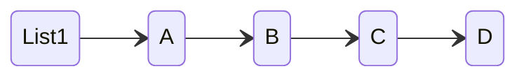
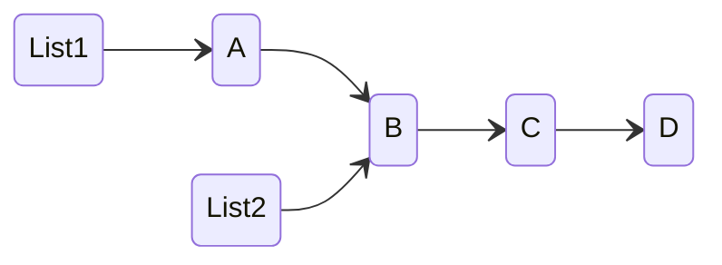
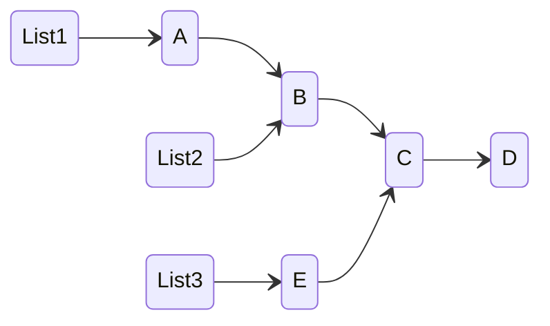
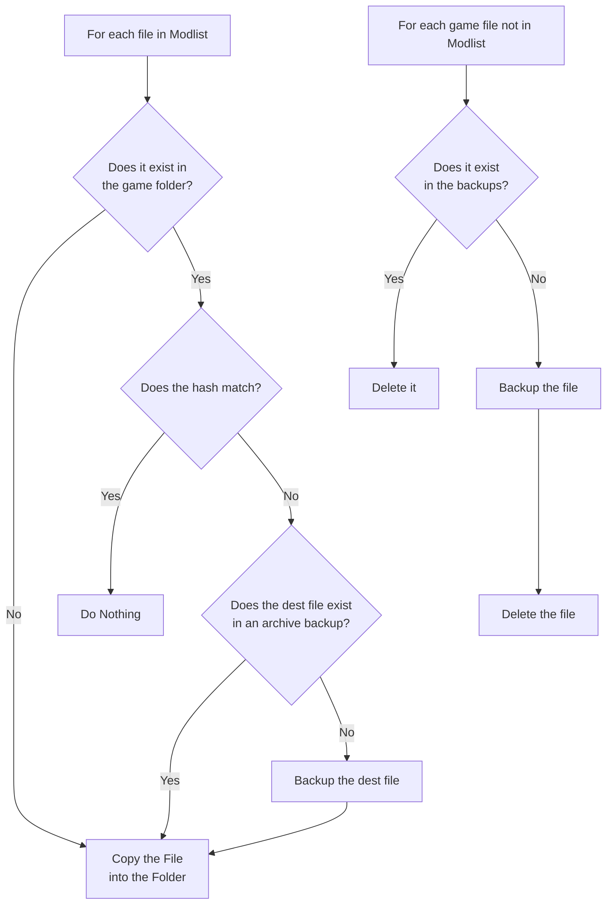

# Immutable Modlists

Immutability is a rather arcane term for a rather strange but yet simple idea: data that never changes
This idea has gained popularity of late in so-called "Functional Programming languages" and has resulted
in the concepts being applied to a whole set of computer science problems.

Immutable data never changes, if a list has 3 items in it, it always has exactly those three items in it.
If someone wants a list with 4 items, they create a new list with the original 3 items in the list but a forth
added on the end. If they want a list with 2 items they make a new list with one of the items missing. In this
way, data never changes while someone is observing the data and if you ever don't like the changes you've made,
you can revert to a previous bit of immutable data.

To visualize this, imagine we have a "singly linked list" of 4 items:



In this diagram we can see that List1 consists of 4 items, A-D. But what if we want a new list of just B-D.



If we wanted a third list that added a new item to C-D we could easily do so:



This simple example shows two key features of immutable data. Firstly we see that the old versions of the
list can easily co-exist with the new versions. Just because a new item was added (to a new list) or an item
was removed, never changed the state of the old list. Secondly we see how optimization can come into play. Instead
of cloning the entire list every time an item was added or removed, instead we see that portions of the list were
re-used in new lists, this concept is known as "structural sharing".

Single linked lists are perhaps the easiest for of immutable data to implement, but with the creation of [Clojure](https://clojure.org/)
in ~2007, immutable hash maps and vectors (indexed arrays) were shown to be possible using structural sharing.
Later on, the author of Clojure, Rich Hickey would go on to invent [Datomic](https://www.datomic.com/) an immutable database.
The very idea of Datomic is somewhat insane: the database is immutable. Terabytes of data can be accessible to a reader, while
other processes can write to the database and those processes can see their changes as an immutable database. Each addition to the
database results in a new "instance" of the database, and old instances remain available forever.

Since the introduction of Clojure the concepts of immutability have made their way through all aspects of computer science. [Talos Linux](https://www.talos.dev/)
is an immutable operating system. [Apache Kafka](https://kafka.apache.org/) is an immutable queue. [Quiescent](https://github.com/levand/quiescent)
takes the ideas of immutability and applies them to React.JS to auto-resolve many of the `should-update` aspects of the framework.

# The Big Idea
So this leads to the question: what can immutable data do for the modding world? A good way to start with answering this question is to ask
what would happen if *everything* was immutable. What if our modlist was immutable data? That wouldn't do much good unless the files represented
by that modlist was also immutable. So what would *that* look like? What if we could find some way to ensure that every change we made to our modlist
resulted in a new modlist. That we could always roll back to a previous state, could swap between two forks of the same list, could add a mod to one fork
then go to the other fork and look at different mod in that case?

Like most applications of immutablity this now becomes a problem of optimization. Clearly the simplistic approach of keeping cloning the entire game directory
for every version of the list wouldn't be practical, but neither is cloning an entire single-linked list just to add one item.

## The Data Model
To start with, every modlist will consist of a list of mods, files in those mods, and "Data Provinance" information about every file inside those mods.
Data Provinance is a type of metadata that describes where the attached data originated. For example, if the user installed `foo.dds` from `my_mod.7z` then
the file entry in the mod may look something like this:

```yaml
Mod1:
    foo.dds:
      Hash: 0x443434
      DataProvinance:
        ArchiveName: my_mod.7z
        ArchiveHash: 0x4424233
        ArchivePath: path/to/foo.dds
Mod2:
    bar.dds:
      - ...
    baz.dds:
      - ...
```

Storing a modlist in this way opens up some possibilities for a mod manager design. Firstly we no longer need to extract the file to "install it", we can delay
installation until it's time to put the file in the game folder. Secondly, we don't need a staging folder, if any tool ever needs to access the file we can extract
it on-demand. Granted this would be an expensive operation for "solid" archives such as 7zip, but there are many ways this could be optimized (for example with a bounded
least-recently-used cache).

Once the user is happy with their modlist, they can choose to "Apply" the list.

## Applying a List
The application of a list to a game folder then becomes a simple tree diff, where the contents of the game folder are compared against the desired modlist.
Most of the time this will result in a "no-op" where no work needs to be done. This can be heavily optimized via a fast hashing algorithm and an examination of the
`last-modified` values of the files. If the file in the game folder doesn't exist, then the applier would run to the appropriate archive and extract the file into the
game folder. If a file exists that shouldn't exist, the file is deleted (and perhaps archived for future retrieval).

Naturally running out to the archives to extract a single file isn't an efficient access pattern, so the correct implementation here would be to batch all the
files to be extracted from a single archive and extract them all at once.

An interesting point to note is that this method has none of the drawbacks of several modern mod managers. There are no hard links, soft links, junctions,
function hooking, staging folders, etc. It *does* require users to keep the archives for all the mods they have downloaded, but with proper data provinance, if
a user deletes an archive they could be prompted to re-download it when required. This system is also very disk agnostic, since archives
are compressed and often read in chunks it's perfectly acceptable for users to store their downloads on HDDs, external drives or even a network share. The afore mentioned
file caches could also be stored on these less performant drives since their only design is to reduce the overhead of seeking through non-indexed [solid archives](https://en.wikipedia.org/wiki/Solid_compression).

The performance of this "list application" is a function of the number of changes that have occurred between one application and the next. Thankfully normal
modding practices help us here. It is uncommon for users to download 100GB of mods and never test between installing the first and the last of the mods. Instead most
users tend to install one or two mods, or perhaps a dozen, then test the game, then install a few more. Thus the cost of applying a list is amortized over the
lifetime of the list.

## Normal Workflows
During modding, users may perform several operations on a modlist and a game folder. These modifications are often destructive, and unfortunately we lack the
required APIs to re-download these files from many of the original sources. Thus we must track these files that are commonly modified and back them up so they can
be restored at a later time. Thankfully the list of files users tend to modify is fairly well known and so we should be able to keep these in a predefined list.
For example, for Skyrim these files are plugin files (.esm, .esp, .esl), and not the game archives or executables. When users modify the archives they tend to download
pre-created optimized archives, and in these cases the mod manager will be replacing the files.

## Decision Graph
Here is a basic flow graph of the modlist application process:



When a game is first "managed" by the modding application, a non-removable modlist would be created from the game files
that contains all the game files in a single mod. This modlist would then be the starting modlist from which all future
modlists for the game would be forked.

This snapshotting of the current gamefolder, and a deriving of a modlist from the state can then be leveraged to perform
change tracking before and after a game or a tool is run. For example, let's take the case of a user running `quickAutoClean.exe` on their Skyrim game plugins.

* The user adds ModA
* They apply the modlist
* They launch `quickAutoClean.exe` through the app
* The `quickAutoClean.exe` program modifies the plugin then exits
* The mod manager does a diff and recognizes that the file has a new `last-modified` date
* The new file is archived, and tracked with Data Provinance information stating that while it originated in ModA it was modified by `quickAutoClean.exe`
* The current modlist is cloned and updated to include the new cleaned plugin and the associated provinance information

At this point the user sees the effect of their actions, and nothing has really changed for them. However their list is now properly
linked to the previous versions. They can run the game, and perhaps decide they don't want that mod to be cleaned, now all they need do
is revert their "active list" to the version before they ran the cleaning tool, click "apply" again, and all the destructive edits are reverted.

