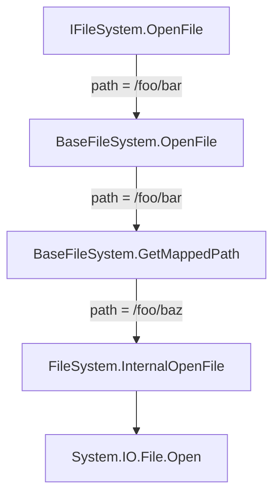

# Use a custom File System abstraction

## Context and Problem Statement

The APIs of the standard library (`System.IO`) use the real file system and basic types like `string` for paths and
integers for file sizes. Using the real file system not only slows down test execution, but it can also have unforeseen
consequences when running tests in parallel.

Another issue arises when trying to support tools like [Wine](https://winehq.org)
and [Proton](https://github.com/ValveSoftware/Proton). Wine is a compatability layer that can run Windows applications
on Linux, without requiring a virtual machine. Wine creates "prefixes", which contain a _virtual_ `C:` drive. Using the
APIs of the standard library, we are unable to correctly make use of this virtual drive, without rewriting all internal
and external code, to be aware of Wine prefixes, and other virtualization.

## Decision Drivers

We need a library with the following features:

- provides an abstraction over the real file system
- provides a mock-able interface for testing
- provides an implementation that uses the real file system
- provides an implementation that uses an in-memory file system for testing
- exposes a limited set of public APIs which uses [nominal typing](../project/0004-use-nominal-typing.md)
- allows for path re-mapping: `/foo/bar` should redirect to `/baz`
- allows for cross-platform path re-mapping: `C:\\foo\\bar` should be converted to `/c/foo/bar` and redirected to `/baz`

## Considered Options

- [`System.IO.Abstraction`](https://github.com/TestableIO/System.IO.Abstractions): this provides fully mock-able
  interfaces and test implementations for the entire `System.IO` namespace. As such, it contains almost every function
  from the standard library, but returns interfaces wherever possible. The library doesn't change any functionality, nor
  any function signature, aside from returning it's own interface types, when necessary. Finally, this library doesn't
  allow for path re-mappings, doesn't properly work with cross-platform paths, as it just redirects all calls to the
  standard library.

- Custom library: the DIY approach allows us to provide a limited set of APIs, tailored towards our use-case that also
  uses our internal types.

## Decision Outcome

We created a custom interface called `IFileSystem` in the `NexusMods.Paths` project, with an implementation that uses
the real file system called `FileSystem`, and an implementation that uses an in-memory fake file system
called `InMemoryFileSystem`.

The available APIs in `IFileSystem` use our custom types:

- `AbsolutePath` instead of raw strings
- `Size` instead of raw integers
- `IFileEntry` instead of `System.IO.FileInfo`
- `IDirectoryEntry` instead of `System.IO.DirectoryInfo`

Path re-mapping is done in the abstract class `BaseFileSystem`, which implements `IFileSystem` and is the parent class
of `FileSystem` and `InMemoryFileSystem`. Having this parent class reduces code duplication and provides separation of
concerns for the concrete implementations:

### Consequences

The app is very IO heavy by design, and thus has a lot of file system calls. Replacing all mentions of `System.IO` with
the new file system abstraction will take some time. Internal legacy APIs have been marked as deprecated and new code
should make use of `IFileSystem` without any issue.
