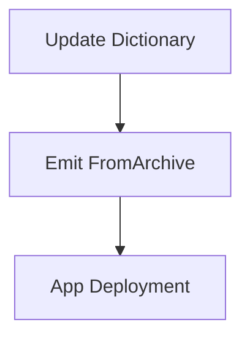

# Advanced Installer Design

The 'Manual Mod Installer', also known as the 'Advanced Installer' is a mechanism for
installing mods which do not come with an automatically recognizable file structure.

This document lists the requirements for the given functionality, as well as some context.

Associated UI Design:
- https://www.figma.com/proto/Ntr9PttR5VrqpTRwwZHzLu/%F0%9F%93%B1-Mod-list?page-id=1826%3A5125&type=design&node-id=1826-5126&viewport=579%2C196%2C0.23&t=A6zTbYWd3oKZP1wF-1&scaling=min-zoom&starting-point-node-id=1826%3A5161


## Context and Problem Statement

There may be some situations where automated installation of a given mod might fail,
or a user may want to install a mod manually.

This can occur due to a variety of reasons; such as:
- An oversight/bug with existing installer implementations.
- An error on mod creator's part.
- Unrecognized/non-standard packaging path.

In the presence of these scenarios, the mod manager must still have a way to install any given mod.

## Decision Drivers & Requirements

- Certain mods may not come with a recognizable file structure.
    - The Nexus Mods App might not know how to install them automatically.

- Interoperability: The Nexus Mods App must be able to somehow deploy ANY mod, regardless of its packaging format.
    - Otherwise, if users end up having to deploy files manually, they may be discouraged from using the mod manager.

- The Manual Installer must work with minimal game implementation code.
    - It is considered the last line of defense; last resort.
      - In other words, must not refuse to work in absence of support code for 'suggestions' etc.

- UX: Must be Easy to Use

  As part of our slogan named 'Make Modding Easy', it's important that the finished product is easy to use.

  Namely, we have to consider that non-technical users may be using the app, and therefore we must make sure
  to provide appropriate hints (suggestions) for them to deploy an unknown mod; even in presence of install
  instructions from mod authors.

- Must support arbitrary path mapping.

  This system must support mapping any path from the source archive into any location in the target game directorie(s)
  [Including AppData, Save Location, etc.]

  This includes mapping multiple files in the same folder to different locations, in case the modder provides
  multiple files side by side when you are only supposed to pick 1.

- Must recognise conflicts.

  The end user using the advanced installer, might end up trying to map files in a way that could cause a conflict.

  For example, the user might map a file to the output directory individually, then map an entire folder; and a file
  within the folder conflicts with an already mapped file.

## An Example of Manual Installation

Some mods may have multiple variants, but don't use a declarative language like the FOMOD XML
format for specifying choices. This tends to be more common in games with more niche communities
and early mods for games.

Imagine the following file structure (imaginary game):

```text
Red Hair
├─ Data
│  ├─ model.dae
│  └─ hair.dds
Green Hair
├─ Data
│  ├─ model.dae
│  └─ hair.dds
Blue Hair
└─ Data
   ├─ model.dae
   └─ hair.dds
```

The user is expected to select items from one of the given folders. These folders do map to game folder, but
because there are duplicates and multiple candidates for deployment, the Nexus Mods App cannot automatically
choose which one to deploy.

## Considered Options (Deployment)

- Reusing the FOMOD Deployment System.
- Programming a new Deployment System from scratch.

## Decision Outcome

After some investigation work, I it has been concluded that it isn't really possible to reuse the FOMOD system here.

While the FOMOD system is technically a subset of the Advanced Installer if you think about it (after all, toggling
1 FOMOD option is just like mapping 1-* files to a given location); the design of the current FOMOD code does not
easily lend itself to reuse.

This is because FOMOD library, emits a list of files to be deployed from the library as 'Instructions'; and we simply
use those instructions to modify an enumerable of files to be deployed. This file list is created by user interacting with
the FOMOD library in an asynchronous call (i.e. logic abstracted away by library). As a result, reusing existing FOMOD
logic does not translate well to `Advanced Installer`,

On the other hand, a good chunk of the UI styling/logic should be reusable.
In other words, we're going for a custom solution.

### Consequences

- Good, because custom solution allows for easier serialization of the data.
- Good for maintenance, as the logic for persisting deployment steps could be reused in the FOMOD code.
    - Note: Both are a file->file mapping effectively, so we can use serialization format for Advanced Installer in FOMOD.

### Implementation Details / Notes

#### Background Knowledge

Currently Mod Installers work by returning an `IEnumerable<AModFile>`, which is a flat collection of files
to be moved from one location to another.

To use FOMOD as an example, extracting a file from an individual archive works in the following manner:
```csharp
return new FromArchive
{
    Id = ModFileId.New(),
    To = new GamePath(gameTargetPath.Type,
        gameTargetPath.Path.Join(RelativePath.FromUnsanitizedInput(instruction.destination))),
    Hash = file.Value.Hash,
    Size = file.Value.Size
};
```

#### Emitting Operations

There may be temptation to dynamically emit the extract (`FromArchive`) instructions as the user selects the install
target in the UI:


This however, is not a good idea; as `undo` operations and unmaps are more difficult to process in a solution like this.
(Might also be costly in huge mods).

Instead, we should maintain a mapping of `Source` -> `Target`, as a dictionary; and only emit the needed operations 'Just in Time'
at the deployment stage.



i.e.

```csharp
// Note the use of nominal typing.
public Dictionary<RelativePath, GamePath> ArchiveToOutputMap;
```

When the user selects a `target`, we simply add the mapping to the dictionary. Accordingly, we remove the mapping when the
user undoes the operation.

The implementation should adhere to the [path standards used internally within the Nexus Mods App](./0003-paths.md);
i.e. All paths should use a separator of `/`, trim whitespace, do not alter `..`, etc.

#### API Design (Proposed)

Note: Initial design, subject to change. Trivial method implementations already included.

```csharp
/// <summary>
/// DeploymentData encapsulates all the data needed for a manual or advanced mod installation.
/// It contains a mapping between the source files in the archive to the target paths in the game directory.
/// </summary>
public struct DeploymentData
{
    /// <summary>
    /// This Dictionary maps relative paths of files in the mod archive to relative paths in the game directories.<br/>
    ///
    /// Key: The relative path of a file within the mod archive.
    /// Value: The relative path where the file should be placed in the game directory.
    /// </summary>
    /// <example>
    /// If a mod file 'texture.dds' in the archive should go to 'Game/Data/Textures/texture.dds',
    /// then the KeyValuePair would be like ("texture.dds", "Game/Data/Textures/texture.dds").
    /// </example>
    /// <remarks>
    /// Paths follow internal Nexus Mods App path standards: they use a "/" as a separator, trim whitespace, and do not alter "..".
    /// </remarks>
    internal Dictionary<RelativePath, GamePath> ArchiveToOutputMap { get; init; } = new();

    /// <summary>
    /// This is a reverse lookup for the _archiveToOutputMap.<br/>.
    /// We use this lookup to ensure that a file has not already been mapped to a given location.
    /// </summary>
    internal Dictionary<GamePath, RelativePath> OutputToArchiveMap { get; init; } = new();

    /// <summary>
    /// Adds a new mapping from a source file in the archive to a target path in the game directory.
    /// </summary>
    /// <param name="archivePath">The relative path of the source file within the mod archive.</param>
    /// <param name="outputPath">The relative path where the file should be placed in the game directory.</param>
    /// <returns>True if the mapping was added successfully, false if the key already exists.</returns>
    public void AddMapping(RelativePath archivePath, RelativePath outputPath);

    /// <summary>
    /// Removes a mapping based on the source file's relative path in the archive.
    /// </summary>
    /// <param name="archivePath">The relative path of the source file within the mod archive.</param>
    /// <returns>True if the mapping was removed successfully, false if the key does not exist.</returns>
    public bool RemoveMapping(RelativePath archivePath);

    /// <summary>
    /// Clears all the existing mappings.
    /// </summary>
    public void ClearMappings();

    /// <summary>
    /// Emits a series of AModFile instructions based on the current mappings.
    /// </summary>
    /// <param name="gameTargetPath">Path to the game folder.</param>
    /// <param name="files">Files from the archive.</param>
    /// <returns>An IEnumerable of AModFile, representing the files to be moved and their target paths.</returns>
    public IEnumerable<AModFile> EmitOperations(EntityDictionary<RelativePath, AnalyzedFile> files, GamePath gameTargetPath);
}
```

Note: Actual implementation must be able to handle e.g. conflicts in the UI.
