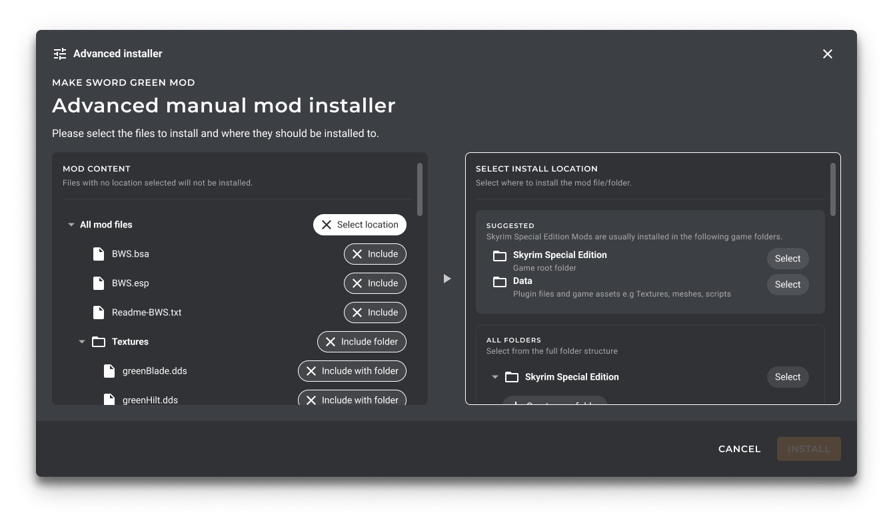

# Advanced Installer: Suggestions

( Tracked by: <I'll Add A Link Here Right before Merging> )
( Note: The filtering algorithms here are considered an iterative improvement, not part of Min Viable Product for this feature )

This document describes the design of the 'Suggestions' system within Advanced Installer, pictured
in the following mockup below:



## Context Statement

When using the Advanced Installer, the user should be provided with 'hints' dictating where a file might
require to be placed based on a number of heuristics.

This is part of the UX effort to 'Make Modding Easy' and a general requirement of our [Advanced Installer Design](./0009-advanced-installer-design.md).

## Considered Options (Suggestions)

- Reusing the Deployment System (`InstallFolderTarget`) for suggestions.
- Creating a Suggestion System from scratch.

## Decision Outcome

Rather than splitting the metadata in two, we can leverage the existing
`InstallFolderTarget` system in order to implement Advanced Installer suggestions;
as that system already has required metadata.

### Consequences

- [Good] Strong code reuse as `InstallFolderTarget` already has required metadata to support this functionality.
- [Neutral] Each `InstallFolderTarget` folder will now need a description.
- [Neutral] All games will need to be converted to new `InstallFolderTarget` system.
- [Negative] The `InstallFolderTarget` list may not contain all folders that the user may want to drop their files manually to.

## Implementation: Reuse of `InstallFolderTarget`

The parts of `InstallFolderTarget` which are usable by the suggestion system will be lifted out into a new interface,
shown below:

```csharp
/// <summary>
/// Represents a target used for suggestions for installing mods within the Advanced Installer.
/// </summary>
public interface ISuggestionFolder
{
    /// <summary>
    /// GamePath to which the relative mod file paths should appended to.
    /// </summary>
    public GamePath DestinationGamePath { get; init; }

    /// <summary>
    /// List of known recognizable file extensions for direct children of the target <see cref="DestinationGamePath"/>.
    /// NOTE: Only include file extensions that are only likely to appear at this level of the folder hierarchy.
    /// </summary>
    public IEnumerable<Extension> KnownValidFileExtensions { get; init; }

    /// <summary>
    /// List of file extensions to discard when installing to this target.
    /// </summary>
    public IEnumerable<Extension> FileExtensionsToDiscard { get; init; }

    /// <summary>
    /// Collection of Targets that are nested paths relative to <see cref="DestinationGamePath"/>.
    /// </summary>
    public IEnumerable<ISuggestionFolder> SubTargets { get; init; }
}
```

## Acquiring `ISuggestionFolder`(s) During Deploy Step (a.k.a. `GetModsAsync`)

Extend the `IGame` interface to expose a property which returns `ISuggestionFolder`(s) for the game's most common directories.

This property is populated with the following elements:
- All `GamePath` entries (i.e. Game folder, Save folder, Config folder, etc.)
- All `InstallFolderTarget` entries (e.g. `Data` folder for Skyrim.), as `ISuggestionFolder`.
- Custom `ISuggestionFolder`(s) defined on a per game basis.
- Apply the filtering steps detailed below. (Not MVP, will be iteratively added later)

This interface can be accessed during the deploy step under `GameInstallation` structure.

## Filtering Suggestions (Directories)

Note: String comparisons performed here adhere to . [Case insensitive + / separator]

The suggestion algorithm for folders is described below.
We will use modified example from [Advanced Installer Design](./0009-advanced-installer-design.md).

Consider the following directory structure:

```text
Red Hair
├─ Data
│  ├─ model.dae
│  └─ hair.dds
Green Hair
├─ Data
│  ├─ model.dae
│  └─ hair.dds
Blue Hair
└─ Data
   ├─ model.dae
   └─ hair.dds
```

Assume the `Data` folder is a folder within the game directory (also applies to subfolders).

If the user selects `model.dae` in `Blue Hair`; the suggestion algorithm should try finding the following in the game's directory tree:
- `Blue Hair/Data`
- `Data`

We keep removing the first directory in the path, until there's at least 1 match in the game's directory tree
(substring sanitized path!). Once there is at least 1 match, include that in the suggestions and terminate the search.

tl;dr Include any folders where any `substring` of the in-archive directory path, matches an `InstallFolderTarget`.

## Filtering Suggestions (Files)

The filtering algorithm for suggestions where to place a file functions in the following manner:

- Filter by `KnownValidFileExtensions`. (Remove if unknown extension).
- Filter by `FileExtensionsToDiscard`. (Remove if extension to discard).
- Add any directories from [Implementation Algorithm (Directories)](#implementation-algorithm-directories)
