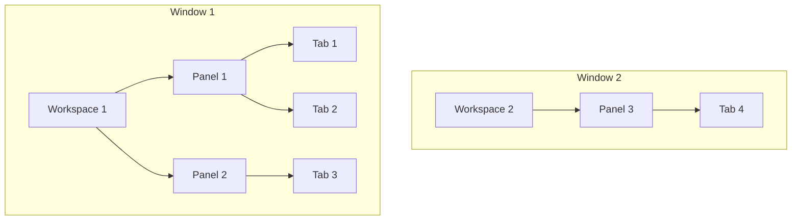

# Workspaces

## Components

The workspace system is made up of the following components:

- Workspaces
- Panels
- Tabs

- Each window can only contain **a single** workspace.
- Each workspace can contain **one or more** panels.
- Each panel can contain **one or more** tabs.

Starting with the smallest component, a tab is comparable to a browser tab. Tabs own the content to display and clicking on another tab will change the displayed content of the current panel.

Panels contains the tabs and are responsible for displaying the currently selected tab, and a "tab strip" for selecting other tabs. Closing a panel will automatically close all of its tabs.

The workspace primarily deals with the panel layout, sizes and position of panels.

## Panels

- A panel always takes up the maximum amount of available space.
- A panel has logical and actual bounds.
  - Logical bounds describe the ratio of space the panel takes up inside the workspace.
    - Example 1: `X: 0, Y: 0, Width: 1, Height: 1` is a panel that is positioned in the top left corner and takes up 100% of the width and height of the workspace.
    - Example 2: `X: 0.5, Y: 0, Width: 0.5, Height: 1` describe a column on the right side, it takes up 100% of the height but only 50% of the width of the workspace and is positioned on the right.
  - Actual bounds are the exact pixel sizes of the panel on the monitor. They are derived by multiplying the logical bounds with the pixel size of the workspace.

### Adding a Panel

- Additional panels can only be added to the workspace if the maximum number of columns and rows aren't reached yet.
- An existing panel must be split in half to create space for a new panel.
- An existing panel can be split into two columns if the number of columns in the current row isn't greater than the maximum amount of allowed columns.
- An existing panel can be split into two rows if the number of rows in the current column isn't greater than the maximum amount of allowed rows.

### Closing a Panel

- Closing a panel is done by joining the current panel with **one or more** adjacent panels.
    - An adjacent panel is a panel that is in the same row or column as the current panel and share a border.
- Columns are preferred to rows when the workspace is horizontal (width > height).
- Rows are preferred to columns when the workspace is vertical (height > width).
- The height of the current panel will be added to the panels in the same column.
- The width of the current panel will be added to the panels in the same row.
