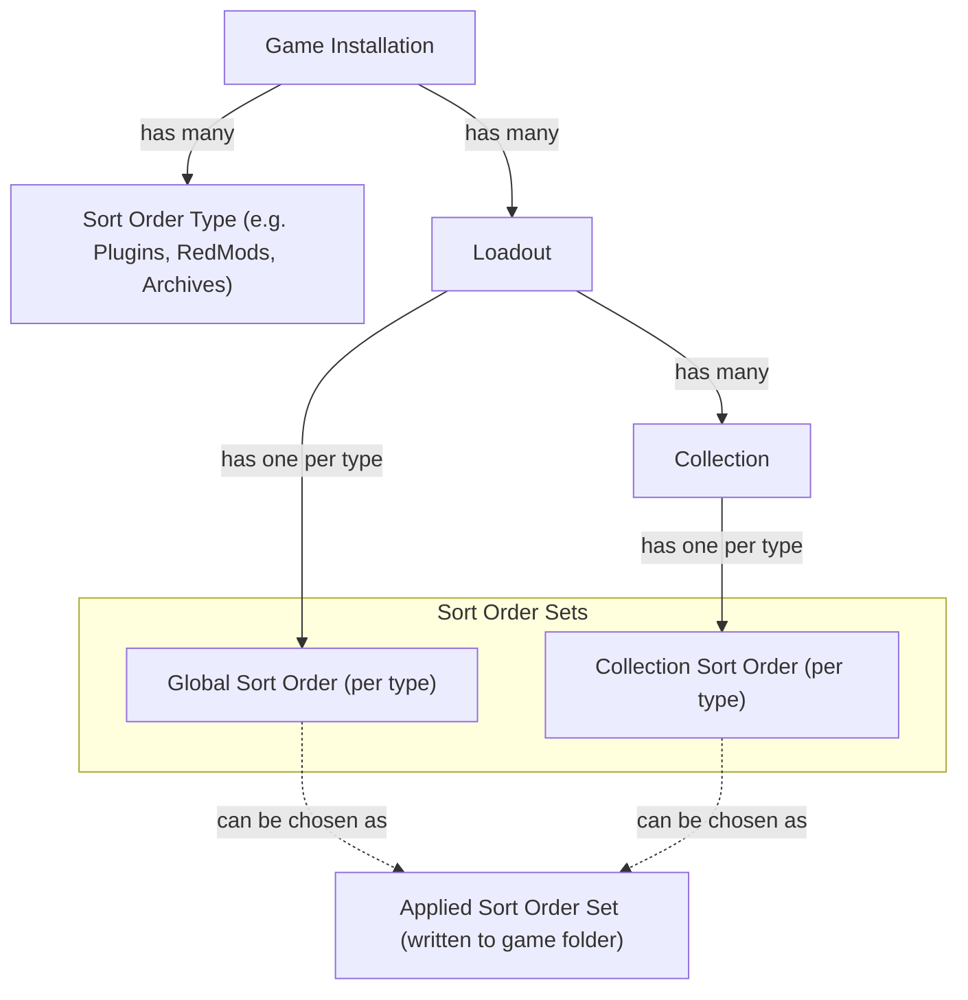

# Load Order Management
Load Order management is one of the most complex features of the app. This document is meant to give an overview of the concepts involved and what kinds of interactions we might have with examples, avoiding UI and implementation details.

## Definition:
A generic system to allow the app and users to modify load order and provide it to the game.

A load order is usually an artifact of some kind to be provided to the game (usually through a file or a command line parameter) that defines the order in which certain mod items should be loaded by the game.

## Sorting:
The order is usually used to ensure that dependencies between mods are resolved correctly and to determine which items win in case of conflicts.

Depending on the game, load order can have different impact on the modded experience. In some games incorrect load order can lead to instability or crashes, in other cases it can lead to mods not working correctly, in other cases it mostly has cosmetic impact.

### Sorting for dependency purposes:
Some items need to be loaded after other to ensure that they work correctly. 
These dependencies can be explicit (e.g., list of masters for Skyrim plugins) or implicit (e.g., a mod that modifies all spells needs to be loaded after the mod that adds new spells, or the new spells won't be modified correctly).

Displaying detected dependencies can help users during the sorting process.


### Sorting for conflict resolution purposes:
If two mod items modify the same thing, the order in which they are loaded can determine which change "wins" and is used by the game.
Different games can have different semantics for what the winner is going to be (smallest index winner vs. greatest index winner).

The granularity of conflicts can also vary between games. Some games only conflict at the value level (e.g., two mods changing the damage value of the same sword, only one can win), while other may conflict at higher levels (e.g., mod A changing HP and mod B changing armor rating of the same NPC would still conflict).

Displaying conflicts between items can help users during the sorting process.

### Sorting of relevant items:
The relative order of two items that don't conflict and don't have direct or indirect dependencies on each other has no importance. A different order would have no impact on the game.

The display of dependencies and conflicts can help users identify which items are relevant for sorting and which ones are not.

The position of mod item A that is currently not in conflict or in dependency relationships can become relevant as soon as new items are added. The new items might have dependencies or conflicts with both item A and other items that already had dependencies or conflicts with each other.

## Load Order enable/disable of items:
Load Orders of some games also allow definition of which items should be loaded.
Ether through game-specific syntax/format demarcation or by inclusion and omission from the order.

In many cases, if an item isn't correctly added to the load order, it might not be loaded at all by the game (e.g., BG3 pak mods). This means that the app needs to ensure all desired items are correctly added to the load order.

### Inclusion of non-active items in the load order:
If disabled items are not included in the load order, enabling them requires the user to sort them in the load order again.

Some games only include active enabled items in the load order.
Other games allow inclusion of available but "meant to be disabled" items in the load order, using special syntax or format to mark them as disabled.
Other games allow inclusion of unavailable items in the load order, which will get ignored by the game. The game might redact the load order to remove these items or ignore them.

For some games, like Skyrim 32bit (Oldrim) that only included the active items in their `plugins.txt` load order, the community introduced a secondary `loadorder.txt` file that per convention would include all the plugins, including the disabled ones. This file would be used by mod managers to manage the load order of all the plugins, regardless of their active state.

Pros and cons of including disabled items in the load order:
#### Pros:
- User doesn't have to find the correct spot for a mod again after enabling it.
- Disabling and re-enabling mods can be done with more peace of mind, without side effects.
- Possible to disable large numbers of mods without disrupting the load order.

#### Cons:
- The load order users see is a superset of the load order the game will actually see/use.
- Users may have a large number of disabled items.
- Users have to sort and maintain the sorting even for items that they don't want to load.

## Size of Load Orders:
Load orders can be of a handful of items or hundreds or even thousands of items.
E.g., Skyrim Special Edition can have several thousand items in the load order. This is common for large mod collections/modlists.

Common numbers range from 5 to 200 items.

## Multiple Load Orders:
Games can have zero, one or multiple load orders (e.g., RedMod load order and .archive files load order for Cyberpunk).

The things being sorted are usually parts of mods, e.g.: a plugin inside a mod.

File path deployment conflicts between mods should generally not be considered a Load Order.
File conflicts are an app-specific issue, not a game one. There are ways for the app to resolve file conflicts that don't require a flat ordering.

## Dependencies and Rules:
Some games have built-in or external ways to define dependencies and rules between items in the load order.

#### Game enforced rules:
The dependencies and rules take precedence over the load order.
E.g.: in Skyrim, the game will find and load the masters of a plugin before the plugin itself, regardless of the load order defined by the user.

```mermaid
graph TD
    %% Show game order
    subgraph Game_Load_Order
        %% Game-enforced (correct) order
        G1["1 Skyrim.esm"]
        G2["2 Unofficial Skyrim Patch.esp"]
        G3["3 AnotherMod.esp"]
        G1 --> G2 --> G3
    end

    %% Show user order
    subgraph User_Load_Order
        %% User-specified (incorrect) order
        US1["1 AnotherMod.esp"]
        US2["2 Unofficial Skyrim Patch.esp"]
        US3["3 Skyrim.esm"]

        US1 --> US2 --> US3
    end

    %% Show dependencies
    subgraph Dependencies
        D1["Skyrim.esm"]
        D2["Unofficial Skyrim Patch.esp"]
        D3["AnotherMod.esp"]
        
        D2 -. depends on .-> D1
        D3 -. depends on .-> D2
    end
```



#### External/non enforced rules:
Some games have external tools that allow users or mod authors to define rules and dependencies between items in the load order.
E.g.: the Loot tool "load before/after" rules for Bethesda games. BG3 allows defining dependencies between pak files, but they are not used for determining load order.

The game would not enforce these rules, but not respecting them may lead to issues in the game. Other tools such as the loot or the app would be responsible for enforcing them.

## Fixed/Locked position items:
Some games have items that are or should always be loaded at a specific position in the load order (usually at the start or end), and in a specific order.

E.g.: in Skyrim, the base `Skyrim.esm` and the DLC masters should always be loaded at the start of the load order:
```
Skyrim.esm
Update.esm
Dawnguard.esm
HearthFires.esm
Dragonborn.esm
```

Another example would be some type of BG3 pak mods that always get loaded at the beginning of the load order.

These fixed items can be:

#### Enforced by the game:
The game will always load these items first, regardless of the load order provided by the app or the user. Displaying them in a different order would be meaningless and misleading.

#### Not enforced, but required for correct operation:
The game would crash or not work correctly if these items are not loaded in the correct position and order.

## Generated load order files:
Some games require writing the order to specific files in a specific format. These files need to be kept up to date with the current load order, or running the game outside the manager would result in the game using the wrong load order.

Load orders are usually subject to a lot of frequent changes, generating a lot of churn. Backing up every revision of the generated load order file would not be practical.

Other solutions such as only backing up on Apply, or generating the file on demand should be considered.

## External editing:
Some games may have alternative tools (even provided by the game itself) to manage the load order.
Some games have in game editor of the load order.

#### Disable app side load order management:
Some users may prefer to use other tools to manage the load order rather than the app (e.g., the in game manager).

In case the game updates and the load order format changes (happened multiple times for BG3 for example), the app-generated load order will be unusable and potentially cause crashing until the app is updated to handle the new format.

An option to disable the app load order management would give an important escape hatch for users in this eventuality.

## Loadouts and load orders:
A loadout is an isolated and self-contained setup for modding a game. Each loadout contains its own load order, independent of the other loadouts.

If the game supports multiple load orders, each loadout will have its own set of load orders.


## Load Order mismatch with what is available:
If the list of items in the order differs from the list of items available, then the order needs to be reconciled with the available items.

Example:

```
### Game state:
    SkyUI_SE.esp
    Unofficial Skyrim Patch.
    Water for ENB.esp
    High Poly Head.esp
    UnlimitedBookshelves.esp
```

```
### Load Order:
    Unofficial Skyrim Patch.esp
    Campfire.esp
    UnlimitedBookshelves.esp
    Water for ENB.esp
```
The load order contains one missing item:
```
    Campfire.esp
```
This item is not available and would be removed from the load order.

The game contains two extra items:
```
    SkyUI_SE.esp
    High Poly Head.esp
```

These items need to be added to the existing load order. The question becomes where to add them and in what order.

If no order information is available, items would usually be added to the winning extremity of the load order in alphabetical order:
```diff
## New Load Order:
    Unofficial Skyrim Patch.esp
-   Campfire.esp
    UnlimitedBookshelves.esp
    Water for ENB.esp
+   High Poly Head.esp
+   SkyUI_SE.esp
```
If some kind of sorting information is available (e.g., installation time, or previous load order), the new items would be sorted relative to each other using the sorting information, and then usually be added to the winning extremity of the load order.

If we take listing order as the sorting information, we would get:
```diff
## New Load Order:
    Unofficial Skyrim Patch.esp
-   Campfire.esp
    UnlimitedBookshelves.esp
    Water for ENB.esp
+   SkyUI_SE.esp
+   High Poly Head.esp
```

To note, this only influenced the relative position of the added items, not the relative position of the existing items. E.g. `SkyUI_SE.esp` was not moved to the top of the load order.

It is in general possible to apply any load order to any list of items, but any item not featured in the load order will simply be appended to some extremity, meaning it will be mostly unsorted.

Excess items inside the load order, on the other hand, shouldn't pose issues.

## Creating backups of load orders:
Creating backups of the load order to re-apply at a later time is a common practice. It can be useful to preserve the load order while performing updates or major changes to the mod list.

## Nexus Collections and Load Order:
Nexus collections are curated lists of mods that are meant to offer a convenient and easy way to install many mods at once, avoiding the process of installing each mod one by one and resolving conflicts and compatibility issues between them.

### Read-Only Nexus Collections:
Ideally, installing a Nexus collection would just work if used in isolation without any modification made by the user (if used for the right game version).

Collection can include Load Order information or rules to ensure that the installation order works correctly.
Each game can have a different format or standard of defining the load order information or rules.

Some Examples:
##### No load order included:
Cyberpunk Collections don't include load order information for RedMods or for .archive files.

##### Flat list load order:
BG3 collections include a Json list of pak files
Awoved collections include a Json list of UE5 pak mods.

##### Before/After Rules:
Skyrim collections contain a plugin list with the enabled state and a separate field for a pluginRules field containing a list of before/after rules to apply to plugins during sorting.

### Collection Optional mods:
Read-only collections can also include optional mods that the users can choose to install or not.
Some collections may even only include optional mods.

The collection may or may not include load order information for the optional mods. Whether they are included depends on the author and isn't otherwise encoded in the collection information.

#### Optional mods included in load order:
The fact that the optional mods can also not be installed means that a sanitized load order would not include them, and future additions of those mods would not see them placed in the original location of the order.

Removing an optional mod and re-adding it later would similarly remove it from the load order and place it at some extremity.

#### Optional mods not included in load order:
Installing optional mods would put them at some extremity of the load order in an unsorted manner.

This could mean that optional mods would not be guaranteed to have a correct valid load order.

Users may want or need to adjust the order of the optional mods, even though the collection is supposed to be read-only.

## Using multiple collections together:
Collections can be used in isolation, but they were meant to be usable in conjunction and alongside other mods and collections.

This means that while the collections are meant to be read-only, the load order given to the game needs to be modifiable to include any other mod that the user may have installed, either as standalone or as part of other collections.

### Multiple collections with rules:
If collections include load order Rules, then the rules from all collections could be used together to determine a valid load order.
Separate collections could include contradicting rules though, potentially causing circular dependency issues.

Circular dependencies resolution would either require user intervention or would get resolved arbitrarily and potentially incorrectly by picking one collection rule to "win" and ignoring the other rule.

There could also be cases of missing rules between items found in separate collections, resulting in incorrect ordering of those items with respect to each other.

Creating, visualizing and managing rules in an intuitive way can be a tough UX challenge.

Users have expressed the desire to be able to adjust the final flat order using drag and drop, regardless of rules.

### Multiple collections with flat orders:
If collections include flat load orders, it becomes tough to get a reliable load order out of multiple of them.
A flat sorting is arduous to merge with other flat sorting without completely disregarding one of them.

This comes from the fact that a flat list provides order for all the items, while a rule system would only provide rules for relevant conflicting items.
The chances of having contradicting rules are lower due to the lower number of rules and the likeliness of the same conflict being resolved in the same way.

Approaches for merging flat orders:

#### Sorted append:
The simple approach would be to take one list and append any unique item from the second list to the end, maintaining the relative order between them.

More complex merging approaches could be considered:

##### Topological sorting:
Interpreting each order as a set of "A before B" constraints and building a directed acyclic graph (DAG) of the items.
If cycles are present, they must be resolved, for example, by dropping conflicting edges from the second order.

##### Patience sorting / Diff3 algorithm:
Complex algorithm used in version control that could be adapted to identify common subsequences and interleave unique items while preserving the original order.


In general, more complex algorithms all still have to solve conflicts in some way, which is going to be arbitrary and potentially incorrect.

## Editable Collections:
In the app, the default "My Mods" collection is editable. In addition, users will be able to create a writable copy of a nexus collection and modify it.
Users will also be able to create new collections from scratch either for organization or for posting them and sharing them on Nexus.

### Load Order for Collection creation:
As part of creating a new collection for sharing, the load order of the items in the collection is also needed (in the form of a list or rules).

This could be done by using the current loadout load order and excluding items that aren't part of the collection, or by using a dedicated modifiable load order for that collection that users may edit.

## Collection-specific load orders:
Similar to how each Loadout has its own load order, each collection could have its own dedicated load order as well.

Nexus collections would already have a load order defined, while writable collections could similarly have a dedicated editable load order that would be used in case the user wanted to publish the collection to Nexus.


### Using collection-specific load orders rather than global ones:
Since collections can have their own set of load orders, if that single collection is enabled, the manager could use the collection-specific load order data instead of the global Loadout level data.

The idea would be to keep the global Loadout level load order intact while the collection one is being used/applied, so that it is possible to switch back without compromising the global load order.

#### Running a nexus collection in "vanilla" sorting:
The main use case would be for running Nexus collections in "vanilla" sorting, to troubleshoot issues with modified orders causing the collection to not work correctly.

If nexus collections include optional mods, that poses questions on how they should be handled.
If the load order is not modified to account for them, the optional mods could not get loaded.
If the load order is modifiable, it would sort of defeat the purpose of having a collection-specific load order in the first place.

It might be possible to have a load order where only optional mods can be moved, but being able to move optional mods between the read-only mods might be required and that could still break things.

### Collection-specific load orders structure:

This graph gives an overview of the relationships between the different components involved in load order management:



To work correctly though, in addition to having a dedicated set of load orders, each collection would also need to have its own set of file conflict rules/resolution, and even its own set of External Changes. This would result in collections ending up being very similar to Loadouts.

#### Editing non-active load order sets:
Having multiple load order sets active also means having to maintain them as new mods are added or removed.

The manager could decide to only maintain the active set of load orders and reconcile changes in bulk only at the moment of switching to a different load order set.

This would prevent users from being able to edit the non-active load orders though, as they would not necessarily be up to date with the current state of loadout or collection.

The main use case for editing non-active load orders would be for collection creation. Other cases could likely be more confusing than helpful.


## Load Order and Undo:
In the case of an undo operation to reset a Loadout to a previous state, all the load orders of that loadout also need to be reset to that state.

This would include UI states that would need to be notified of the reset operation, as well as reverting which load order set is "applied" to the previous state.


## Operations that impact load orders:
A reference for the operations that have an impact on load orders.

- Loadout creation
- Loadout deletion
- Collection creation
- Collection deletion
- Item is added to loadout/collection
- Item is removed from loadout/collection
- Item is enabled/disabled in loadout/collection
- User changes order
- Undo reverts loadout and sort order to an earlier state
- Synchronize ingests external changes to the load order
- Switch of "active" load order set (e.g., switching to a collection-specific load order)

The relevant load orders need to be updated in response to these operations. Each operation should update the load order only once. We wouldn't want item additions to happen twice, for example.

Operations should be serialized to avoid loss of updates due to race conditions. E.g., item addition while the user is changing the order of items.


