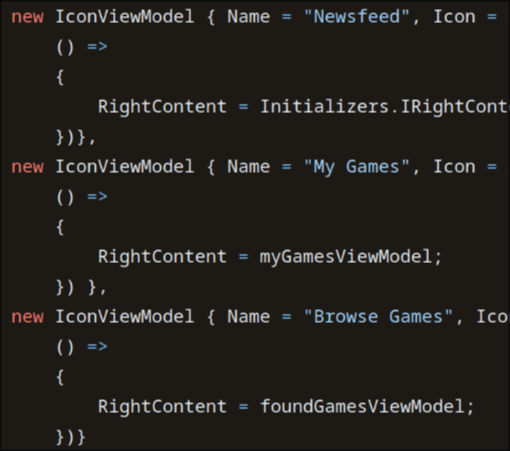

```
status: accepted  
date: {2023-08-15 when the decision was last updated}  
deciders: App Team @ 2023-07-19 Meeting  
```

# Internationalisation and Localisation

## Context and Problem Statement

Internationalisation and Localisation, referred to as `i18n` and `l10n` onwards, describe the process of adapting our code to be locale agnostic.

Currently, our UI contains hard-coded strings, meaning the values are constant and part of our code:



Although hardcoding strings makes designing and implementing user interfaces straightforward, it also means that we force English as a UI language.

### Additional Details

`i18n` and `l10n` also encompass formatting rules for various constructs like numbers, date and time, currencies, as well as text layouts. English is left-to-right and top-to-bottom horizontally, but other languages read from right-to-left and some even vertically. 

Text can also sometimes greatly vary in length. If a button has a text of length `10` in English, it might only contain two characters in Japanese or `20` in German. If the UI isn't designed or able to adapt to drastic changes in text, it will lead to text cutoff, undesired wrapping behavior or make the text completely illegible.

Another issue are fonts. Most fonts used on the web only support a limited amount of characters, typically based on Roman alphabet. CJK fonts (**C**hinese, **J**apanese, and **K**orean), like [Noto by Google](https://fonts.google.com/noto), are special fonts that contain a vast amount of characters from all parts of the world.

These are usually not required by websites, since browsers have fallback fonts, however, for applications that render text directly, such as ours, rendering an unsupported character might result in white boxes: https://github.com/jellyfin/jellyfin/issues/5008


## Decision Drivers

* Support Common Languages (EN, SP, CN) etc.  
* Make Modding Easier (TM) [for non-native speakers].  
* Editing translations for people must be easy.  

During discussion, we decided that we only intend to support Left To Right languages (LTR), which makes it a non-driver in decision making. 

This is down to the design overhead involved; as adding RTL support would require entirely new UI layouts/designs.

## Considered Options

* DIY Solution involving Loading ResourceDictionary per language.  
* .resx files.  
* Custom code-behind.  

## Decision Outcome

Chosen option: `.resx files`.

### Consequences

* Good, because the solution is compile time safe.  
* Good, because translators can use existing translation services (like [Weblate](https://docs.weblate.org/en/latest/formats/resx.html)).  
* Bad, because translators cannot see the changes within the UI [without installing dev tools & recompiling].  
* Bad, because `.resx` files can introduce minimal stutter as changing locale requires a new DLL load every load.  

## Pros and Cons of the Options

### DIY Solution

This solution involves loading language translation through Avalonia ResourceDictionaries via `.axaml` files.  

* Good, because translators can see new translations immediately.  
* Good, because making translations requires no specialised tooling or recompilation (just a text editor).  
* Good, because translation can be effortlessly changed on the fly.  
* Bad, because this solution is not compile time safe.  

### RESX files

We use resource `.resx` files, comprised of 1 default file, then 1 language per locale.

* Good, because this is familiar to many developers [industry standard], making it easier for external contributors.  
* Good, because there is a lot of external 3rd party tooling to allow editing resource files for non-technical users.  
* Good, because the solution is compile time safe.  
* Bad, because translators cannot see their changes inside actual app when translating.  

### Custom Code-Behind

A custom implementation that involves dynamically fetching string values which are read from either a file or embedded resource.

* Neutral, because this is basically doing the `.resx` solution, but with some manually created tooling.  
* Bad because no convenient user tooling exists for this one.  

## Common Drawbacks

In cases where we originally used string interpolation, such as 

```csharp
$"Hello {user}"
```

This code would have to be changed to:

```csharp
// using resources (or equivalent)
// Resources.Hello is "Hello {0}"
string.Format(Resources.Hello, user);
```

The issue here is that `Hello {0}` injects a parameter into the `string.Format` function. When people PR/submit translations, we need to ensure that people correctly insert the format placeholders `{0}`, `{1}`, etc.

## More Information

- We will need to seek alternative fonts down the road for CJK support; since our design system with Roboto and Montserrat do not support such fonts.