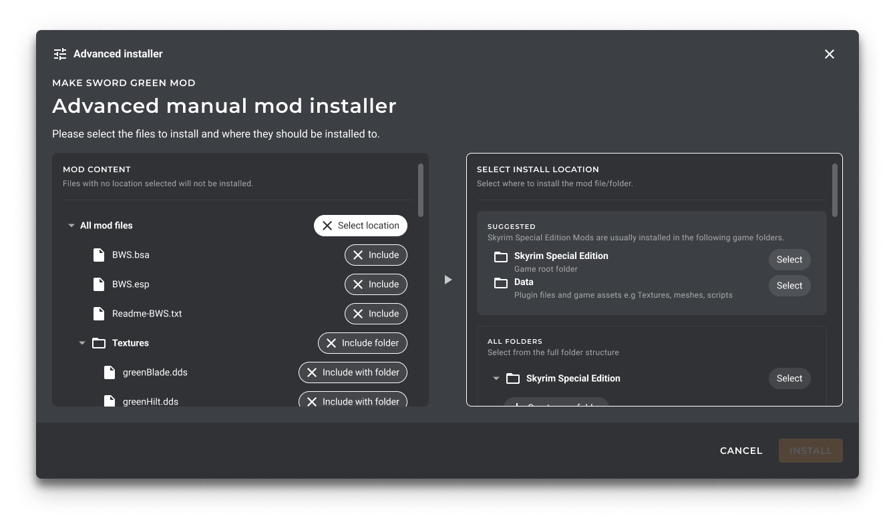

# Advanced Installer: Suggestions

This document describes the design of the 'Suggestions' system within Advanced Installer, pictured
in the following mockup below:



## Context Statement

When using the Advanced Installer, the user should be provided with 'hints' dictating where a file might
require to be placed based on a number of heuristics.

This is part of the UX effort to 'Make Modding Easy' and a general requirement of our [Advanced Installer Design](./0009-advanced-installer-design.md).

## Considered Options (Suggestions)

- Reusing the Deployment System (`InstallFolderTarget`) for suggestions.
- Creating a Suggestion System from scratch.

## Decision Outcome

Rather than splitting the metadata in two, we can leverage the existing
`InstallFolderTarget` system in order to implement Advanced Installer suggestions;
as that system already has required metadata.

### Consequences

- [Good] Strong code reuse as `InstallFolderTarget` already has required metadata to support this functionality.
- [Neutral] Each `InstallFolderTarget` folder will now need a description.
- [Neutral] All games will need to be converted to new `InstallFolderTarget` system.
- [Negative] The `InstallFolderTarget` list may not contain all folders that the user may want to drop their files manually to.

## Implementation: Reuse of `InstallFolderTarget`

The parts of `InstallFolderTarget` which are usable by the suggestion system will be lifted out into a new interface,
shown below:

```csharp
/// <summary>
/// Represents a target used for suggestions for installing mods within the Advanced Installer.
/// </summary>
public interface IModInstallDestination
{
    /// <summary>
    /// GamePath to which the relative mod file paths should appended to.
    /// </summary>
    public GamePath DestinationGamePath { get; init; }

    /// <summary>
    /// List of known recognizable file extensions for direct children of the target <see cref="DestinationGamePath"/>.
    /// NOTE: Only include file extensions that are only likely to appear at this level of the folder hierarchy.
    /// </summary>
    public IEnumerable<Extension> KnownValidFileExtensions { get; init; }

    /// <summary>
    /// List of file extensions to discard when installing to this target.
    /// </summary>
    public IEnumerable<Extension> FileExtensionsToDiscard { get; init; }
}
```

## Acquiring `IModInstallDestination`(s) During Deploy Step (a.k.a. `GetModsAsync`)

Extend the `GameInstallation` abstract class to expose a property which returns `IModInstallDestination`(s) for the
game's most common directories. To do this, we will add an abstract method into `AGame`, to accompany the existing `GetLocations()` method.

This property is populated with the following elements:

- All `GamePath` entries (i.e. Game folder, Save folder, Config folder, etc.)
- All `InstallFolderTarget` entries (e.g. `Data` folder for Skyrim.), as `IModInstallDestination`.
- Custom `IModInstallDestination`(s) defined on a per game basis.
- Remove duplicates.
- Apply the filtering steps detailed below. (Detailed in future ADR/Issue)

This interface can be accessed during the deploy step under `GameInstallation` structure.

Note: Currently we don't auto fetch, `InstallFolderTarget`(s) [as in, auto add targets with 0 code] for the following reason(s):

- We might potentially one day have directories that `GenericFolderMatchInstaller` might use, but we don't want to display to user.
- We can only pull locations from `GenericFolderMatchInstaller` in current code, but that lives in an inaccessible package/project from `AGame`.
