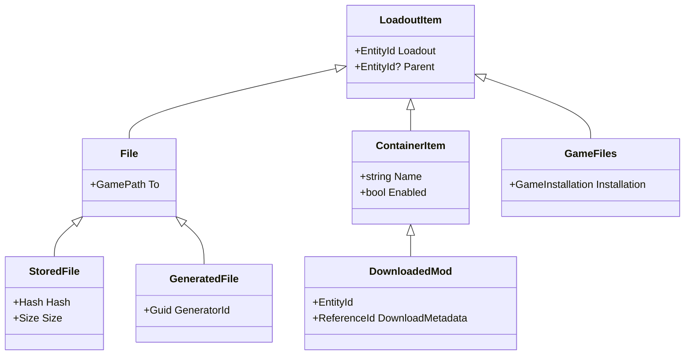

# Loadout Items

## Context and Problem Statement

Currently, the app follows the standard mod manager approach of loadouts being a tree of `loadout -> mods -> files`

## The Current Situation
The current approach is mostly driven by tradition, the fact that other mod managers do it this way, mostly due to the need
keep files on disk extracted so they can be linked into the game folder or easily accessable by VFS code. This is not a hard
requirement for us, and we can do things differently

To start this design process, let's enumerate the sorts of things we would want to store in a loadout:

- Mods downloaded from the internet
- Config files for these mods
- FOMOD or installer option selections
- 'Stored files' or files that are used verbatim by the game, like textures or meshes
- Generated files, like merged patches or bashed patches
- Game settings, like INI files
- Nexus Collections installed by the user. 

## The Solution

The decision made (mostly through online discussions) is to store all of these items in a single parent model in MnemonicDB:
this will be called a `loadout item` and the specific behavior of each item will be based on the polymorphic nature
of these models. To start, we will design the fairly simple data model:

Each item points to the loadout it belongs to, and can optionally point to a parent item. This allows us to build a tree
of these items with various relationships. In this model, downloaded mods, become more of a tag for the items they contain
and less of strongly typed model. These container items can be enabled or disabled as a group, (eventually collections will
also be containers).

## Impact on various parts of the app

### Loadout View Model

The Loadout View Model, in this model becomes a list of all ContainerItems, their names, their creation times, etc. The code
to find these items mostly becaomes `ContainerItem.FindByParentId(db, loadout)`.

### Synchronizer

The Synchronizer will need to be updated to handle the new model, flattening a loadout becomes a matter of finding all `File`
items that point to the loadout, then walking all those items to make sure each parent is enabled.
