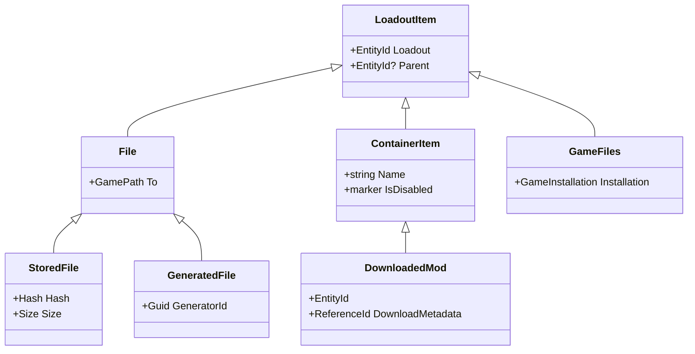

# Loadout Items

## Context and Problem Statement

Currently, the app follows the standard mod manager approach of loadouts being a tree of `loadout -> mods -> files`

## The Current Situation
The current approach is mostly driven by tradition, the fact that other mod managers do it this way, mostly due to the need
keep files on disk extracted so they can be linked into the game folder or easily accessable by VFS code. This is not a hard
requirement for us, and we can do things differently

To start this design process, let's enumerate the sorts of things we would want to store in a loadout:

- Mods downloaded from the internet
- Config files for these mods
- FOMOD or installer option selections
- 'Stored files' or files that are used verbatim by the game, like textures or meshes
- Generated files, like merged patches or bashed patches
- Game settings, like INI files
- Nexus Collections installed by the user. 

## The Solution

The decision made (mostly through online discussions) is to store all of these items in a single parent model in MnemonicDB:
this will be called a `loadout item` and the specific behavior of each item will be based on the polymorphic nature
of these models. To start, we will design the fairly simple data model:

Each item points to the loadout it belongs to, and can optionally point to a parent item. This allows us to build a tree
of these items with various relationships. In this model, downloaded mods, become more of a tag for the items they contain
and less of strongly typed model. These container items can be enabled or disabled as a group, (eventually collections will
also be containers).

## Impact on various parts of the app

### Loadout View Model

The Loadout View Model, in this model becomes a list of all ContainerItems, their names, their creation times, etc. The code
to find these items mostly becaomes `ContainerItem.FindByParentId(db, loadout)`.

### Synchronizer

The Synchronizer will need to be updated to handle the new model, flattening a loadout becomes a matter of finding all `File`
items that point to the loadout, then walking all those items to make sure each parent is enabled. Stated another way, the
loadout is flatted down by grouping all loadout items by `To` that are not an ancestor of a item that has the `Disabled` marker
attribute.

Naturally this approach does not handle file conflicts, but it is assumed that these conflicts will be rare in most cases. When these
conflicts do occur the Synchronzier will pass the options to a `ResolveWinningFile` method that will pick which of the conflicting
files is the winner. Due to this approach it is not required that loadout items or mod be sorted, instead only the conflicting
files need to be ordered, in which case the ordering is often trivially detected based on the files and mods in question

### Mod Library

The mod library grid will look in the loadout for any loadout items with the given `DownloadMetadata` and use this to drive
the "installed" or "not installed" states in the grid. 

### Diagnostics

Diagnostics likely will need to be updated to handle specific types of loadout items, the biggest changing being moving 
mod referencs to container/downloaded mod items. 

### Stardew Valley Updates

Stardew valley installers will need to be updated to emit a single parent container of the type DownloadedMod that contains
other containers of "SMAPI Mod" which each contain the files of the mod. In future UI updates we can decide if we want
to display all of these mods as a list, a tree, or only the top or lower levels of the tree. 

## Rationale

The primary motivation for this change is to move questions of what a specific object is from code-time to runtime. Displaying
items in a grid or a tree, or projecting parts of the loadout item tree into a list all now become runtime concerns and 
we are free to project the data in any way required. New file or container types can be added to this process and existing
grids and lists should work as-is. 
