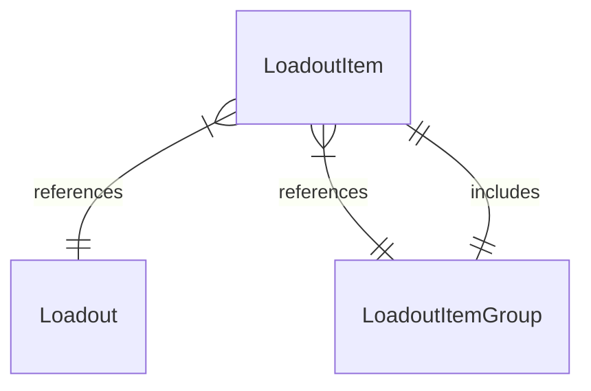

# Loadout and Library Items

## Context and Problem Statement

The data model of Loadouts containing "Mods", and "Mods" containing Files is inadequate. The definition of a "Mod" is ambiguous and leads to miscommunication and misunderstanding. A mod manager is supposed to manage mods, but we're doing much more. In this subpar data model, "Game Files" and "Overrides" are also considered to be "Mods". Any additional features would need to be shoehorned into the definition of a "Mod" resulting in convoluted design implementations and backend data queries.

## The Solution

Instead of trying to force the use of "Mod", the decision was made to use "Loadout Items". A `LoadoutItem` is just that, an item in a Loadout with a name. Expanding on this, we have `LoadoutFile` which represents a file and includes `LoadoutItem`. There are many more subtypes of `LoadoutItem` and extensions are free to add more as they see fit. Another core type is the `LoadoutItemGroup`. This type itself is also a `LoadoutItem` and any `LoadoutItem` can be part of a `LoadoutItemGroup`:

This model is a tree structure and allows for arbitrary grouping of items. Previously, we'd run into issues where one archive might install three SMAPI Mods. The previous model would struggle here since the user expects one "Mod" to appear, but we installed three. The new model doesn't have this issue, as you'd get one "top level" group containing the three SMAPI Mods.

Another important part of our data model is the Library. Previously named "File Origin Registry", it was a complete mess of hacked together models representing downloads. The relationship between the Library and Loadouts was also difficult to understand.

As a counterpart to `LoadoutItem`, the new model has `LibraryItem`. This represents an item in the Library. Further classification is possible, and the model has additional types like `LibraryArchive` for archives in the Library. Similar to the situation with "Mods", the old model tried to shoehorn everything into the definition of a "downloaded archive".

The link between the Library and Loadouts with the new model is very clear with the new `LibraryLinkedLoadoutItem` type that directly references the `LibraryItem` that the `LoadoutItem` is linked to.

## Impact

Besides reducing the amount of technical debt and hacked together code that was very convoluted and unmaintainable, the new types allow for easier and precise querying of relevant data. Installers can easily create subtypes of `LoadoutItem`, and diagnostic emitters can easily query those and use the data provided by the installers.

Implementing designs is also made much easier for the same reasons. Many queries can be abstracted and UIs can be unified to show the same data across the entire App. This allows us to implement more complex designs that were previously not feasible.
