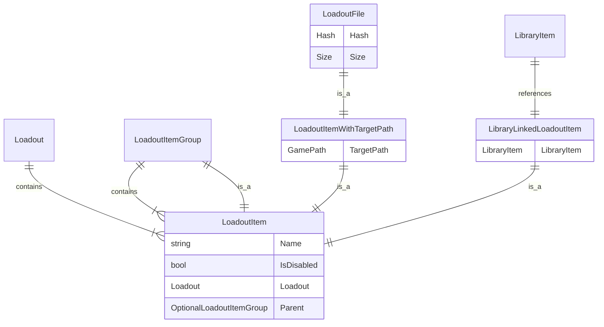
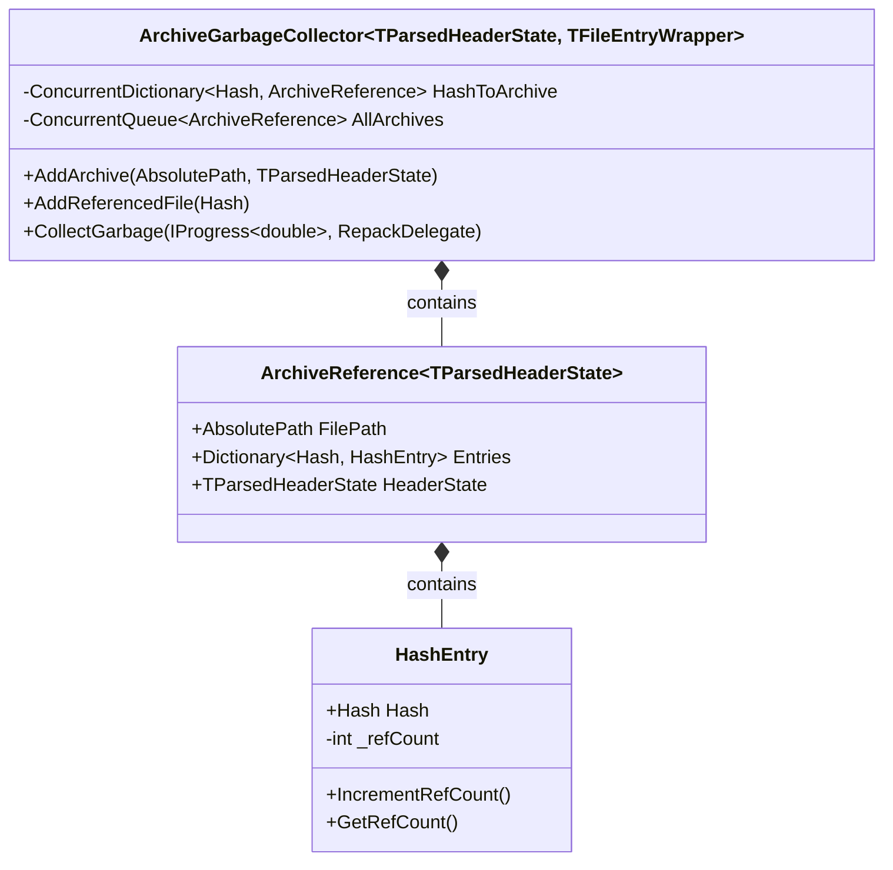
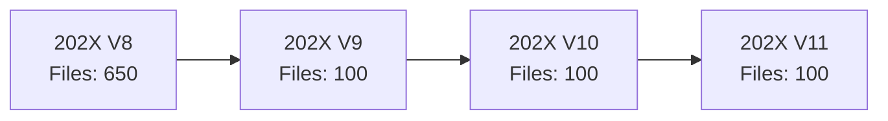
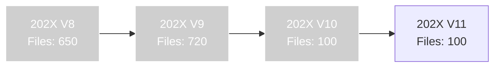

# Context and Problem Statement

!!! note "This is a design document"

    This document focuses more on how GC will be implemented in the application,
    rather than the tradeoffs/benefits of having a GC in the first place, etc.

As users interact with the application, creating and deleting loadouts, mods and more;
there will be an ever-growing amount of files which are no longer needed on disk.

Sources of unused files may include:

- Removed loadouts.
    - ***Example:*** After removing a loadout, some `LoadoutItems` backed by a file are no longer referenced in any loadout.
- Trimmed/reset loadout history.
    - ***Example:*** Removing loadout history will remove references to `LoadoutItems`, which will leave unreferenced files.

## Design Overview

The Garbage Collection mechanism is implemented using a `mark-and-sweep` approach.

This can be broken down into the following steps:

- [Parse all `Nx` archives used by the App](#parsing-nx-archives).
    - The `Nx` archives contain the hashes of all files in its headers.
    - This finds out all the files we've got packed.
    - This gives us ***AllFileList (A)***
- [Perform a `mark` phase through the DataStore.](#performing-the-mark-phase)
    - Find all files that are in use.
    - This is any `LoadoutItem` which is a file (`LoadoutItemWithTargetPath`) that is not marked as deleted (retracted).
    - And also any item marked as `BackedUpFile`.
    - This gives us ***UsedFileList (B)***.
- [Remove all elements in ***AllFileList (A)*** that are *not* in ***UsedFileList (B)***](#removing-unused-items).
    - The removal process involves `'repacking'` all archives which have had their files
removed to exclude the files that are no longer needed.

### Parsing Nx Archives

!!! note "This process involves identifying all archives the App has available, and which files are contained within them."

The App may extract files from archives from a number of locations, not just a single folder.

These locations are (today) declared by [DataModelSettings.ArchiveLocations][archive-locations], and would
be customizable by the user in the future.

To obtain the list of all files the App can extract, we find all `.nx` files within
each of the `DataModelSettings.ArchiveLocations` locations and use the
[HeaderParser][header-parser] API. From there we can access the `Entries` field
and obtain the hashes of all files in the archive.

!!! note "This process takes around 60us for a typical `.nx` archive (4K header) and an NVMe SSD."

    Though expect it to take longer in practice due to high handle open overhead
    (especially on Windows).

### Performing the Mark Phase

!!! info "How we identify all the 'used' files."

As with any `Garbage Collector`, we need to identify all the 'roots' of a tree
from which files may be referenced from.

***As of current time, the following are the known roots in the `DataStore`:***

- Mod Library
    - Any item in the library may be added to a loadout at any time, thus must
      not be deleted.
    - More specifically, we're interested in `LibraryArchiveFileEntry` objects
      which are not retracted. These are the files that are stored inside archives
      added to the library.
- Loadouts
    - Loadouts have some `LoadoutItems` which do not correspond to a `LibraryItem`.
    - Example: `Overrides` (External Changes) files.
- Backed up files
    - Base type of `BackedUpFile`.
    - Derived types may use names like `SynchronizerBackedUpFile`.

The `DataModel` has the following approximate structure:



!!! note "`Loadouts` can contain any item which derives from `LoadoutItem`."

    This includes `LoadoutItemGroup`, `LoadoutItemWithTargetPath`, `LoadoutFile` etc.
    These links have been omitted for clarity.

!!! note "Additional types based on `LoadoutItemWithTargetPath` may exist."

    For example something like `{ModFramework}LoadoutFile`, etc.

In order to scan for files, you iterate over all loadouts that are not retracted/deleted;
then walk through all of the `LoadoutItem` instances which derive from `LoadoutItemWithTargetPath`; this
will get us the `Game Files` and `Overrides` files.

Then we must walk through all the files associated with `LibraryItem` instances, as
these may be re-added any time through the mod library.

All of these items would go in the [UsedFileList (B)](#design-overview).

!!! danger "Unaccounted files will lead to disaster."

    A file that is used, but has not been seen as the GC will be deleted.
    That's no good!!

Contributors must not put files via a system external to loadouts in one of the
`Archives` directories without adding additional `roots` into the GC.

### Removing Unused Items

!!! info "This is also known as `repacking`."

To put it in simple terms, we create a new archive, with some files from the
original archive excluded.

Efficient support for doing this has been added into the Nx library, and is available as part of 
[NexusMods.Archive.Nx 0.5.0 (Release Notes)](https://github.com/Nexus-Mods/NexusMods.Archives.Nx/releases/tag/0.5.0). Most of the time spent repacking is a straight
byte for byte copy of the compressed Nx blocks; aside from the rare occasions where
some files need to be dropped from small (Max `1MB` with current settings) SOLID blocks.

This process is therefore bottlenecked entirely by the speed of I/O.

#### Updating the DataStore

!!! note "An extra step is needed."

The `DataStore` (see: [`NxFileStore`][nx-file-store]), has copies of the [`FileEntry`][nx-toc] structs
from the Nx archives (as [`ArchivedFile`][archived-file]). These include the info needed to
extract the files and must be updated.

!!! danger "Possibility of corruption in event of power loss."

    The new archive file ***MUST NOT*** replace the old archive on the filesystem.

It is not possible to replace the old `.nx` archive and update the [`ArchivedFile`][archived-file]
entries in an atomic fashion. Therefore, during repacking, always create a *new* archive file,
and then point the existing [`ArchivedFile`][archived-file] entries to the new archive instead.

#### Concurrency and Locks

!!! warning "Files actively in use by [`NxFileStore`][nx-file-store] cannot be deleted during `GC` process."

A concurrent change to [`ArchivedFile`][archived-file] in itself is not dangerous, given that
by the time it is updated, the new archive will exist alive and well.

However, if [`NxFileStore`][nx-file-store] is actively extracting a file from an archive,
the GC should not delete the source `.nx` archive, a lock must be placed to prevent
that edge case from happening.

#### Edge Case: Duplicate Items

!!! danger "Sometimes we may have a duplicate item in two distinct `.nx` archives."

Sometimes developers may make an error while working on the App and not put the correct
safety procedures (i.e. taking a write lock) to ensure that no duplicates are created
within the Nx Archives.

This is dangerous, because there are two sources of truth
for where a given hash is stored, *the archives* and [*the DataStore*](#updating-the-datastore).  

##### Reproduction

To understand the dangers involved, let's try reproducing the bug.

!!! note "The bug is fixed today."

    Today, the 'bug' is fixed as of commit ( `34de799623cf9688e6c3dcabca7fe029426583ed` ) , however prior to it;
    the bug could be reproduced in the way listed below.

We will make an assumption that we have an un-patched GC and faulty code that
creates duplicates.

Create 2 archives:

- dummy-1 (zip)
- dummy-2 (zip)

Inside `dummy-1`, add 1 file.
Inside `dummy-2`, add the file from `dummy-1`, and an additional file.

Add the `dummy-1` and `dummy-2` archives from disk in the following order:

- dummy-1
- dummy-2

Adding `dummy-2` creates a duplicate file due to an error by the programmer,
the `DataStore` entry for the duplicate hash will be re-routed to `dummy-2` when
it previously pointed to `dummy-1`.

If we now delete `dummy-1`; the error should have a 50-50 chance of reproducing;
depending on order archives are processed. There is a risk retracting the item in the
DataStore will retract the item in the wrong archive/container.

!!! note "There is some RNG involved."

    Reproduction is non-determinstic, due to nature of data.
    Bigger archives with duplicates are more likely to yield errors.

    So you can replace `dummy-1` with `SMAPI 4` and `dummy-2` with `SMAPI 3` 
    for a more reliable reproduction.

## Core Code Design

!!! abstract "The main modular 'core' of the GC lives as `ArchiveGarbageCollector<TParsedHeaderState, TFileEntryWrapper>`"

It is composed of the following building blocks:

1. `ArchiveGarbageCollector<TParsedHeaderState, TFileEntryWrapper>`: The main entry point for the Garbage Collection process.
2. `ArchiveReference<TParsedHeaderState>`: Represents an individual archive file.
3. `HashEntry`: Tracks reference counts for individual file hashes.



### Process Flow

!!! info "Explains how to use the `ArchiveGarbageCollector`."

1. Archive Collection
    - Method: `AddArchive(AbsolutePath archivePath, TParsedHeaderState header)`
    - This performs the [Parsing Nx Archives](#parsing-nx-archives) step.
    - We determine ***AllFileList (A)***.

2. Reference Marking
    - Method: `AddReferencedFile(Hash hash)`
    - This helps perform the [Mark Phase](#performing-the-mark-phase).
    - Increments the reference count for each file hash found in `HashToArchive`.
    - We determine ***UsedFileList (B)***.

3. Garbage Collection and Archive Repacking
    - Method: `CollectGarbage(IProgress<double>? progress, RepackDelegate doRepack)`
    - Iterates through all archives, creating a list of file hashes with reference count >= 1.
    - If the number of referenced files is less than the total files in the archive, trigger a repack operation.
    - Any files in archive but not in  (in **AllFileList (A)** but not **UsedFileList (B)**) should be removed.

For example use, please see the tests.

!!! question "Why is there a reference count?"

    [For future use with archive compaction.](#archive-compactionmerging)

### Repacking Callback

!!! info "The `repacking` process is delegated to a user provided function"

As seen in the `CollectGarbage` method above.

```csharp
public delegate void RepackDelegate(IProgress<double> progress, List<Hash> hashes, ArchiveReference<TParsedHeaderState> archive);
```

This makes testing easier, and provides greater flexibility.

To this method we plug a function to [Remove Unused Items](#removing-unused-items)
and [Update the DataStore](#updating-the-datastore).

## Open Questions

- When should Garbage Collection run?
    - Should it be triggered in the background automatically?
    - Or perhaps as part of events like loadout deletion?
- Are there any specific optimizations needed for very large numbers of archives or files?
    - Other than the ones already brought up in this ADR. 

Some of these will be decided in the future, based on results.

## Future Work

These items would eventually require their own separate ADR and issues.

### Hard deletion of old loadout data on GC.

!!! note "Post GC, legacy loadout data does not serve much usefulness"

Leftover legacy data in the Database would instead slow down queries, including
those needed by `Garbage Collection` itself. Ideally, entire entities could be completely
removed from the `DataStore`. 

### Limiting Archive Sizes on Backup

!!! note "Performance of the [repacking](#removing-unused-items) step is limited by disk speed."

Some mods, for example [Skyrim 202X: Architecture][202x-architecture], can be quite large;
for instance, in this case, around 10GiB.

This is problematic, because if you download an update to this mod, which has *some*
new files, and then delete the old version; a large amount of the 10GiB archive may
still be used. In which case this amounts to a 10GiB copy.

The current proposal is to limit archive size to 1GiB; but this may change in the future.

### Archive Compaction/Merging

!!! note "Removal of Mod Versions/Revisions May lead to Fragmentation of Mod Files"

Consider a situation where you have a long-lived loadout with some large mods:



(Where each version's file count shows a number of `new` or `changed` files.)

Eventually you may delete a loadout, or trim the history of a loadout, which may
leave you with a situation like this:



If you want to extract `202X V11`, you'll need to extract the contents left in the
original archives made by `V8`, `V9`, `V10`, and `V11`; even though the older
versions of these mods no longer exist.

In the long term, this sort of fragmentation will lead to a lot of
handle opens and as a result, slow apply times (especially on Windows).

No planned work for this yet; just a far future concern needing addressing.

## Meeting Notes

- [https://github.com/Nexus-Mods/NexusMods.App/issues/1186#issuecomment-2244744526](https://github.com/Nexus-Mods/NexusMods.App/issues/1186#issuecomment-2244744526)

[archive-locations]: https://github.com/Nexus-Mods/NexusMods.App/blob/6a9cee951ad68e17bf24e4e64aa8906f5a63a590/src/NexusMods.DataModel/DataModelSettings.cs#L27
[header-parser]: https://nexus-mods.github.io/NexusMods.Archives.Nx/Library/Headers/HeaderParser/
[202x-architecture]: https://www.nexusmods.com/Core/Libs/Common/Widgets/DownloadPopUp?id=480708&nmm=1&game_id=1704
[archived-file]: https://github.com/Nexus-Mods/NexusMods.App/blob/93c9c5e124e53ac1ceb1dbcc978b8a8f6de59914/src/NexusMods.DataModel/ArchiveContents/ArchivedFile.cs#L17
[nx-file-store]: https://github.com/Nexus-Mods/NexusMods.App/blob/93c9c5e124e53ac1ceb1dbcc978b8a8f6de59914/src/NexusMods.DataModel/NxFileStore.cs#L31
[nx-toc]: https://nexus-mods.github.io/NexusMods.Archives.Nx/Specification/Table-Of-Contents/
