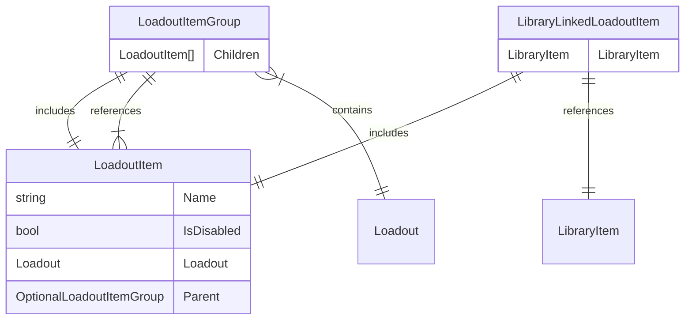

!!! info "Removing items from the `Library` is a tricky subject."

## Problem Statement

!!! info "In other words, what is the context we're working with."

- Mod Library is a collection of mods we have downloaded, or added from other sources.
- A mod (LoadoutItem) is added to a loadout via the library,
- We want to remove items from the Library.
    - And ultimately get rid of used space via [Garbage Collection].

## View of our DataModel

We have `many` loadouts which each contain many `LoadoutItems`.

!!! note "A `LoadoutItemGroup` is a `LoadoutItem` which is a collection of `LoadoutItem`(s)."

Each `LoadoutItem` is linked to a `LibraryItem` via a join entity called `LibraryLinkedLoadoutItem`,
***HOWEVER*** not all `LoadoutItem`(s) are linked to a `LibraryItem`.

For example:

- A `LibraryItem` that was never added to a `Loadout` will not have a `LibraryLinkedLoadoutItem` entry.
- A `LibraryItem` may have multiple `LibraryLinkedLoadoutItem` entries, if added to multiple loadouts.
- Some `LoadoutItem`(s) may not have a corresponding `LibraryItem` at all.
    - For example: The `Game Files` and `Overrides` are not `LibraryItem`(s), but are `LoadoutItem`(s).

## Edge Cases

!!! info "When we delete a mod or number of mods from the Library, there are several cases we need to consider."

- `IsNexus`: Whether a mod was downloaded from Nexus Mods
    - Explanation: `Nexus Mods` is currently the only currently supported mod source that
      has guarantees files will always be available for download. (Files are not removed)

- `IsDownload` && `!IsNexus`: Whether a mod was downloaded from ***NOT*** Nexus Mods
    - Explanation: Files on other websites may be removed by the site, mod author, or other reasons.
    - We should warn the user that recovering the mod may be difficult.

- `IsManuallyAdded`: Whether a mod was added manually by the user from a raw archive file.
    - Explanation: The user may have added a mod from a source that is not a mod site.
    - The mod can only be recovered if the user still has the original file.

- `IsAddedToAnyLoadout`: Whether the mod has been added to any loadout.
    - Explanation: The mod will need removing from all loadouts it is in.
    - ***The user should be warned*** about this, before proceeding.

Having to support multi-select makes this a bit more complex too.
States may be mixed, for example you can select an item that is both `IsNexus` and `IsManuallyAdded`.

One of these should show a warning, the other should not.

## UI Behaviour

- `IsNexus`: No warning.
- `IsDownload` && `!IsNexus`: Warning that file may not be restored because it may be deleted.
- `IsManuallyAdded`: Warning that file may not be restored because it's from disk.
- `IsAddedToAnyLoadout`: Warning that the mod is in a loadout and will be removed from it.

## Current Status

!!! info "Some of these cases don't currently apply, thus the actual warnings are not implemented."

- `IsNexus`: N/A
- `IsDownload` && `!IsNexus`: N/A
- `IsManuallyAdded`: ✅
- `IsAddedToAnyLoadout`: ✅

If the case is not checked, we don't currently support the use case
(e.g. restore a download, rollback a loadout), and thus the warning does not
strictly need to be shown.

[Garbage Collection]: ../backend/0017-garbage-collector-design.md
