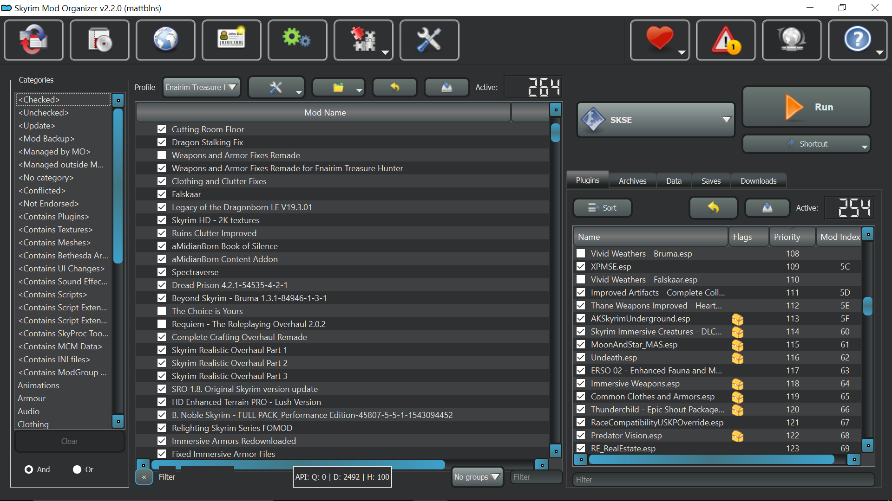
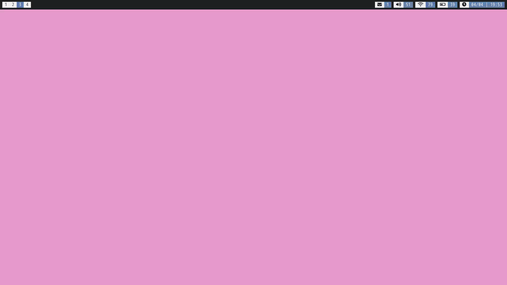
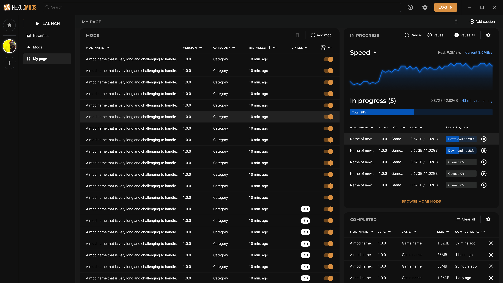

# UI Panel (or widget) layout in the app

## Context and Problem Statement

We have a rather broad range of use cases in the app. Some of our users are beginners at modding, others are experienced
users who don't want to be held back by the software. Some users have ultra-wide monitors, others have small laptops, still
others have multiple monitors. In general we want to support all these options while still making the interface easy to
understand and use.

## Decision Drivers
While researching approaches to this design we looked at several options. The main drivers for our decision were:

* Make the UI easy to extend with new tools. We shouldn't have to figure out where to "fit" a visualizer or tool, we should simply be able to make an interface and have it
  be added to the UI via the DI system
* Don't limit ourselves to a UI design that is not forward thinking enough. Sure we may only want one texture viewer today, but what if we want to view two textures side-by-side?
* Everyone has a different workflow, so make the UI adaptable to portrait, landscape, and ultra-wide monitors, as well as Steam Deck displays
* The UI should come with sensible defaults, with options for experts to really leverage the power of the application on their setups.
* Make the UI discoverable by new users, you shouldn't need arcane incantations to get the UI to do what you want.

## Examined Products

### Vortex
Vortex offers limited UI configuration of most of the UI, but the dashboard is quite customizable:

While the rest of the app has a horizontal-only, two panel viewing model.

This is sub optimal for widescreens that would like to split vertically or optimally have multiple panels open at once.

### Mod Organizer 2
This app features a two pane system, split vertically but with tabs on the right pane to allow the user to switch between
different visualizers for the files and loadout configuration. This is a good approach for a two pane system, but it doesn't
allow for more than two panes, and it doesn't allow for horizontal splitting, or any splitting at all.

### Tiling Window Managers
Tiling window managers are a class of window managers that automatically tile windows on the screen. They are popular with
power users because they allow for very efficient use of screen real estate. In this example (taken from the [flashfocus](https://github.com/fennerm/flashfocus) project)
each time a button is pressed, the current pane is split in half, and the new pane is focused. This is a rather extreme
case of minimalizm, but in the hands of an expert it can be very powerful. In addition these panes are often used
for notifications and popups. If a modal dialog is opened, it will be opened in a new pane, and the user can easily switch
to that pane, and then close it when they are done (or it may auto close).

### Blender
Blender is a 3D modeling application that has a very flexible UI. It allows the user to split the screen horizontally or vertically
to create new panels. Each panel has a header that allows the user to change the type of panel it is. In addition panels
can be swapped between different areas of the UI, and combined. These layouts are stored in the .blend file, so they are
persistent between sessions and even across machines. This often results in developers creating a layout that works for them
and then cloning that into each additional project they create.

### Previous mockup done by the UI team
This mockup was done by the UI team to show what a UI might look like with a multi pane system. It was done before any meetings
on the subject or before this ADR was written. However it has one key features the other examples don't have, a rather basic
"Add Pane" button. This helps a bit with discoverability so that users don't need to know to right click separators. They can
click "add pane" and then choose the type of pane they want once the default is shown. We can still add the right click menu
to the separators for power users, but this helps new users get started.

## Decision Outcome
After much discussion we've kindof decided to go "whole hog" on support in the UI, thus we propose the following:

* Make a UI grid for Avalonia that takes a set of ViewModelHosts and displays them in a grid, with movable separators between them.
* The most recent pane to be focused will be tracked by the grid at all times. Blender displays this as a slight tint to the header of the pane, we may do the same
* Clicking "Add Pane" Button will by default try to split the biggest pane in half in a way that results in the most 1:1 ratio of width and height
* Split menus will be added to the separators for power user, and by default they will split at the position of the mouse cursor. No fancy preview splitting will
  be supported at first, we can add that feature later
* All layouts should savable as JSON data, so that we can persist them between sessions and across machines.
* Each pane will have the following properties
    * A title
    * A Unique ID/Type (for saving and loading the state later)
    * A ViewModelHost for the content of the pane
    * A ViewModelHost for the header of the pane. This header will exist as a toolbar above the rest of the pane.
* Via switching a boolean on the grid, it will swap into a tabbed mode, where each pane becomes a separate tab, and the tabs can be toggled through via a "Next and Previous" commands.
  this will most often be used on the Steam Deck, but it may also be useful for users who want to focus on one pane at a time on a small screen. Also in this mode, the header for the
  pane will be integrated into the main toolbar.
* For multi-monitor support we will allow for multiple windows to be active from the app at once, launching a new window will simply create a new instance of the app's MainViewModel.

### Consequences
Building this UI will take a lot of time, but it's not extremely difficult work. Movable separators are already supported in Avalonia, and the rest
of the hard work in this project is related to data management and saving/loading the layouts.

Another consequence of this design is that we may choose to make components even more modular than they are now. For example, we may want to break the
downloader component into "Downloading", "Completed", and "Download Performance" panes. 