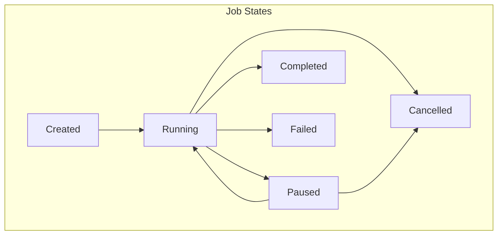
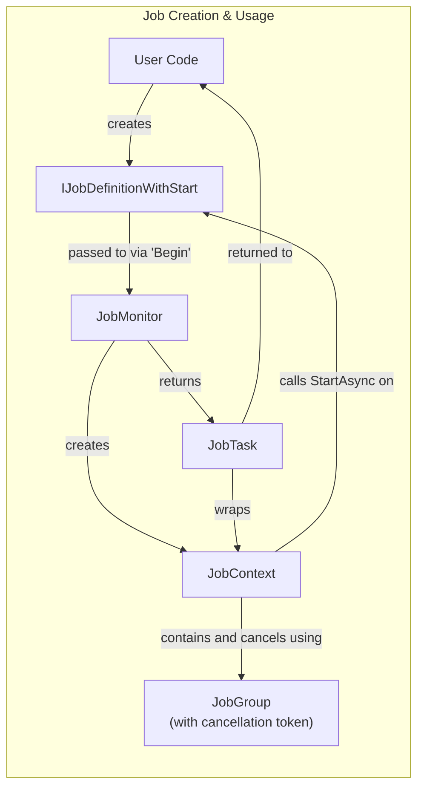

# Jobs System

## Overview

The Jobs system in NexusMods.App is how long-running background tasks are spawned.

These feature progress tracking, cancellation support, and error handling.

Examples of jobs include downloading files and installations.

## Architecture

The Jobs system is built around several key components that work together to provide a comprehensive task management solution:





!!! note "JobGroup instances are created internally via JobGroupCreator"

    But that class is currently effectively unused.

## Core Components

### IJobDefinition

The base interface for all job definitions. Job definitions describe what work needs to be done and contain any parameters needed for execution.

```csharp
public interface IJobDefinition;

public interface IJobDefinition<TResultType> : IJobDefinition
    where TResultType : notnull;
```

### IJobDefinitionWithStart

A specialized job definition that includes its own execution logic via the `StartAsync` method:

```csharp
public interface IJobDefinitionWithStart<in TParent, TResultType> : IJobDefinition<TResultType>
    where TParent : IJobDefinition<TResultType>
    where TResultType : notnull
{
    ValueTask<TResultType> StartAsync(IJobContext<TParent> context);
}
```

### IJobMonitor

The central component that manages job execution, tracking, and lifecycle:

```csharp
public interface IJobMonitor
{
    // Start a job with external task logic
    IJobTask<TJobType, TResultType> Begin<TJobType, TResultType>(
        TJobType job, 
        Func<IJobContext<TJobType>, ValueTask<TResultType>> task);
    
    // Start a self-executing job
    IJobTask<TJobType, TResultType> Begin<TJobType, TResultType>(TJobType job);
    
    // Job management
    void Cancel(JobId jobId);
    void CancelGroup(IJobGroup group);
    void CancelAll();
    
    // Observability
    ReadOnlyObservableCollection<IJob> Jobs { get; }
    IObservable<IChangeSet<IJob, JobId>> GetObservableChangeSet<TJob>();
}
```

### IJobContext

Provides the execution context for jobs, including progress reporting and cancellation support:

```csharp
public interface IJobContext<out TJobDefinition> : IJobContext 
    where TJobDefinition: IJobDefinition
{
    TJobDefinition Definition { get; }
    Task YieldAsync();
    CancellationToken CancellationToken { get; }
    IJobMonitor Monitor { get; }
    IJobGroup Group { get; }
    
    void SetPercent<TVal>(TVal current, TVal max);
    void SetRateOfProgress(double rate);
}
```

### IJobGroup

Groups related jobs together for batch operations and shared cancellation:

```csharp
public interface IJobGroup : IReadOnlyCollection<IJob>
{
    CancellationToken CancellationToken { get; }
    void Cancel();
    bool IsCancelled { get; }
}
```

## Usage Examples

### Creating a Simple Job Definition

Simple job definitions (using the `Begin` method with a lambda) are used when you
want to handle the execution logic in the same method where you call `Begin`.

The job definition serves as context/data, while the actual work is done in the lambda callback right where you need it.

```csharp
// Use records, as jobs should not mutate their own parameters.
public record MyJobDefinition : IJobDefinition<string>
{
    public string InputData { get; init; } = "";
}

// Usage
var jobMonitor = serviceProvider.GetRequiredService<IJobMonitor>();
var jobDefinition = new MyJobDefinition { InputData = "test" };

var jobTask = jobMonitor.Begin(jobDefinition, async (context) =>
{
    // Access job data through context
    var data = context.Definition.InputData;
    
    // Report progress
    context.SetPercent(0, 100);
    
    // Do some work with the data
    await Task.Delay(1000, context.CancellationToken);
    context.SetPercent(50, 100);
    
    // Check for cancellation
    await context.YieldAsync();
    
    // Complete work
    await Task.Delay(1000, context.CancellationToken);
    context.SetPercent(100, 100);
    
    return $"Job completed with: {data}";
});

// Wait for result
var result = await jobTask;
```

!!! note "In the current codebase, sometimes closures are used to pass the context instead of the `IJobDefinition`"

    This could be improved.

### Self-Executing Job

A job with entirely self-contained logic/context, to fire and (sometimes) forget.

```csharp
// Use records, as jobs should not mutate their own parameters.
// The fields we store here are effectively method parameters passed in
// to run the job.
public record ProcessFileJob : IJobDefinitionWithStart<ProcessFileJob, ProcessResult>
{
    public required AbsolutePath FilePath { get; init; }
    
    public async ValueTask<ProcessResult> StartAsync(IJobContext<ProcessFileJob> context)
    {
        // Access job definition properties
        var filePath = context.Definition.FilePath;
        
        // Report progress
        context.SetPercent(0, 100);
        
        // Process file
        var result = await ProcessFileAsync(filePath, context.CancellationToken);
        
        context.SetPercent(100, 100);
        return result;
    }
}

// Usage
var job = new ProcessFileJob { FilePath = somePath };
var jobTask = jobMonitor.Begin(job);
var result = await jobTask;
```

## Best Practices

### Cancellation and Error Handling

!!! tip "Cancellation Best Practices"
    
    Call `YieldAsync()` around around expensive, time consuming code to support job cancellation.<br/>
    This checks the `CancellationToken`, and throws if necessary.

#### Standard Cancellation

!!! info "Most jobs follow this pattern"

**For Job Callers (Caller)**

To cancel a job, use the `JobMonitor`'s `Cancel()` method:

```csharp
// Cancel a specific job
jobMonitor.Cancel(jobId);

// Cancel all jobs in a group
jobMonitor.CancelGroup(jobGroup);

// Cancel all active jobs
jobMonitor.CancelAll();
```

**For Job Implementations (Callee)**

Use `YieldAsync()` to check for cancellation at natural breakpoints:

```csharp
// AddDownloadJob.cs
public async ValueTask<LibraryFile.ReadOnly> StartAsync(IJobContext<AddDownloadJob> context)
{
    await context.YieldAsync();    // Before starting download
    await DownloadJob;

    await context.YieldAsync();    // After download, before installing to library
    // ... continue processing
}
```

```csharp
// HttpDownloadJob.cs
private async ValueTask<AbsolutePath> StartAsyncImpl(IJobContext<HttpDownloadJob> context)
{
    await context.YieldAsync();    // Before metadata fetch
    await FetchMetadata(context);

    await context.YieldAsync();    // Before HTTP download request
    using var request = PrepareRequest(out var isRangeRequest);
    // ... continue with download
}
```

#### Cancelling Jobs from Within

!!! note "Some jobs allow the user to cancel themselves."

    Sometimes a job may show a confirmation or configuration dialog, whereby
    the user can choose to cancel the job should they decide to not commit.

In those cases, the job needs to be able to cancel itself.
This can be done by simply calling `CancelAndThrow`.

```csharp
// The user did something as part of this job that requires this job
// to terminate itself.
context.CancelAndThrow(ex.Message);
```

##### Cancelling Jobs from Within and External Code

!!! note "Sometimes the job may interact with external components that are unaware of the job system."

    In those cases, make a best effort to propagate cancellation.

Here's an example of how this is done for the `Advanced Installer`:

**For Job Callers (Caller)**

```csharp
// InstallLoadoutItemJob.cs
try
{
    // The `AdvancedManualInstallerUI` throws if the user
    // cancels the installation.
    var result = await installer.ExecuteAsync(LibraryItem, loadoutGroup, transaction, loadout, context.CancellationToken);
}
catch (OperationCanceledException ex)
{
    // Inside our job we propagate this cancellation down
    context.CancelAndThrow(ex.Message);
}
```

And in the AdvancedManualInstallerUI we have:

```csharp
// AdvancedManualInstallerUI.cs
if (!shouldInstall) // User hit 'cancel'.
    throw new OperationCanceledException("The user chose to abort the installation");
```

Ideally propagate without using exceptions, but this is truly an *exceptional* (unusual) case.

### Progress Reporting

!!! tip "**Use percentage for determinate progress** when total work is known"

```csharp
// HttpDownloadJob.cs
await using var outputStream = new StreamProgressWrapper<IJobContext<HttpDownloadJob>>(
    fileStream,
    context,
    (state, tuple) =>
    {
        var (bytesWritten, speed) = tuple;
        // Update percentage.
        // If ContentLength is not set, use Size.One
        // to avoid risk of division by zero.
        state.SetPercent(bytesWritten, ContentLength.ValueOr(static () => Size.One));
        state.SetRateOfProgress(speed);  // Rate in bytes/second
    });
```

### Factory Methods

!!! tip "Often you want to fire a job right away after it is created."

    In this case, make `Create` helper function to encapsulate
    the job creation and job starting logic as one.

```csharp
// HttpDownloadJob.cs
public static IJobTask<HttpDownloadJob, AbsolutePath> Create(
    IServiceProvider provider,
    Uri uri,
    Uri downloadPage,
    AbsolutePath destination)
{
    var monitor = provider.GetRequiredService<IJobMonitor>();
    var job = new HttpDownloadJob
    {
        Uri = uri,
        DownloadPageUri = downloadPage,
        Destination = destination,
        Logger = provider.GetRequiredService<ILogger<HttpDownloadJob>>(),
        Client = provider.GetRequiredService<HttpClient>(),
    };
    return monitor.Begin<HttpDownloadJob, AbsolutePath>(job);
}
```

## Caveats

!!! warning "Job Disposal Not Implemented"

    While jobs can implement `IDisposable` or `IAsyncDisposable`, they're not actually disposed by the job system.<br/>
    If you need resource cleanup, handle it within the job's execution logic before completion.
