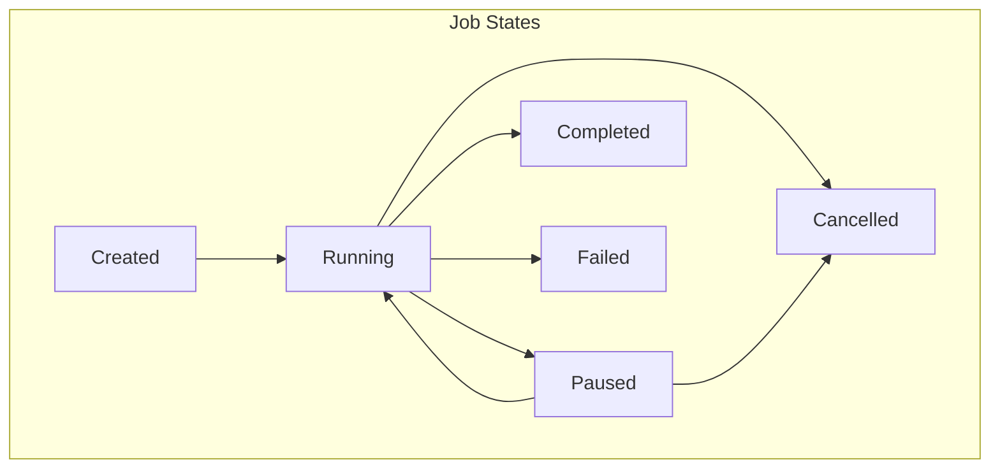
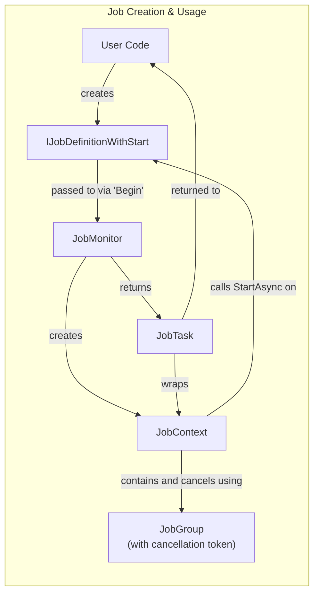

# Jobs System

## Overview

The Jobs system in NexusMods.App is how long-running background tasks are spawned.

These feature progress tracking, cancellation support, and error handling.

Examples of jobs include downloading files and installations.

## Architecture

The Jobs system is built around several key components that work together to provide a comprehensive task management solution:





!!! note "JobGroup instances are created internally via JobGroupCreator"

    But that class is currently effectively unused.

## Core Components

### IJobDefinition

The base interface for all job definitions. Job definitions describe what work needs to be done and contain any parameters needed for execution.

```csharp
public interface IJobDefinition;

public interface IJobDefinition<TResultType> : IJobDefinition
    where TResultType : notnull;
```

### IJobDefinitionWithStart

A specialized job definition that includes its own execution logic via the `StartAsync` method:

```csharp
public interface IJobDefinitionWithStart<in TParent, TResultType> : IJobDefinition<TResultType>
    where TParent : IJobDefinition<TResultType>
    where TResultType : notnull
{
    ValueTask<TResultType> StartAsync(IJobContext<TParent> context);
}
```

### IJobMonitor

The central component that manages job execution, tracking, and lifecycle:

```csharp
public interface IJobMonitor
{
    // Start a job with external task logic
    IJobTask<TJobType, TResultType> Begin<TJobType, TResultType>(
        TJobType job, 
        Func<IJobContext<TJobType>, ValueTask<TResultType>> task);
    
    // Start a self-executing job
    IJobTask<TJobType, TResultType> Begin<TJobType, TResultType>(TJobType job);
    
    // Job management
    void Cancel(JobId jobId);
    void CancelGroup(IJobGroup group);
    void CancelAll();
    
    // Observability
    ReadOnlyObservableCollection<IJob> Jobs { get; }
    IObservable<IChangeSet<IJob, JobId>> GetObservableChangeSet<TJob>();
}
```

### IJobContext

Provides the execution context for jobs, including progress reporting and cancellation support:

```csharp
public interface IJobContext<out TJobDefinition> : IJobContext 
    where TJobDefinition: IJobDefinition
{
    TJobDefinition Definition { get; }
    Task YieldAsync();
    CancellationToken CancellationToken { get; }
    IJobMonitor Monitor { get; }
    IJobGroup Group { get; }
    
    void SetPercent<TVal>(TVal current, TVal max);
    void SetRateOfProgress(double rate);
}
```

### IJobGroup

Groups related jobs together for batch operations and shared cancellation:

```csharp
public interface IJobGroup : IReadOnlyCollection<IJob>
{
    CancellationToken CancellationToken { get; }
    void Cancel();
    bool IsCancelled { get; }
}
```

## Usage Examples

**📋 [View All Job Examples - (in `src/Examples/Jobs`)](https://github.com/Nexus-Mods/NexusMods.App/tree/main/src/Examples/Jobs)**
