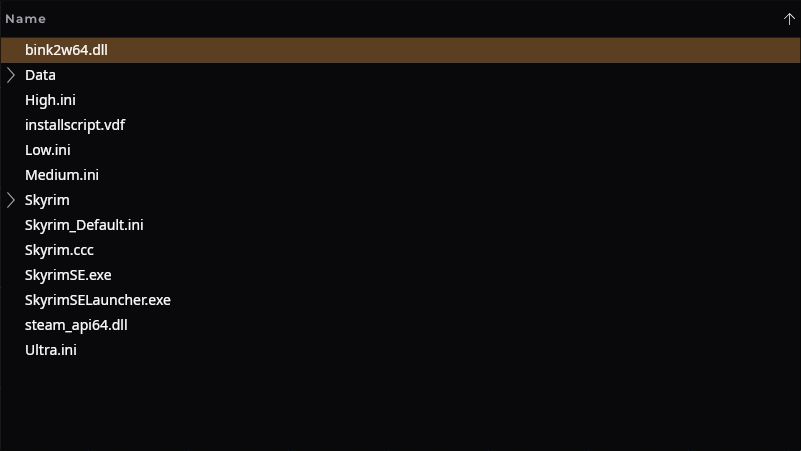
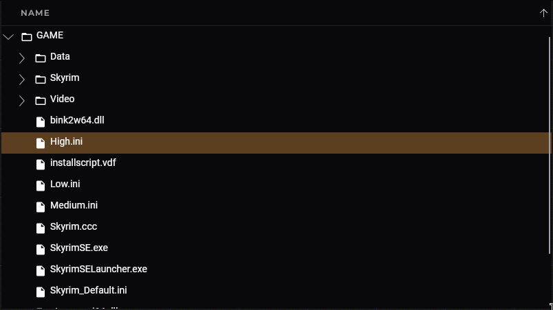
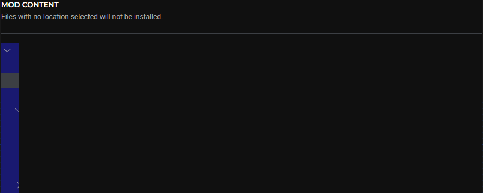

# UI Coding Conventions and Guidelines

!!! info "The Nexus Mods App uses [Avalonia] combined with [ReactiveUI] and [Dynamic Data] for the user interface."

    This document contains conventions, guidelines, tips and tutorials on how to use these tools in the project.

    We'll also be going over some technical details on how these tools work and how they interact with the project.

## Avalonia

!!! info "[Avalonia] is a multi-platform UI framework for creating native .NET applications."

It takes inspiration from [WPF] and [WinUI] but is distinctly different to ensure it works on all platforms.
The framework also uses [Skia] for rendering to ensure cross-platform compatibility.

## Understanding XAML Bindings

!!! tip "Describes how data from the code makes its way to the UI."

!!! note "[Avalonia] uses AXAML, which has some minor differences compared to the standard XAML that was popularized by [WPF]."

### Simple Introduction

Creating a new view called `MyView.axaml` will also create a **code behind** file called `MyView.axaml.cs` that,
by default, only has a `InitializeComponent();` call inside it's constructor:

```csharp
public partial class MyView : UserControl
{
    public MyView()
    {
        InitializeComponent();
    }
}
```

To actually display any data you need a **data context**. Every control in Avalonia has a property called `DataContext`.
You can set this property to some instance of a class that contains data that you want to display:

```csharp
public class MyData
{
    public string Greeting => "Hello World!";
}

public partial class MyView : UserControl
{
    public MyView()
    {
        DataContext = new MyData(); // 👈
        InitializeComponent();
    }
}
```

Inside the AXAML file of the view, you can now add a `TextBlock` and **bind** the `MyData.Greeting` property to the `TextBlock.Text` property:

```xml
<StackPanel>
    <TextBlock Text="{Binding Greeting}" />
</StackPanel>
```

This kind of binding is called **XAML Binding** because the binding is created inside the UI markup file.

The default **binding mode** for *most* properties is **one way** meaning that binding is from the source, aka
the data context, to the target (the view).

Another common binding mode is **two way** binding which is required for properties on input controls, like
`TextBox.Text` and `Checkbox.IsChecked`.

### Working with Avalonia Previewer

!!! tip "When using XAML bindings, it's recommended to set the design data context. This provides a hint to the IDE auto-completion service and allows you to use the previewer."

```xml
<Design.DataContext>
    <ui:MyData/>
</Design.DataContext>
```

### Updating the Displayed Content

Currently, the `MyData.Greeting` property is a get-only property, meaning it doesn't have a setter and the
underlying field can't be changed. Let's change the `MyData.Getting` property to have a public setter:

```csharp
public class MyData
{
    public string Greeting { get; set; } = "Hello World!";
}
```

To update the text, we can add a simple button to the view that, when triggered, will change the property to something else:

```xml
<StackPanel>
    <TextBlock Text="{Binding Greeting}" />
    <Button Click="OnClick">Change Text</Button>
</StackPanel>
```

The `Button` control has a `Click` event that we can use to register an event handler called `OnClick`.
This event handler will be called whenever the button is clicked:

```csharp
public partial class MyView : UserControl
{
    public MyView()
    {
        DataContext = new MyData();
        InitializeComponent();
    }

    private void OnClick(object? sender, RoutedEventArgs e)
    {
        DataContext.Greeting = "Hallo Welt!";
    }
}
```

!!! bug "If you were to build and run this project, you'll find that clicking the button does nothing."

This is because the data context doesn't **notify** the view that the property has changed.

To add this functionality, the data context needs to implement the [`INotifyPropertyChanged`](https://learn.microsoft.com/en-us/dotnet/api/system.componentmodel.inotifypropertychanged) interface:

```csharp
public class MyData : INotifyPropertyChanged
{
    private string _greeting = "Hello World!";
    public string Greeting
    {
        get => _greeting;
        set
        {
            _greeting = value;
            OnPropertyChanged(nameof(Greeting));
        }
    }

    public event PropertyChangedEventHandler PropertyChanged;

    protected virtual void OnPropertyChanged(string propertyName)
    {
        PropertyChanged?.Invoke(this, new PropertyChangedEventArgs(propertyName));
    }
}
```

This is a lot of boilerplate code that various frameworks and tools can abstract away, but you should be aware of
what's going on behind the scenes. In this code snippet, we explicitly implement the property setter to invoke
the [`PropertyChanged`](https://learn.microsoft.com/en-us/dotnet/api/system.componentmodel.inotifypropertychanged.propertychanged) event.

If the view has any bindings and the data context implements this interface, the view will register an event handler
at runtime to listen for property changes the view binds to. This allows the framework to re-render
only a specific part of the UI, since it now knows exactly which parts of the UI have been updated.

!!! warning "Changes to the displayed content must be done on the UI Thread."

## How Nexus Mods App Does UI (ReactiveUI)

### Events & Bindings

!!! note "The XAML bindings from the previous example work great for very simple applications."

However... once you start adding more and more functionality to it, developing with XAML bindings can
have some massive disadvantages.

The main disadvantage comes from using events. With events you register an event handler, either from the AXAML
(providing very little control), or from the code behind, creating a mess and potentially leading to [Event Handler Leaks].

!!! example "Example with Events (from Code Behind)"

    ```csharp
    public YourView()
    {
        // Note: This isn't strictly needed for this specific example, as both the event
        //       receiver and publisher are the same view, however not doing this with long
        //       lived objects outside of this view risks event leaks.
        this.Activated += WindowActivated;
        this.Deactivated += WindowDeactivated;
    }

    private void WindowActivated(object sender, EventArgs e)
    {
        this.PropertyChanged += TextPropertyChanged;
    }

    private void WindowDeactivated(object sender, EventArgs e)
    {
        this.PropertyChanged -= TextPropertyChanged;
    }

    private void TextPropertyChanged(object sender, PropertyChangedEventArgs e)
    {
        if (e.PropertyName == nameof(Text))
        {
            if (Text.Length > 10)
            {
                // Do Stuff
            }
        }
    }
    ```

An alternative to events for such notifications are **observables** ([observable design pattern]).
The pattern defines an **observable** ([`IObservable<T>`](https://learn.microsoft.com/en-us/dotnet/api/system.iobservable-1))
as a provider for push-based notifications and an **observer** ([`IObserver<T>`](https://learn.microsoft.com/en-us/dotnet/api/system.iobserver-1))
as a mechanism for receiving push-based notifications.

The great thing about this pattern and how it's implemented in C#, is that it doesn't require any special syntax
or keywords like the `event` keyword. Conceptually, these are just interfaces that have [Extension Methods] that return values.

The result is you can adapt other language constructs like LINQ on the pattern:

!!! example "Example with Observables"

    ```csharp
    public YourView()
    {
        InitializeComponent();
        this.WhenActivated(disposables =>
        {
            // Observables
            this.WhenAnyValue(x => x.Text)
                .Select(text => text.Length > 10)
                .Subscribe(hasMinLength => { })
                .DisposeWith(disposables);
        }
    }
    ```

This makes the pattern inherently ***composable*** and is one of the major reasons why ReactiveUI
is commonly used in UI development.

!!! note "Sadly, ReactiveUI requires a lot of boilerplate code to get started, as well as a base level understanding of various software development concepts like the observable pattern."

### Binding Patterns ('Model-View-ViewModel' a.k.a. MVVM)

!!! info "Most .NET UI Projects, including ours use an architectural pattern called 'MVVM' for managing complex apps."

Another important pattern is the **Model-View-ViewModel** pattern, or **MVVM**.

At it's core, the MVVM pattern allows us to separate our various components.

<div class="grid cards" markdown>

-   :material-television-classic:{ .lg .middle } __View__

    ---

    The View is what appears on the user's screen. In the previous example, that's `MyView`.

-   :material-database:{ .lg .middle } __Model__

    ---

    The Model represents the data and business logic of the application.

    For example a ***Mod*** is a model.

</div>

<div class="grid cards" markdown>
-   :material-account:{ .lg .middle } __ViewModel__

    ---

    The ViewModel, such as `MyData`, provides public properties and commands for the View to bind to.

    It facilitates communication between the View and the Model.

</div>

MVVM and it's separation of concerns makes developing the views and ViewModels straightforward:

- The View should only bind to the ViewModel.
- The ViewModel should only contain the functionality required to drive the View and display the data.

ReactiveUI makes this pattern much easier to implement.

#### An Example

Let's re-create the [previous example](#simple-introduction) and change it to use MVVM, ReactiveUI and the
observable pattern instead of being event-driven with XAML bindings:

We can start with `MyViewModel` and a simple `Greeting` property:

```csharp
public class MyViewModel
{
    public string Greeting { get; } = "Hello World!";
}
```

Instead of creating a normal Avalonia `UserControl`, we can create a `ReactiveUserControl` that is provided the `Avalonia.ReactiveUI` package:

```xml
<reactive:ReactiveUserControl
    x:TypeArguments="ui:MyViewModel"
    xmlns="https://github.com/avaloniaui"
    xmlns:x="http://schemas.microsoft.com/winfx/2006/xaml"
    xmlns:d="http://schemas.microsoft.com/expression/blend/2008"
    xmlns:mc="http://schemas.openxmlformats.org/markup-compatibility/2006"
    xmlns:ui="clr-namespace:Example"
    xmlns:reactive="http://reactiveui.net"
    mc:Ignorable="d" d:DesignWidth="800" d:DesignHeight="450"
    x:Class="Example.MyView">

    <Design.DataContext>
        <ui:MyViewModel />
    </Design.DataContext>

    <StackPanel>
        <TextBlock />
    </StackPanel>

</reactive:ReactiveUserControl>
```

The code-behind class `MyView.axaml.cs` will also have inherit from `ReactiveUserControl<TViewModel>`:

```csharp
public partial class MyView : ReactiveUserControl<MyViewModel>
{
    public MyView()
    {
        InitializeComponent();
    }
}
```

!!! question "But why do we need to do this? What's a `ReactiveUserControl`?"

Well, each view has a lifetime, for example opening Window and later closing a window in an App.
`ReactiveUserControl` allows ReactiveUI to 'hook into' Avalonia lifetimes.

This means we can create our resources when a page or window is shown, and dispose them when we're done.

??? info "A detailed explanation of under the hood, inner workings of ReactiveUserControl (click to expand)"

    Resource cleanup is handled by the built-in .NET `IDisposable` interface.

    ```csharp
    public interface IDisposable
    {
        void Dispose();
    }
    ```

    `ReactiveUserControl<TViewModel>` inherits from the Avalonia `UserControl` class but also implements the ReactiveUI
    interface `IViewFor<TViewModel>`. This interface extends `IActivatableView`, which is a marker interface for telling
    ReactiveUI that the current view can be activated. The activation method is an implementation detail of the UI framework
    itself, ReactiveUI supports more than Avalonia, so this needs to be kept vague. In the context of Avalonia, activation
    [occurs when the view gets loaded](https://github.com/AvaloniaUI/Avalonia/blob/2a85f7cafed6c90d4a8cd11dee36a9dd15ebcc1e/src/Avalonia.ReactiveUI/AvaloniaActivationForViewFetcher.cs#L37-L52)

    The `Loaded` and `Unloaded` events of an Avalonia `Control` determine whether a view is activated or not.
    The code snippet above also showcases that you can construct observables from events and thus convert from
    event-driven programming to the observable pattern.


The `IObservable<T>` and `IObserver<T>` interfaces (observables) are tightly combined with the
built-in .NET `IDisposable` interface used for resource cleanup.

Recall part of the earlier 'Observables' example:

```csharp
// Method inside 'WhenActivated' is called when Window/Page is shown.
this.WhenActivated(disposables => // 👈 'disposables' is ran on window/page close.
{
    this.WhenAnyValue(x => x.Text)
        .Select(text => text.Length > 10)
        .Subscribe(hasMinLength => { }) // 👈 returns IDisposable
        .DisposeWith(disposables); // 👈 dispose on window/page close
}
```

The `Subscribe` method on an `IObservable<T>` returns `IDisposable`.
Calling `Dispose` on this returned instance allows the observer to stop receiving notifications from the provider.

The important aspect of this is that the observable (property) will remove the reference to the observer (subscribe method).

!!! question "Why is this cleanup important?"

    Garbage Collection (GC).

    If you don't dispose the observer, it may hold reference to the observable for a longer period of time,
    potentially even the entire lifetime of the process. (i.e. [Event Handler Leaks] but with observables)

    Note that in the example above it's not strictly necessary to call `DisposeWith` due to how Avalonia is built
    under the hood (unlike WPF, UWP), however risks of leaks are real when working with 'external' (injected)
    components.

    So in the App we dispose everything, for consistency and for safety.

In summary, instances of `IObservable<T>` and `IObserver<T>` should always be disposed when they go **out of scope**.

##### Adding a Binding

Going back to the code-behind of our view, we currently have no bindings at all:

```csharp
public MyView()
{
    InitializeComponent();
}
```

!!! note "To create a 'reactive' binding, we need to be able to reference the control in our code"

This can be done by simply adding a *name* to the control. In this example, we want to change the text of
the `TextBlock`, so we can attach a name to that control in the view:

```xml
<StackPanel>
    <TextBlock x:Name="MyTextBlock" />
</StackPanel>
```

Avalonia's source generator will generate a field available from `.axaml.cs` with the same name:

```csharp
// <auto-generated />
partial class MyView
{
    internal global::Avalonia.Controls.TextBlock MyTextBlock;

    public void InitializeComponent(bool loadXaml = true)
    {
        if (loadXaml)
        {
            AvaloniaXamlLoader.Load(this);
        }

        MyTextBlock = this.FindNameScope()?.Find<global::Avalonia.Controls.TextBlock>("MyTextBlock");
    }
}
```

!!! tip "This is why your `.axaml.cs` file has to be `partial`, and why constructor calls `InitializeComponent`"

With the name in place, we can create a one-way bind from the `Greeting` property in the ViewModel to the
`Text` property of the `TextBlock` control in our View:

```csharp
public MyView()
{
    InitializeComponent();

    this.WhenActivated(disposables =>
    {
        this.OneWayBind(ViewModel, vm => vm.Greeting, view => view.MyTextBlock.Text)
            .DisposeWith(disposables);
    });
}
```

`OneWayBind` is an extension method of `this`, with the following definition:

```csharp
public static IReactiveBinding<TView, TVProp> OneWayBind<TViewModel, TView, TVMProp, TVProp>(
    this TView view,
    TViewModel? viewModel,
    Expression<Func<TViewModel, TVMProp?>> vmProperty,
    Expression<Func<TView, TVProp>> viewProperty,
    object? conversionHint = null,
    IBindingTypeConverter? vmToViewConverterOverride = null)
    where TViewModel : class
    where TView : class, IViewFor);
```

!!! note "That method might be a bit daunting to look at, but basically..."

    - We pass the ***ViewModel***
    - A property of the ViewModel in a 'lambda' (`vm.Greeting`)
    - A property of an UI control (***ReactiveUserControl***) in a 'lambda' (`MyTextBlock.Text`)

    Note the two lambdas are technically [expression trees], not methods, some language limitations apply.

    It's complex but think of expression trees being telling the framework 'how to get your property'
    , as opposed to 'make method that gets your property'.

The last two arguments of the `OneWayBind` function are optional, they mostly exist to convert between one type to
another but should only rarely be used.

`OneWayBind` returns an instance of `IReactiveBinding<TView, TValue>` which should be disposed with
`DisposedWith`, as mentioned before.

!!! tip "Now the UI is listening to changes in the `ViewModel`."

    If you add `INotifyPropertyChanged` and made `Greeting` modifiable by adding `set;`, the UI should update on value change.
    But changing UI will not change code behind, as it's a 'one way' binding.

### Commands (The Reactive Way)

Our `MyViewModel.Greeting` property is currently just get-only, which means it will never change.

Let's add a `Button` that will modify the property (like we did before, but in the 'reactive' way!):

```csharp
public class MyViewModel
{
    //                updated here 👇
    public string Greeting { get; set; } = "Hello World!";
}
```

```xml
<StackPanel>
    <TextBlock x:Name="MyTextBlock" />
    <Button x:Name="MyButton">Click Me!</Button>
</StackPanel>
```

Instead of using the `Click` event, we will use **Commands**.

!!! tip "Commands allow the ***View*** to trigger logic defined in the ***ViewModel***"

```csharp
public class MyViewModel
{
    public string Greeting { get; set; } = "Hello World!";
    public ReactiveCommand<Unit, Unit> ChangeGreetingCommand { get; }

    public MyViewModel()
    {
        ChangeGreetingCommand = ReactiveCommand.Create(() =>
        {
            Greeting = "Hallo Welt!"; // Herro Za Warudo!
        });
    }
}
```

It's important to note that `ReactiveCommand<TParam, TResult>` takes in a `TParam` and returns a `TResult`.

!!! note "Usually you won't have inputs/outputs, so you can use `Unit` type which is essentially an alias for `void`."

We can now bind with the `BindCommand` extension method:

```csharp
this.WhenActivated(disposables =>
{
    this.OneWayBind(ViewModel, vm => vm.Greeting, view => view.MyTextBlock.Text)
        .DisposeWith(disposables);

    // 👆 Code from before
    // 👇 New Code

    this.BindCommand(ViewModel, vm => vm.ChangeGreetingCommand, view => view.MyButton)
        .DisposeWith(disposables);
});
```

This is just like `OneWayBind` from earlier, but we select the control itself rather than one of its properties.
The framework will figure out the rest 😛.

!!! bug "Compiling and running this, clicking the button will not change the text."

We must not forget to implement `INotifyPropertyChanged`. This time we won't write the boilerplate however,
we'll let Reactive take care of it.

=== "Our Code (What we Write)"

    ```csharp
    public class MyViewModel : ReactiveObject
    {
        [Reactive]
        public string { get; set; } = "Hello World!";
    }
    ```

=== "What ReactiveUI Generates"

    ```csharp
    public class MyViewModel : ReactiveObject
    {
        private string _greeting = "Hello World!";
        public string Greeting
        {
            get => _greeting;
            set => this.RaiseAndSetIfChanged(ref _greeting, value);
        }
    }
    ```

=== "Doing this Manually without Reactive"

    ```csharp
    public class MyData : INotifyPropertyChanged
    {
        private string _greeting = "Hello World!";
        public string Greeting
        {
            get => _greeting;
            set
            {
                _greeting = value;
                OnPropertyChanged(nameof(Greeting));
            }
        }

        public event PropertyChangedEventHandler PropertyChanged;

        protected virtual void OnPropertyChanged(string propertyName)
        {
            PropertyChanged?.Invoke(this, new PropertyChangedEventArgs(propertyName));
        }
    }
    ```

We've successfully removed a lot of boilerplate this time around. `ReactiveObject` already implements
`INotifyPropertyChanged` and adding `[Reactive]` to the property will transform our code to use it.

!!! note "The `[Reactive]` attribute is part of the `ReactiveUI.Fody` package."

#### Conditional Execution

Another cool feature of `ReactiveCommand` is the `canExecute` observable:

```csharp
public class MyViewModel : ReactiveObject
{
    [Reactive]
    public string Greeting { get; set; } = "Hello World!";

    public ReactiveCommand<Unit, Unit> ChangeGreetingCommand { get; }

    public MyViewModel()
    {
        var canExecute = this
            .WhenAnyValue(vm => vm.Greeting)
            .Select(greeting => greeting == "Hello World!");

        ChangeGreetingCommand = ReactiveCommand.Create(() =>
        {
            Greeting = "Hallo Welt!";
        }, canExecute);
    }
}
```

When creating a `ReactiveCommand`, you can pass an `IObservable<bool>` along.

When the command gets created, it will subscribe to this observable and make the command unavailable if the observable
returns `false`.

!!! tip "If you bind this command to a `Button`, the framework will disable the button if the command can't execute."

!!! warning "If you are using an observable that references something outside of the current scope, remember to use `WhenActivated` and `DisposeWith` on the `ReactiveCommand`."

#### Selecting Multiple Properties

When creating commands and the `canExecute` observable, you might want to check multiple properties at once:

```csharp
public class MyViewModel : ReactiveObject, IActivatableViewModel
{
    public ViewModelActivator Activator { get; } = new();

    [Reactive] public string Text { get; private set; } = string.Empty;

    [Reactive] public bool IsChecked { get; set; }

    public ReactiveCommand<Unit, Unit> AddCommand { get; set; }

    public MyViewModel()
    {
        // This command should only be available if Text is not empty and IsChecked is true
        AddCommand = ReactiveCommand.Create(() => { });
    }
}
```

There are two ways to handle this in Reactive:

=== "WhenAnyValue Overload"

    ```csharp
    var canExecute = this.WhenAnyValue(
        vm => vm.Text,
        vm => vm.IsChecked,
        (text, isChecked) => !string.IsNullOrWhiteSpace(text) && isChecked
    );

    AddCommand = ReactiveCommand.Create(() => { }, canExecute);
    ```

=== "CombineLatest"

    ```csharp
    var hasText = this.WhenAnyValue(vm => vm.Text).Select(text => !string.IsNullOrWhiteSpace(text));
    var isChecked = this.WhenAnyValue(vm => vm.IsChecked);
    var canExecute = hasText.CombineLatest(isChecked).Select(tuple => tuple is { First: true, Second: true });

    AddCommand = ReactiveCommand.Create(() => { }, canExecute);
    ```

The former is preferred due to code cleanliness.

!!! tip "Make sure to use good variable named with `WhenAnyValue`, not `x`, `y`, `z`."

### Nested Bindings (Expression Chains)

!!! info "ReactiveUI uses expression trees for methods like `OneWayBind` and `WhenAnyValue`."

Expressions can be used to set up "chains" for nested properties:

```csharp
this.WhenAnyValue(x => x.Foo!.Bar!.Baz)
    .Subscribe(x => Console.WriteLine(x));
```

!!! warning "You can't use `?` for 'null propagation' in expressions, i.e. `x => x.Foo?.Bar?.Baz`"

!!! warning "`WhenAny` and all it's variants, will only send notifications if evaluating the expression wouldn't throw a `NullReferenceException`"

    This is why you use `x => x.Foo!.Bar!.Baz`, you tell the compiler to ignore nullability of the properties.

    ReactiveUI will prevent any null related exceptions and crashes from occuring in these expression chains.

When you do `x => x.Foo.Bar.Baz`, ReactiveUI will set up the following subscriptions:

1. Subscribe to `this`, look for `Foo`
2. Subscribe to `Foo`, look for `Bar`
3. Subscribe to `Bar`, look for `Baz`
4. Subscribe to `Baz`, publish to Subject

This means:

- If `Foo` changes, `this` will be notified and it will re-subscribe to the new `Foo`.
- If `Bar` changes, `Foo` will be notified and it will re-subscribe to the new `Bar`.

You don't have to manually manage nested subscriptions, the framework does it for you.

Lastly, `WhenAny` only notifies on changes of the output value. It only tells you when the final value of the
expression has changed. If any intermediate values changed, then the subscriptions will be updated again, but
***you won't get a new notification if the final value hasn't changed***:

```csharp
this.WhenAnyValue(x => x.Foo!.Bar!.Baz)
    .Subscribe(x => Console.WriteLine(x));

this.Foo.Bar.Baz = "Hi!";
// ✅ "Hi!"

this.Foo.Bar.Baz = "Hi!";
// ❌ Value hasn't changed, nothing happened

this.Foo.Bar = new Bar() { Baz = "Hi!" };
// ❌ The intermediate value changed, but final hasn't.

this.Foo.Bar = new Bar() { Baz = "Hello!" };
// ✅ "Hello!"
```

### Exceptions with ReactiveUI

!!! note "By default, ReactiveUI will crash the application if an exception is thrown inside a command or an subscription."

```csharp
this.WhenActivated(disposables =>
{
    this.WhenAnyValue(vm => vm.IsChecked)
        .Where(b => b)
        .Do(_ => ThrowSomething())
        .Subscribe()
        .DisposeWith(disposables);
});
```

!!! tip "For commands and other objects that have a `ThrownExceptions` property, you can register a different default exception handler."

For subscriptions, you need to use `SubscribeSafe` instead of `Subscribe`:

```csharp
this.WhenActivated(disposables =>
{
    this.WhenAnyValue(vm => vm.IsChecked)
        .Where(b => b)
        .Do(_ => ThrowSomething())
        .SubscribeSafe(Observer.Create<bool>(
            _ => { }, // onNext
            ex => Console.WriteLine(ex), // onError
            () => { }) // onCompleted
        ).DisposeWith(disposables);
});
```

`SubscribeSafe` re-routes synchronous exceptions to the `OnError` channel of the observer.

Our `ReactiveUiExtensions` class has `SubscribeWithErrorLogging` that can be used for convenience:

```csharp
this.WhenActivated(disposables =>
{
    this.WhenAnyValue(vm => vm.IsChecked)
        .Where(b => b)
        .Do(_ => ThrowSomething())
        .SubscribeWithErrorLogging()
        .DisposeWith(disposables);
});
```

This uses the injected `ILogger<T>` and should be used instead of `SubscribeSafe`.

## Binding Collections & Lists (Dynamic Data)

!!! question "What is Dynamic Data?"

    Dynamic Data is the glue that allows collections (e.g. lists) to be used 'reactive' environment.

    Instead of using events, it provides observers and observables.

Besides the `INotifyPropertyChanged`, there is also [`INotifyCollectionChanged`](https://learn.microsoft.com/en-us/dotnet/api/system.collections.specialized.inotifycollectionchanged) used for whole collections
as opposed to simple properties.

This interface alongside its [`CollectionChanged`](https://learn.microsoft.com/en-us/dotnet/api/system.collections.specialized.inotifycollectionchanged.collectionchanged) event tells listeners when items are added/removed/replaced etc.

Common implementations of this interface include [`ObservableCollection<T>`](https://learn.microsoft.com/en-us/dotnet/api/System.Collections.ObjectModel.ObservableCollection-1) and it's
read-only counterpart [`ReadOnlyObservableCollection<T>`](https://learn.microsoft.com/en-us/dotnet/api/system.collections.objectmodel.readonlyobservablecollection-1).

------

Let's look at an example that displays a bunch of GUIDs using a `ListBox`.

The user can click on an "Add" button to add a new GUID, they can select an item from
the list and they can click a "Remove" button to remove the selected item from the list:

```csharp
public class MyViewModel : ReactiveObject, IActivatableViewModel
{
    public ViewModelActivator Activator { get; } = new();

    private readonly SourceList<Guid> _sourceList = new();

    private readonly ReadOnlyObservableCollection<string> _items;

    // 👇 we bind to this from the UI
    public ReadOnlyObservableCollection<string> Items => _items;

    [Reactive] public int SelectedIndex { get; set; } = -1;

    public ReactiveCommand<Unit, Unit> AddCommand { get; }
    public ReactiveCommand<Unit, Unit> RemoveCommand { get; }

    public MyViewModel()
    {
        AddCommand = ReactiveCommand.Create(() =>
        {
            _sourceList.Edit(list => list.Add(Guid.NewGuid()));
        });

        var canRemove = this
            .WhenAnyValue(vm => vm.SelectedIndex)
            .Select(selectedIndex => selectedIndex >= 0 && selectedIndex < _sourceList.Count);

        RemoveCommand = ReactiveCommand.Create(() =>
        {
            _sourceList.Edit(list => list.RemoveAt(SelectedIndex));
        }, canRemove);

        _sourceList
            .Connect() // 👈 we use the code here to make ReadOnlyObservableCollection from DynamicData
            .Transform(guid => guid.ToString()) // 👈 we can sort, manipulate, etc. the items
            .Bind(out _items)
            .Subscribe();
    }
}
```

!!! note "All observables in this ViewModel references ViewModel itself, so `WhenActivated` and `DisposeWith` are not needed here."

The part of the code that comes from Dynamic Data is the `SourceList<T>`. There is also `SourceCache<TObject, TKey>`
(essentially a Dictionary) that you should use when your objects have unique identifiers, and you don't care about the
position, since you'll likely be sorting them anyways.

!!! tip "When you have a unique key (e.g. for Database Entities like our App), prefer `SourceCache`."

This example uses a `ListBox` to display the items and the `ListBox.SelectedIndex` property to remove an item at a specific
index, so we use a `SourceList<T>`.

### Updating DynamicData Collections

!!! tip "This is usually done with the `Edit` method provided by Dynamic Data"

Notably, the `Edit` method also does "batching" meaning that removing multiple items from the collection in one edit
will result in only one notification (`IChangeSet`), instead of `n` single item removals.

??? example "An Example of Single Notification (Click to Expand)"

    ```csharp
    AddCommand = ReactiveCommand.Create(() =>
    {
        Console.WriteLine("Before edit");
        _sourceList.Edit(list =>
        {
            Console.WriteLine("Start of edit");
            list.Add(Guid.NewGuid());
            list.Add(Guid.NewGuid()); //
            Console.WriteLine("End of edit");
        });
        Console.WriteLine("After edit");
    });

    _sourceList
        .Connect()
        .Transform(guid => guid.ToString())
        .Bind(out _items)
        .Subscribe(_ => Console.WriteLine("In subscription"));
    ```

    The output is the following:

    ```
    Before edit
    Start of edit
    End of edit
    In subscription
    After edit
    ```

    If you add another `list.Add(Guid.NewGuid());`, this output won't change, thanks to batching.

#### Rendering the Collection

View:

```xml
<StackPanel>
    <Button x:Name="AddButton">Add</Button>
    <Button x:Name="RemoveButton">Remove</Button>
    <ListBox x:Name="MyListBox" SelectionMode="Single">
        <ListBox.DataTemplates>
            <DataTemplate DataType="{x:Type system:String}">
                <TextBlock Text="{CompiledBinding}"/> <!-- Bind to DataContext (our string) -->
            </DataTemplate>
        </ListBox.DataTemplates>
    </ListBox>
</StackPanel>
```

View (Code Behind)

```csharp
this.WhenActivated(disposables =>
{
    this.BindCommand(ViewModel, vm => vm.AddCommand, view => view.AddButton)
        .DisposeWith(disposables);

    this.BindCommand(ViewModel, vm => vm.RemoveCommand, view => view.RemoveButton)
        .DisposeWith(disposables);

    // Bind to the public Items property, NOT to the SourceCache!
    this.OneWayBind(ViewModel, vm => vm.Items, view => view.MyListBox.ItemsSource)
        .DisposeWith(disposables);
});
```

!!! note "A Note on ListBox Rendering (There's a Small Surprise! 🎁)"

    While we're using reactive bindings to bind to the `ListBox.ItemsSource` property, the control expects us to
    provide a `DataTemplate` that is used to actually render the items. Here we just used a `TextBlock` and asked it to handle
    `string` types.

    However, with Reactive, if the item type is a ViewModel, you don't need to use XAML bindings at all!
    ReactiveUI *comes with a built-in feature* to auto-create Views from ViewModels!

    If you have a ViewModel, the framework can look for all registered Views, construct the matching
    View, and bind the ViewModel to it.

The following code will scan the entire assembly for Views that implement `IViewFor<TViewModel>`
and associates them with the corresponding `TViewModel`:

```csharp
public partial class App
{
    public App()
    {
        Locator.CurrentMutable.RegisterViewsForViewModels(Assembly.GetCallingAssembly());
    }
}
```

To better understand how this works, let's create a `StringView` and `StringViewModel`:

```csharp
public class StringViewModel : ReactiveObject, IActivatableViewModel
{
    public ViewModelActivator Activator { get; } = new();
    public readonly string Text;

    public StringViewModel(string text)
    {
        Text = text;
    }
}
```

```csharp
public partial class StringView : ReactiveUserControl<StringViewModel>
{
    public StringView()
    {
        InitializeComponent();

        this.WhenActivated(disposables =>
        {
            this.WhenAnyValue(view => view.ViewModel)
                .WhereNotNull()
                .Do(PopulateFromViewModel)
                .Subscribe()
                .DisposeWith(disposables);
        });
    }

    private void PopulateFromViewModel(StringViewModel vm)
    {
        MyTextBlock.Text = vm.Text;
    }
}
```

!!! note "This is overkill to display a single read-only field but it serves to illustrate how View resolution works."

Also note that the code-behind of the View is slightly different.

!!! tip "If the ViewModel properties don't change over time (they are read only) set the properties directly."

    This is more efficient since you only have a subscription on the ViewModel instead of every property.

The `MyViewModel.Items` collection also has to be updated to use `StringViewModel` instead of `string`:

```csharp
private readonly ReadOnlyObservableCollection<StringViewModel> _items;
public ReadOnlyObservableCollection<StringViewModel> Items => _items;
```

And the main View can be simplified, with XAML bindings removed:

```xml
<StackPanel>
    <Button x:Name="AddButton">Add</Button>
    <Button x:Name="RemoveButton">Remove</Button>
    <ListBox x:Name="MyListBox" SelectionMode="Single" />
</StackPanel>
```

At runtime, ReactiveUI will find the correct View for the ViewModel and instantiate it.
This is done by the `ViewModelViewHost` control from `Avalonia.ReactiveUI` package.

***It will also give `MyListBox` a `DataTemplate` automatically.***

??? example "For reference, when `MyListBox` is auto given a `DataTemplate` it's basically given this (click to expand)"

    ```xml
    <StackPanel>
        <Button x:Name="AddButton">Add</Button>
        <Button x:Name="RemoveButton">Remove</Button>
        <ListBox x:Name="MyListBox" SelectionMode="Single">
            <DataTemplate>
                <!-- Don't bind from XAML, this is for example only !-->
                <reactive:ViewModelViewHost ViewModel="{CompiledBinding}"/>
            </DataTemplate>
        </ListBox>
    </StackPanel>
    ```

    For reference only, don't do this in the code.

!!! tip "The `ViewModelViewHost` control should only be used if you can directly bind to the `ViewModel` property."

This is useful if you have a View that can display potentially any ViewModel, for example in 'container' views.

### Nesting ViewModels in ViewModels

Once you start using observable collections with ViewModels you might end up in a scenario where you have a
"parent" ViewModel and multiple "child" ViewModels that get created by the parent:

```csharp
public class MyViewModel : ReactiveObject, IActivatableViewModel
{
    public ViewModelActivator Activator { get; } = new();

    private readonly SourceCache<ChildViewModel, Guid> _sourceCache = new(child => child.Id);
    private readonly ReadOnlyObservableCollection<ChildViewModel> _children;
    public ReadOnlyObservableCollection<ChildViewModel> Children => _children;

    public readonly ReactiveCommand<Unit, Unit> AddChildCommand;

    public MyViewModel()
    {
        _sourceCache
            .Connect()
            .Bind(out _children)
            .Subscribe();

        AddChildCommand = ReactiveCommand.Create(() =>
        {
            _sourceCache.Edit(updater =>
            {
                updater.AddOrUpdate(new ChildViewModel());
            });
        });
    }
}

public class ChildViewModel : ReactiveObject, IActivatableViewModel
{
    public ViewModelActivator Activator { get; } = new();

    public Guid Id { get; }
    public string Name { get; }

    public ChildViewModel()
    {
        Id = Guid.NewGuid();
        Name = Id.ToString("D");
    }
}
```

This can be pretty common but requires some design decisions to be made before continuing.

#### Parent reacting to changes in one of the children

!!! tip "Example Use Case! Display number of selected children in title/text."

We previously learned that ReactiveUI supports expression chaining using `this.WhenAnyValue(x => x.Foo.Bar.Baz)` but
this only works if each property in this chain is a single item and not a collection.

For this example, let's assume the View for the `ChildViewModel` contains a `CheckBox` that is bound to the `IsChecked` property:

```csharp
public class ChildViewModel : ReactiveObject, IActivatableViewModel
{
    public ViewModelActivator Activator { get; } = new();

    public Guid Id { get; }
    public string Name { get; }

    [Reactive]
    public bool IsChecked { get; set; }

    public ChildViewModel()
    {
        Id = Guid.NewGuid();
        Name = Id.ToString("D");
    }
}
```

The parent wants to be notified when the `IsChecked` property on any of the children changes.<br/>
This can be easily done using Dynamic Data:

```csharp
this.WhenActivated(disposables =>
{
    _sourceCache
        .Connect()
        .WhenValueChanged(child => child.IsChecked)
        .Subscribe(newValue => Console.WriteLine(newValue))
        .DisposeWith(disposables);
});
```

Adding a new item to the source cache will print `false` because that's the initial value.
When clicking the checkbox, the console will print `true` and unchecking the checkbox will print `false` again.
This works for any amount of children.

The extension method `WhenValueChanged` is part of Dynamic Data and has an optional parameter to change this behavior:

```csharp
this.WhenActivated(disposables =>
{
    _sourceCache
        .Connect()
        .WhenValueChanged(child => child.IsChecked, notifyOnInitialValue: false)
        .Subscribe(newValue => Console.WriteLine(newValue))
        .DisposeWith(disposables);
});
```

You can also replace `WhenValueChanged` with the more powerful version `WhenPropertyChanged`:

```csharp
this.WhenActivated(disposables =>
{
    _sourceCache
        .Connect()
        .WhenPropertyChanged(child => child.IsChecked)
        .Subscribe(propertyValue => Console.WriteLine($"Sender: {propertyValue.Sender.Id} Value: {propertyValue.Value}"))
        .DisposeWith(disposables);
});
```

Instead of only getting the value, you get a tuple that contains the sender and the value.

!!! warning "`WhenValueChanged` and `WhenPropertyChanged` create observables and subscriptions on each of the children.<br/>Dispose with with `DisposeWith`"

#### Children sending notifications to the parent

The previous scenario was about the parent reacting to changes in the child, but
what if the child wants to send a notification to the parent?

Let's assume the View of the child has a "Remove" `Button` that, when clicked, will remove the child from the
list.

This requires the child ViewModel to have a reactive command `RemoveCommand` that is bound to the "Remove" `Button`.
When the `RemoveCommand` is being executed, it has to tell the parent to remove the child.

!!! note "This problem has multiple solutions, we will show some of them to illustrate the differences."

The first idea would be to have a `RemoveChild` method on the parent and pass the parent to the child when it gets instantiated:

```csharp
// Parent Code
public MyViewModel()
{
    AddChildCommand = ReactiveCommand.Create(() =>
    {
        _sourceCache.Edit(updater =>
        {
            // pass "this" to the child
            updater.AddOrUpdate(new ChildViewModel(this));
        });
    });
}

public void RemoveChild(Guid childId)
{
    // with a source cache we only need an ID to remove the child
    _sourceCache.Edit(updater =>
    {
        updater.Remove(childId);
    });
}

// Child Code
public ChildViewModel(MyViewModel parent)
{
    Id = Guid.NewGuid();
    Name = Id.ToString("D");

    RemoveCommand = ReactiveCommand.Create(() =>
    {
        // simply call the method on the parent
        parent.RemoveChild(Id);
    });
}
```

Instead of calling a method, we could also have a reactive command:

```csharp
public MyViewModel()
{
    RemoveChildCommand = ReactiveCommand.Create<Guid>(childId =>
    {
        _sourceCache.Edit(updater =>
        {
            updater.Remove(childId);
        });
    });
}

// pass the RemoveChildCommand directly
public ChildViewModel(ReactiveCommand<Guid, Unit> removeChildCommand)
{
    Id = Guid.NewGuid();
    Name = Id.ToString("D");

    RemoveCommand = ReactiveCommand.Create(() =>
    {
        // the Execute method returns a "cold" observable, that doesn't do anything until
        // someone subscribes to it
        using var disposable = removeChildCommand.Execute(Id).Subscribe();
    });
}
```

You can pass an `IObserver<Guid>` to the child ViewModel:

```csharp
// 👇 this is the IObserver<Guid>
private readonly Subject<Guid> _removeChildSubject = new();

public MyViewModel()
{
    this.WhenActivated(disposables =>
    {
        _removeChildSubject.Subscribe(childId =>
        {
            _sourceCache.Edit(updater =>
            {
                updater.Remove(childId);
            });
        }).DisposeWith(disposables);
    });
}

public ChildViewModel(IObserver<Guid> removeChildObserver) // 👈 _removeChildSubject
{
    Id = Guid.NewGuid();
    Name = Id.ToString("D");

    RemoveCommand = ReactiveCommand.Create(() =>
    {
        removeChildObserver.OnNext(Id);
    });
}
```

Finally, there a solution that doesn't pass **anything** to the child:

```csharp
public ChildViewModel()
{
    Id = Guid.NewGuid();
    Name = Id.ToString("D");

    RemoveCommand = ReactiveCommand.Create(() => Id);
}
```

!!! tip "This is the preferred solution"

The child ViewModel will have a remove command that does nothing because removing the child is responsibility
of the parent.

The parent can make use of the fact that reactive commands also implement `IObservable<TResult>`,
meaning the parent can subscribe to the remove command of the child and do something when the command finished executing:

```csharp
this.WhenActivated(disposables =>
{
    _sourceCache
        .Connect()
        .MergeMany(child => child.RemoveCommand)
        .Subscribe(childId =>
        {
            _sourceCache.Edit(updater =>
            {
                updater.Remove(childId);
            });
        })
        .DisposeWith(disposables);
});
```

The star of this solution is `MergeMany` which is part of Dynamic Data and merges the selected observable on each item.
It automatically handles subscriptions for items being added and removed. This code is ideal because it keeps the child stupid and simple.

### Trees

!!! tip "If you need to make trees which could potentially have many items, use [TreeDataGrid](#trees-with-columns-treedatagrid) instead."

Dynamic Data also supports trees without tree structures. The data internally is flat. As an example, we'll create a `PersonViewModel`:

```csharp
public class PersonViewModel : ReactiveObject, IActivatableView
{
    public ViewModelActivator Activator { get; } = new();

    public Guid Id { get; }
    public string Name { get; }
    public Guid ParentId { get; }

    public ReactiveCommand<Unit, Guid> RemoveCommand { get; }

    public PersonViewModel(Guid id, Guid parentId)
    {
        Id = id;
        ParentId = parentId;
        Name = id.ToString("D");

        RemoveCommand = ReactiveCommand.Create(() => id);
    }
}
```

The important bit is the fact that the object doesn't contain a reference to other objects, it just has an ID
(`Guid` in this case) that links them together.

```csharp
public class MyViewModel : ReactiveObject, IActivatableViewModel
{
    public ViewModelActivator Activator { get; } = new();

    private readonly SourceCache<PersonViewModel, Guid> _sourceCache = new(x => x.Id);
    private readonly ReadOnlyObservableCollection<NodeViewModel> _nodes;
    public ReadOnlyObservableCollection<NodeViewModel> Nodes => _nodes;

    public MyViewModel()
    {
        _sourceCache
            .Connect()
            .TransformToTree(item => item.ParentId) // 👈 right here!
            .Transform(node => new NodeViewModel(node))
            .Bind(out _nodes)
            .Subscribe();

        this.WhenActivated(disposables =>
        {
            _sourceCache
                .Connect()
                .MergeMany(child => child.RemoveCommand)
                .Subscribe(childId =>
                {
                    _sourceCache.Edit(updater =>
                    {
                        updater.Remove(childId);
                    });
                })
                .DisposeWith(disposables);
        });
    }
}
```

The magic method is `TransformToTree` from Dynamic Data.

This single method transforms our input into a fully recursive tree using a pivot point we specify (in this case, `ParentId`).

`TransformToTree` transforms the `IObservable<IChangeSet<PersonViewModel, Guid>>` into an `IObservable<IChangeSet<Node<PersonViewModel, Guid>, Guid>>`.

This `Node<TObject, TKey>` type comes from Dynamic Data and needs to be transformed into a custom ViewModel for Avalonia:

```csharp
public class NodeViewModel : ReactiveObject, IActivatableViewModel
{
    public ViewModelActivator Activator { get; } = new();

    private readonly ReadOnlyObservableCollection<NodeViewModel> _children;
    public ReadOnlyObservableCollection<NodeViewModel> Children => _children;

    public PersonViewModel Item { get; }

    public NodeViewModel(Node<PersonViewModel, Guid> node)
    {
        Item = node.Item;

        node.Children
            .Connect()
            .Transform(child => new NodeViewModel(child))
            .Bind(out _children)
            .Subscribe();
    }
}
```

We convert `Node<TObject, TKey>` into a `NodeViewModel` to be able to display them in Avalonia using a `TreeView`:

```xml
<ScrollViewer Background="White">
    <TreeView x:Name="MyTreeView">
        <TreeView.ItemTemplate>
            <TreeDataTemplate DataType="{x:Type ui:NodeViewModel}" ItemsSource="{CompiledBinding Children}">
                <StackPanel Orientation="Horizontal">
                    <TextBlock Text="{CompiledBinding Item.Name}" />
                    <Button Command="{CompiledBinding Item.RemoveCommand}">Remove</Button>
                </StackPanel>
            </TreeDataTemplate>
        </TreeView.ItemTemplate>
    </TreeView>
</ScrollViewer>
```

The code-behind only has to bind to the `ItemsSource` property of the `TreeView` and it just works out-of-the-box:

```csharp
this.WhenActivated(disposables =>
{
    this.OneWayBind(ViewModel, vm => vm.Nodes, view => view.MyTreeView.ItemsSource)
        .DisposeWith(disposables);
});
```

### Trees with Columns (TreeDataGrid)

!!! info "Functional Example(s) available at [TreeDataGrid Examples][treedatagrid examples]"

#### Basic TreeDataGrid

!!! info "Functional Example(s) available at [TreeDataGrid Examples][treedatagrid basic] as 'Basic'"

To create a TreeDataGrid, we will take the following steps:

- [**Update your ViewModel**](#update-your-viewmodel): To Support TreeDataGrid Features.
- [**Prepare the Data**](#prepare-the-data): Use DynamicData to create the tree.
- [**Create the Columns**](#create-the-columns): Reference the key for custom view.
- [**Add the TreeDataGrid**](#add-the-treedatagrid): Use the custom view, and give it a key.

##### Update Your ViewModel

!!! tip "[Full Example File (Basic/ViewModel/IFileViewModel.cs)][treedatagrid basic vm]"

Suppose you have a ViewModel in which you want to display the name of a file:

```csharp
// Something like this.
public interface IFileViewModel : IViewModelInterface
{
    public string Name { get; }
}
```

In order to use your ViewModel with the `TreeDataGrid`, you need to implement a 
few additional interfaces:

```csharp
public interface IFileViewModel : 
    IViewModelInterface, // For INotifyPropertyChanged and Reactive.
    IExpandableItem, // For ability to expand. (IsExpanded)
    
    // For child/parent creation via DynamicData.
    // Pass 'self' and 'unique key 'as generic types.
    // This key can be a GUID, auto incremented int, or something else unique.
    // In this example, we use a file/folder path.
    IDynamicDataTreeItem<IFileViewModel, GamePath> 
{
    // Name of the file
    public string Name { get; }
}
```

| Interface Name         | Purpose                                     |
|------------------------|---------------------------------------------|
| `IExpandableItem`      | Provides `IsExpanded`, for expanding nodes. |
| `IDynamicDataTreeItem` | Simplifies tree creation with Dynamic Data. |

You can now implement this interface as such:

```csharp
// FullPath: Contains File Path
public class FileDesignViewModel(GamePath fullPath) // 👈 Constructor
    : AViewModel<IFileViewModel>, IFileViewModel
{
    // Name of the file
    public string Name => Key.Name;

    // IDynamicDataTreeItem
    public ReadOnlyObservableCollection<IFileViewModel>? Children { get; set; }
    public IFileViewModel? Parent { get; set; }
    public GamePath Key { get; set; } = fullPath;

    // IExpandableViewModel
    [Reactive] public bool IsExpanded { get; set; }
}
```

##### Prepare The Data

!!! tip "[Full Example File (Basic/FileTreeDesignViewModel.cs)][treedatagrid basic vm impl]"

!!! info "This is almost identical to previous [Trees](#trees) section."

    So we'll keep it simple.

Now we will create a bunch of `IFileViewModel` objects and expose them as a 
`ReadOnlyObservableCollection` the TreeDataGrid can bind to.

```csharp
// Create the DynamicData container.
var cache = new SourceCache<IFileViewModel, GamePath>(x => x.Key);

// Add some `IFileViewModel` elements here... e.g. from Database //

// Convert to ReadOnlyObservableCollection.
cache.Connect()
    .TransformToTree(model => model.Key.Parent)
    .Transform(node => node.Item.Initialize(node))
    .Bind(out var items)
    .Subscribe(); // force evaluation
```

We are operating under the assumption that no 2 files/folders can have the
same name.

Here we use `x => x.Key` as the key selector, where `Key` is the unique
identifier for the item. This `Key` in our example is the file/folder path, 
which is guaranteed to be unique in a file tree. To identify the parent, 
we use `model.Key.Parent`.

Lastly, we do `.Transform(node => node.Item.Initialize(node))`. This is a 
extension method which unwraps the `DynamicData`'s `Node` type, and basically
initializes the elements inherited from `IDynamicDataTreeItem`.

##### Create the Columns

!!! tip "[Full Example File (Basic/FileTreeDesignViewModel.cs)][treedatagrid basic vm impl]"

!!! info "We take the items created from `TransformToTree` and create a `TreeDataGridSource`."

Create a `TreeDataGridSource` using the `items` from `TransformToTree` (previous step):

```csharp
TreeSource = CreateTreeSource(items);
```

In the source, we define a single column:
```csharp
private static HierarchicalTreeDataGridSource<IFileViewModel> CreateTreeSource(
    ReadOnlyObservableCollection<IFileViewModel> treeRoots)
{
    return new HierarchicalTreeDataGridSource<IFileViewModel>(treeRoots)
    {
        Columns =
        {
            new HierarchicalExpanderColumn<IFileViewModel>( // For expanding
                // Our column. 
                // First generic parameter is Input (IFileViewModel)
                // Second generic parameter is Output (something with ToString)
                new TextColumn<IFileViewModel,string>(
                        "Name", // Header name
                        x => x.Name, // Method to return string
                        width: new GridLength(1, GridUnitType.Star)
                    ),
                    node => node.Children, // Getter for children
                    null,
                    node => node.IsExpanded
                ),
        },
    };
}
```

##### Add The TreeDataGrid

!!! tip "[Full Example File (Basic/FileTreeView.axaml)][treedatagrid basic view]"

Add the `TreeDataGrid` to your View:

```xml
<!-- Some elements omitted for clarity -->
<reactiveUi:ReactiveUserControl x:TypeArguments="basic:IFileTreeViewModel"
                                x:Class="Examples.TreeDataGrid.Basic.FileTreeView">
    <Design.DataContext>
        <basic:FileTreeDesignViewModel /> <!-- Preview Data -->
    </Design.DataContext>

    <!-- Visual Tree -->
    <TreeDataGrid Classes="TreeWhiteCaret" ShowColumnHeaders="True"
                  x:Name="ModFilesTreeDataGrid" Width="1"/>

</reactiveUi:ReactiveUserControl>
```

And bind to the `HierarchicalTreeDataGridSource` (TreeSource) in code-behind:

```csharp
public partial class FileTreeView : ReactiveUserControl<IFileTreeViewModel>
{
    public FileTreeView()
    {
        InitializeComponent();
        
        this.WhenActivated(disposables =>
        {
            // Bind `TreeSource` from previous step to control.
            this.OneWayBind<IFileTreeViewModel, FileTreeView, ITreeDataGridSource<IFileViewModel>, ITreeDataGridSource>
                (ViewModel, vm => vm.TreeSource, v => v.ModFilesTreeDataGrid.Source!)
                .DisposeWith(disposables);
            
            // This is a workaround for TreeDataGrid collapsing Star sized columns.
            // This forces a refresh of the width, fixing the issue.
            ModFilesTreeDataGrid.Width = double.NaN;
        });
    }
}
```

The final result should look something like:



#### TreeDataGrid with Custom Column

!!! info "Functional Example(s) available at [TreeDataGrid Examples][treedatagrid single column] as 'Single Column'"

!!! note "This example is stripped down as much as possible, use the examples for full example."

To add a custom column, we will take the following steps:

- [**Create a View**](#view): `FileColumnView.axaml` & `FileColumnView.axaml.cs`
- [**Update the TreeDataGrid**](#using-the-custom-column-with-treedatagrid): Use the custom view, and give it a key.
- [**Modify the Column Definition**](#using-the-custom-column-with-treedatagrid): Reference the key for custom view.

##### ViewModel

!!! tip "[Full Example File (SingleColumn/FileColumn/IFileColumnViewModel.cs)][treedatagrid single column vm]"

!!! note "We extended the ViewModel to include a flag to toggle folder/file icon."

```csharp
public interface IFileColumnViewModel : IViewModelInterface, 
    IExpandableItem, IDynamicDataTreeItem<IFileColumnViewModel, GamePath>
{
    // New: IsFile dictates whether to show folder or file icon.
    bool IsFile { get; }
    string Name { get; }
}
```

##### View

!!! tip "[Full Example File (SingleColumn/FileColumn/FileColumnView.axaml)][treedatagrid single column column view]"

We can now create a custom view for our column.

```xml
<!-- Omitted some code for clarity, see examples for full code -->
<reactiveUi:ReactiveUserControl 
    x:TypeArguments="fc:IFileColumnViewModel"
    x:Class="Examples.TreeDataGrid.SingleColumn.FileColumn.FileColumnView"
    d:DataContext="{x:Static fc:FileColumnDesignViewModel.SampleFolder}">
    <Grid Grid.Column="0" ClipToBounds="True" ColumnDefinitions="Auto,Auto" 
          Name="FileElementGrid">
        <!-- File / Directory Icon -->
        <unifiedIcon:UnifiedIcon Grid.Column="0" x:Name="EntryIcon" />
        <!-- File Name -->
        <TextBlock Grid.Column="1" x:Name="FileNameTextBlock" />
    </Grid>
</reactiveUi:ReactiveUserControl>
```

`FileColumnView.axaml.cs`

```csharp
public partial class FileColumnView : ReactiveUserControl<IFileTreeNodeViewModel>
{
    public FileColumnView()
    {
        InitializeComponent();
        
        // Use `ViewModel.WhenAnyValue` in here if this stuff needs updating 
        // dynamically. There's a separate example for this in 'examples' 😉
        this.WhenActivated(d =>
        {
            // Set the icon.
            // `File` or `FolderOutline` are defined as 'icon styles'
            // (IconsStyles.xaml)
            EntryIcon.Classes.Add(ViewModel!.IsFile ? "File" : "FolderOutline");
            
            // Set the text.
            FileNameTextBlock.Text = ViewModel!.Name;
        });
    }
}
```

##### Using the Custom Column with `TreeDataGrid`

!!! tip "[Full Example File (SingleColumn/FileTreeView.axaml)][treedatagrid single column view]"

To use the custom column, update `TreeDataGrid.Resources` in the View:

```xml
<TreeDataGrid Grid.Row="2" Classes="TreeWhiteCaret" ShowColumnHeaders="True">
    <TreeDataGrid.Resources>
        <!-- Specify the following:
            1. View for Custom Columns (`FileColumnView`).
                - The custom view you created just now.
            2. Key for the Custom Column (`CustomRow`).
                - We will reference this in code behind.
        -->
        <DataTemplate x:Key="CustomRow" DataType="{x:Type files:IFileColumnViewModel}">
            <files:FileColumnView DataContext="{CompiledBinding}" />
        </DataTemplate>
    </TreeDataGrid.Resources>
</TreeDataGrid>
```

And where you're creating the `HierarchicalTreeDataGridSource` (in `CreateTreeSource`).

```csharp
new HierarchicalExpanderColumn<IFileColumnViewModel>(
    new TemplateColumn<IFileColumnViewModel>(
        Language.Helpers_GenerateHeader_NAME, // column name
        "CustomRow", // 👈 specify the custom column 'key'
        // width etc. //
    ),
    node => node.Children,
    null,
    node => node.IsExpanded),
```

You use a `TemplateColumn` with your ViewModel.



!!! note "Stock columns like `TextColumn` will have default sorting implementations"

    In this scenario, the names/folders are sorted lexicographically 
    (alphabetically, like in a dictionary).

#### Tips & Tricks

##### Bug: Columns Are Incorrectly Sized

!!! info "When placed in certain containers, columns of the `TreeDataGrid` may be incorrectly sized when using `*` width."



This is a [bug in the TreeDataGrid control][treedatagrid column bug], which is mostly common in single column
setups (although can happen in multi column). This bug is fixed by triggering a forced column size recalculation.

An easy way to do so is the following...

1. Give your grid a positive width in the XAML:

    ```xml
    <TreeDataGrid x:Name="ModFilesTreeDataGrid" Width="1"> <!-- 👈 Set a width to positive number -->
    ```

2. Reset the width in the code-behind after assigning a source:

    ```csharp
    public YourViewWithGrid()
    {
        InitializeComponent();
        this.WhenActivated(disposables =>
        {
            // Do something to update the TreeDataGrid Source
            this.WhenAnyValue(view => view.ViewModel)
                .WhereNotNull()
                .Do(PopulateFromViewModel)
                .Subscribe()
                .DisposeWith(disposables);
            
            // Reset the control width back to NaN, to default it back as if no
            // width was specified.
            ModFilesTreeDataGrid.Width = double.NaN;
        });
    }
    ```

When the width is reset, columns are recalculated.

##### Custom Sorting Rules

!!! tip "Custom sorting can be specified as part of the column definition."

```csharp
new HierarchicalExpanderColumn<IFileColumnViewModel>(
    new TemplateColumn<IFileColumnViewModel>(
        "NAME",
        "FileNameColumnTemplate",
        width: new GridLength(1, GridUnitType.Star),
        // 👇 Right here
        options: new TemplateColumnOptions<IFileColumnViewModel>
        {
            // Compares if folder first, such that folders show first, then by file name.
            CompareAscending = (x, y) =>
            {
                if (x == null || y == null) return 0;
                var folderComparison = x.IsFile.CompareTo(y.IsFile);
                return folderComparison != 0 ? folderComparison : string.Compare(x.Name, y.Name, StringComparison.OrdinalIgnoreCase);
            },

            CompareDescending = (x, y) =>
            {
                if (x == null || y == null) return 0;
                var folderComparison = x.IsFile.CompareTo(y.IsFile);
                return folderComparison != 0 ? folderComparison : string.Compare(y.Name, x.Name, StringComparison.OrdinalIgnoreCase);
            },
        }
    ),
    node => node.Children,
    null,
    node => node.IsExpanded
)
```

The example sort above gives you the `File Explorer` sort. 
Folders first, then files. Each group is sorted by name.

##### Sorting Out of the Box

!!! tip "Sometimes you might want to have your tree sorted out of the box."

    For example, if you are making a 'file explorer' you want to have the 
    folders on top and files on the bottom by default.

```csharp
// TreeSource is `HierarchicalTreeDataGridSource`
TreeSource = CreateTreeSource(_items);
TreeSource.SortBy(TreeSource.Columns[0], ListSortDirection.Ascending);
```

This API isn't easy to discover, so there you go :P

## NexusMods.App.UI

This section will be completely about the specifics of the project and the differences to a "normal" Avalonia UI project.

The project `NexusMods.App.UI` was built with dependency injection in mind. We have a custom View locator
that using the DI system called [`InjectedViewLocator`](https://github.com/Nexus-Mods/NexusMods.App/blob/main/src/NexusMods.App.UI/InjectedViewLocator.cs#L9).
As mentioned previously, ReactiveUI can construct a View from a ViewModel.

### Adding Views

Typically this is done using an assembly scanner that looks for `IViewFor<TViewModel>` implementations and links them
to the `TViewModel` type. When we request a View for `TViewModel`, the framework knows that `IViewFor<TViewModel>` exists
and tries to construct it using the default constructor.

In this project, however, the Views are created using DI, meaning that you have to register the Views and ViewModel
beforehand in the [`Services`](https://github.com/Nexus-Mods/NexusMods.App/blob/main/src/NexusMods.App.UI/Services.cs#L60) file:

```csharp
.AddView<MyView, IMyViewModel>()
.AddViewModel<MyViewModel, IMyViewModel>()
```

For `AddView`, the View has to implement `IViewFor<TViewModel>`. You will get this interface for free by
using `ReactiveUserControl<TViewModel>` or `ReactiveWindow<TViewModel>`.

The actual ViewModel being referenced is an interface.<br/>
The interface has to extend `IViewModelInterface` which is a marker (dummy) interface:

```csharp
public interface IMyViewModel : IViewModelInterface
{
    public string Name { get; set; }
}
```

The implementation of this interface `MyViewModel` would look like this:

```csharp
public class MyViewModel : AViewModel<IMyViewModel>, IMyViewModel
{
    [Reactive]
    public string Name { get; set; } = string.Empty;
}
```

The abstract class `AViewModel<TViewModel>` and the `IViewModelInterface` are custom made to be used in our DI system.
`AViewModel<TViewModel>` inherits from `ReactiveObject` and implements `IActivatableViewModel`, so you can freely use
`this.WhenActivated` inside the constructor.

The benefit of using an interface for the `TViewModel` type parameter is being able to have different implementations.
You'll usually find two implementations in the project, one for design time and another for runtime:

```csharp
public class MyViewModel : AViewModel<IMyViewModel>, IMyViewModel
{
    [Reactive]
    public string Name { get; set; } = string.Empty;
}

public class MyDesignViewModel : AViewModel<IMyViewModel>, IMyViewModel
{
    public string Name { get; set; } = "This is some design default value";
}
```

We can use the design ViewModel by setting the design data context in the View:

```xml
<Design.DataContext>
    <local:MyDesignViewModel />
</Design.DataContext>
```

Using a design ViewModel is great if the ViewModel contains only data and next to no logic or commands.
You should be mindful of not replicating any logic of the normal ViewModel inside the design ViewModel,
as it often results in duplicate, messy and/or less maintainable code.

The design ViewModel can also inherit from the normal ViewModel if that makes it easier.

In summary, you'll need to create four (+1 code-behind) files in most cases:

- `IMyViewModel`: extends `IViewModelInterface`
- `MyView`: inherits from `ReactiveUserControl<IMyViewModel>`
- `MyViewModel`: inherits from `AViewModel<IMyViewModel>` and implements `IMyViewModel`
- `MyDesignViewModel`: inherits from `AViewModel<IMyViewModel>` and implements `IMyViewModel`

These files should be grouped together in a folder that isn't a namespace provider.
You should also link the ViewModel implementations to the interface, similar to how the code-behind file is linked to the View:

```
|
|- IMyViewModel.cs
|--- MyViewModel.cs
|--- MyDesignViewModel.cs
|- MyView.axaml
|--- MyView.axaml.cs
```

This is, understandably, quite a lot of boilerplate just to create a new View, whew!

## Best Practices

### Threading

**Always** set properties in the ViewModel on the UI thread. The Views should **always** act on the UI thread.

### Naming

**Always** use descriptive variables in expressions:

```csharp
// bad:
this.WhenAnyValue(x => x.Text)
    .Where(x => Find(x))
    .Select(x => !x.Status)
    .Subscribe(x => { });

// good:
this.WhenAnyValue(vm => vm.Text)
    .Where(text => Find(text))
    .Select(searchResult => !searchResult.Status)
    .Subscribe(searchResult => { });
```

Good alternatives to `x`:

- `vm` for ViewModels
- `view` for Views
- `item` for items in a collection
- `child` for children
- The name of the property that was previously selected

### ViewModel Properties

**Always** use `ObservableAsPropertyHelper<T>` (OAPH) to expose the latest values from an `IObservable<T>` that is
async or runs on the task pool scheduler. The OAPH is scheduled by default meaning it doesn't set the value immediately.

This is why it's suited for setting the result of asynchronous work or work that ran on another scheduler:

```csharp
public class BadExampleViewModel
{
    [Reactive]
    public string Text { get; set; } = string.Empty;

    public BadExampleViewModel()
    {
        this.WhenActivated(disposables =>
        {
            // Don't use Subscribe to the set the property
            Observable
                .FromAsync(SomeAsyncMethod, RxApp.TaskpoolScheduler)
                .Subscribe(text => Text = text)
                .DisposeWith(disposables);
        });
    }

    private static Task<string> SomeAsyncMethod(CancellationToken cancellationToken)
    {
        return Task.FromResult("Hi!");
    }
}

public class GoodExampleViewModel
{
    private readonly ObservableAsPropertyHelper<string> _text;
    public string Text => _text.Value;

    public GoodExampleViewModel()
    {
        _text = Observable
            .FromAsync(SomeAsyncMethod, RxApp.TaskpoolScheduler)
            // Always set the scheduler to be the Main Thread Scheduler
            .ToProperty(this, vm => vm.Text, scheduler: RxApp.MainThreadScheduler);

        this.WhenActivated(disposables =>
        {
            Disposable.Create(() => _text.Dispose()).DisposeWith(disposables);
        });
    }

    private static Task<string> SomeAsyncMethod(CancellationToken cancellationToken)
    {
        return Task.FromResult("Hi!");
    }
}
```

In a ViewModel, **always** use `BindToVM` and a reactive property to expose the latest values from an `IObservable<T>`
that returns immediately and isn't doing anything async:

```csharp
public class GoodExampleViewModel
{
    [Reactive] public string Text { get; private set; }

    public GoodExampleViewModel()
    {
        this.WhenActivated(disposables =>
        {
            Observable
                .Return("Hi!")
                .BindToVM(this, vm => vm.Text)
                .DisposeWith(disposables);
        });
    }
}
```

### Creating and using Design ViewModels

The design ViewModel should only exist to feed dummy data to the base ViewModel. It can inherit from the normal ViewModel and set properties in the constructor:

```csharp
interface IMyViewModel : IViewModelInterface
{
    public MyData Data { get; }
}

public class MyViewModel : AViewModel<IMyViewModel>, IMyViewModel
{
    public MyData Data { get; }

    // The base ViewModel doesn't have a default constructor.
    public MyViewModel(MyData data)
    {
        Data = data;
    }
}

public class MyDesignViewModel : MyViewModel
{
    // To be used as a design context, the design ViewModel has to have a default
    // constructor.
    public MyDesignViewModel() : base(GenerateData()) { }

    private static MyData GenerateData() { /* omitted */ }
}
```

The design ViewModel should be as small and compact as possible. It should also behave the same as the base ViewModel. The only reason it exist is to populate the base ViewModel with dummy data to be rendered in the previewer.

!!! tip "If the base ViewModel creates multiple child ViewModels, then the design ViewModel should not create child design ViewModels"

```csharp
public interface IMyViewModel : IViewModelInterface
{
    public ReadOnlyObservableCollection<IChildViewModel> Children { get; }
}

public interface IChildViewModel : IViewModelInterface { /* omitted */ }
```

```csharp
public class MyViewModel : AViewModel<IMyViewModel>, IMyViewModel
{
    private readonly SourceCache<MyData, Guid> _sourceCache = new(x => x.Id);

    private readonly ReadOnlyObservableCollection<IChildViewModel> _children;
    public ReadOnlyObservableCollection<IChildViewModel> Children { get; }

    public MyViewModel(List<MyData> data)
    {
        // The base ViewModel uses the data to create intances of ChildViewModel
        _sourceCache
            .Connect()
            .Transform(item => new ChildViewModel(item))
            .Bind(out _children);

        _sourceCache.Edit(updater =>
        {
            updater.AddOrUpdate(data);
        });
    }
}

public class MyDesignViewModel : MyViewModel
{
    // Instead of using the data to create instances of ChildDesignViewModel,
    // the MyDesignViewModel will only generate dummy data and pass it to MyViewModel.
    public MyDesignViewModel : base(GenerateData()) { }

    private static List<MyData> GenerateData() { /* omitted */ }
}
```

### View to ViewModel Bindings

**Always** populate the View directly with values from the ViewModel **if** the values don't change over time (eg. if they are read-only):

```csharp
public MyView()
{
    InitializeComponent();

    this.WhenActivated(disposables =>
    {
        this.WhenAnyValue(view => view.ViewModel)
            .WhereNotNull()
            .Do(PopulateFromViewModel)
            .Subscribe()
            .DisposeWith(disposables);
    });
}

private void PopulateFromViewModel(MyViewModel vm)
{
    MyTextBlock.Text = vm.Text;
}
```

**Always** use `OneWayBind` if the property can't be changed from the View:

```csharp
this.WhenActivated(disposables =>
{
    this.OneWayBind(ViewModel, vm => vm.Text, view => view.MyTextBlock.Text)
        .DisposeWith(disposables);
});
```

**Always** use `Bind` if the property is intended to be changed from the View:

```csharp
this.WhenActivated(disposables =>
{
    this.Bind(ViewModel, vm => vm.IsChecked, view => view.MyCheckBox.IsChecked)
        .DisposeWith(disposables);
});
```

**Always** use `BindToView` to expose the latest value of an observable stream to the View:

```csharp
this.WhenActivated(disposables =>
{
    this.WhenAnyValue(this, view => view.ViewModel!.SomeFloat)
        .Select(f => f.ToString("###0.00"))
        .BindToView(this, view => view.MyTextBlock.Text)
        .DisposeWith(disposables);
});
```

### Disposing

**Always** use `DisposeWith` to dispose any reactive bindings:

```csharp
this.WhenActivated(disposables =>
{
    this.OneWayBind(ViewModel, vm => vm.Text, view => view.MyTextBlock.Text)
        .DisposeWith(disposables);
});
```

**Always** dispose subscriptions of observables:

```csharp
public class FooViewModel : ReactiveObject, IActivatableViewModel
{
    [Reactive] public BarViewModel? Other { get; set; }

    public FooViewModel()
    {
        this.WhenActivated(disposables =>
        {
            // This observable references "Other" which has an unknown lifetime.
            this.WhenAnyValue(vm => vm.Other!.Text)
                .Subscribe(text => { })
                .DisposeWith(disposables);
        });
    }
}

public class BarViewModel : ReactiveObject, IActivatableViewModel
{
    [Reactive] public string Text { get; set; } = string.Empty;

    public BarViewModel()
    {
        this.WhenActivated(disposables =>
        {
            // This observable references the ViewModel itself, it technically doesn't
            // have to be disposed to be cleaned up as no references to other
            // objects are being created. However, to keep our code uniform and easier
            // to read, you must dispose the subscription, even if it doesn't make a difference.
            this.WhenAnyValue(vm => vm.Text)
                .Subscribe(text => { })
                .DisposeWith(disposable);
        });
    }
}
```

### Dynamic Data

**Never** expose the `SourceList<T>` or `SourceCache<TObject, TKey>` field to the View. These fields should **always** be marked as `private readonly` and the only public properties should either be an `IObservable<IChangeSet<T>>` that is the result from calling `.Connect` or `ObservableCollection<T>` or `ReadOnlyObservableCollection<T>`.

**Always** try using `SourceCache<TObject, TKey>` first. If the object type doesn't have an Id, you can always just add one using `Guid`. `SourceList<T>` has less APIs and features, like the ones shown in the following examples.

For a parent reacting to changes in any of the children, use `WhenValueChanged` when you only need the value and `WhenPropertyChanged` when you also need the sender ([example](#parent-reacting-to-changes-in-one-of-the-children)):

```csharp
public class ChildViewModel
{
    // child has a reactive property that the parent wants to observe changes on:
    [Reactive] public bool IsChecked { get; set; }
}

public ParentViewModel()
{
    this.WhenActivated(disposables =>
    {
        _sourceCache
            .Connect()
            // WhenValueChanged and WhenPropertyChanged return a single IObservable<T> for all items
            // they automatically handle new and removed items
            .WhenValueChanged(child => child.IsChecked)
            .Subscribe(newValue => Console.WriteLine(newValue))
            .DisposeWith(disposables);
    });
}
```

Instead of passing a reference of the parent to the child, keep the child simple and stupid and have the parent subscribe to an observable of all children using `MergeMany` ([example](#children-sending-notifications-to-the-parent)):

```csharp
public ChildViewModel()
{
    RemoveCommand = ReactiveCommand.Create(() => Id);
}

public ParentViewModel()
{
    this.WhenActivated(disposables =>
    {
        _sourceCache
            .Connect()
            // ReactiveCommand<TParam, TResult> implements IObservable<TResult>
            .MergeMany(child => child.RemoveCommand)
            .Subscribe(childId =>
            {
                _sourceCache.Edit(updater =>
                {
                    updater.Remove(childId);
                });
            })
            .DisposeWith(disposables);
    });
}
```

---

[Avalonia]: https://docs.avaloniaui.net/
[ReactiveUI]: https://www.reactiveui.net/
[Dynamic Data]: https://dynamic-data.org/
[WPF]: https://learn.microsoft.com/en-us/dotnet/desktop/wpf/overview/
[WinUI]: https://learn.microsoft.com/en-us/windows/apps/winui/
[Skia]: https://skia.org/
[Event Handler Leaks]: https://stackoverflow.com/a/4526840
[Extension Methods]: https://learn.microsoft.com/en-us/dotnet/csharp/programming-guide/classes-and-structs/extension-methods#orderby-example
[observable design pattern]: https://learn.microsoft.com/en-us/dotnet/standard/events/observer-design-pattern
[expression trees]: https://learn.microsoft.com/en-us/dotnet/csharp/advanced-topics/expression-trees/
[treedatagrid examples]: https://github.com/Nexus-Mods/NexusMods.App/blob/main/src/Examples/TreeDataGrid/README.md
[treedatagrid basic]: https://github.com/Nexus-Mods/NexusMods.App/blob/main/src/Examples/TreeDataGrid/Basic
[treedatagrid basic view]: https://github.com/Nexus-Mods/NexusMods.App/blob/main/src/Examples/TreeDataGrid/Basic/FileTreeView.axaml
[treedatagrid basic vm]: https://github.com/Nexus-Mods/NexusMods.App/blob/main/src/Examples/TreeDataGrid/Basic/ViewModel/IFileViewModel.cs
[treedatagrid basic vm impl]: https://github.com/Nexus-Mods/NexusMods.App/blob/main/src/Examples/TreeDataGrid/Basic/FileTreeDesignViewModel.cs
[treedatagrid single column]: https://github.com/Nexus-Mods/NexusMods.App/blob/main/src/Examples/TreeDataGrid/SingleColumn
[treedatagrid single column view]: https://github.com/Nexus-Mods/NexusMods.App/blob/main/src/Examples/TreeDataGrid/SingleColumn/FileTreeView.axaml
[treedatagrid single column column view]: https://github.com/Nexus-Mods/NexusMods.App/blob/main/src/Examples/TreeDataGrid/SingleColumn/FileColumn/FileColumnView.axaml
[treedatagrid single column vm]: https://github.com/Nexus-Mods/NexusMods.App/blob/main/src/Examples/TreeDataGrid/SingleColumn/FileColumn/IFileColumnViewModel.cs
[treedatagrid column bug]: https://github.com/AvaloniaUI/Avalonia.Controls.TreeDataGrid/issues/221
