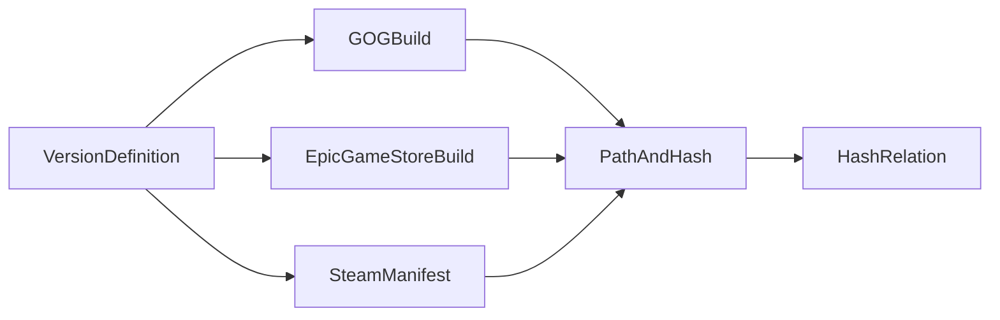

# Updating Game Hashes

The app uses a small database of game hashes to determine what files in a game folder are part of the game, and what files
are added by the user or "external files". These hashes can also be used to detect changes from files and installed game versions. 

The data for these hashes is stored in the `https://github.com/Nexus-Mods/game-hashes` repository. There are two main folders
in this repository: `json` and `contrib`. The `json` folder contains machine generated data (described below), while the 
`contrib` folder contains human curated data.

### Linking Vanity Versions

Internally every game store has some sort of build identifier for a game. For Steam this is a build id, for GOG it's a game version
and for Epic it's the manifest hash. This data is stored in the `version_aliases.yaml` file in the `contrib` folder. And looks
something like this;

```yaml
{GameName}:
  {OS}:
    - Name: {Vanity Version Name}
      Steam:
          - {Steam Build ID1}
          - {Steam Build ID2}
      GOG:
          - {GOG Version1}
          - {GOG Version2}
      Epic:
          - {Epic Manifest Hash1}
          - {Epic Manifest Hash2}
```

So a segment of the Cybeprunk 2077 version aliases file would look like this:

```yaml
Cyberpunk 2077:
  Windows:
    - Name: 2.2(1)
      GOG:
        - 2.2(1)
      Steam:
        - 6971552143247463690
      Epic:
        - ccf50a34ad87fed91d0ae2657b89248cfaa80ac6
    - Name: 2.21
      GOG:
        - 2.21
      Steam:
        - 8420445566849588826
      Epic:
        - 80931fa8897b3e30190d7ea3f30480e1dc89f014  
```

This file determines what is showin in various places of the app for a the game version. 

### Game File Hashes

In the JSON folder is a director called `hashes`. This is large set of JSON files that contain mappings between hashes of 
various sizes. For example:

```json
{
  "XxHash3": "1EEB6D248EFB0D0A",
  "XxHash64": "8CC7B7CFF403D58D",
  "MinimalHash": "1EEB6D248EFB0D0A",
  "Sha1": "6FAC55E5BA31AAED2F38E4D5ABD4FEEDCC111577",
  "Md5": "EC7B48A59E0D029600F0C56D1577B00F",
  "Crc32": "93950E61",
  "Size": 16264
}
```

Each store indexes files with their own preferred hash, and the app uses XxHash3, so mappings are required to convert from one
hash to another. The `MinimalHash` is a hash estimate (defined elsewhere in the docs) that can be used to quickly get a hash for
a file in cases where it's known that hash collisions are rare. The various CLI commands described later in this document
will keep these hashes up-to-date and so this folder can be safely ignored by developers.

### Build Info
In the `json/stores` folder is a folder for each supported game store. Inside these folders are sets of JSON files that contain
mappings between build identifiers, and path/hash pairs. The contents of these folders are not important for developers, 
and they are mostly a data-dump of data hosted by the game stores. Often these game stores will only use one of the above
file hash types, so part of the database build process is linking all the entities described above together.


## What to do when a game updates
When a game updates, the hashes for the new version of the game and the build information need to be indexed, and then a
new hash database needs to be built and released. All hash data is centralized in the GitHub repository, to the first step is
to do a checkout of the repository and checkout the latest copy of the NexusMods app. 

``git clone https://github.com/Nexus-Mods/game-hashes.git``

Now for each major game store, the files need to be indexed. 

### Indexing Steam Files
First of all, login to Steam via the CLI (or the UI of the app):

`dotnet run -- --as-main steam login`

Now index the game:

`dotnet run -- --as-main steam app index -a {AppId} -o {GithubCloneFolder}/json`

The AppId in this case is the Steam AppId, so check below for per-game instructions as many games have DLC and expansions
that need to be indexed as well. Also notice how the path is postfixed with the `json` folder. This command will often 
ignore files that already exist to speed up the indexing process. So if a file is already hashed, there's no 
need to rehash it. Be aware of this if you are debugging the code and need to correct bad json data.

### Indexing GOG Files
For GOG, the process is very similar. First, login to GOG via the CLI (or the UI of the app):

`dotnet run -- --as-main gog login`

Now index the game:

`dotnet run -- --as-main gog app index -p {ProductId} -o {GithubCloneFolder}/json`

The rest is similar to the Steam indexing process.

### Indexing Epic Games Files
For Epic Games, the process is more convoluted. Epic doesn't store as rich of information as the other stores, so for 
now we rely on `egdata.api` for our metadata and base file hashes. In addition Epic only ever allows downloading the latest
version of a game, so it's common for `egdata.api` to list a version that cannot be downloaded anymore. These "dead" versions
are ignored by the rest of the indexing code. 

You do not have to log into Epic Games via the CLI, as the `egdata.api` is public. So first of all index the game's files:

`dotnet run -- --as-main egs app index -a "{AppId}" -o {GithubCloneFolder}/json`

This command will pull the latest manifest and build information for the given game. At this point, all we have is the build
information and the SHA1 hashes of the files, we still need to somehow get the other hash variants so we can link all the data
together. 

Next make sure the game is installed on your machine and up-to-date. The folder need not be clean, as files found there that do 
not match the SHA1 hash will be ignored, but a dirty game folder may cause a build to be skipped. 

`dotnet run -- --as-main egs app hash -g "{GameName}" -o {GithubCloneFolder}/json --hashes`

This command will go to the game folder for the given game and create all the hashes for the files in that folder.


### Building the Hash Database
Once all the files have been indexed, they should be commited to the github repository. The next step is to build the hash database
and release it. This is done by running the GitHub action `Build and Release` in the `game-hashes` repository. This action will
build the hash database and release it as a GitHub release. The app will detect the new release and update its internal
hash database automatically.

This build process essentially links all the data together, the graph of entity types looks something like the following:



`VersionDefinition` entities define the "vanity version" of a game and link to one or more "manifest" files for each game store.
These stores contain a lot of metadata information about the build and link to a series of PathAndHash entities. These entities
contain the path to a file and a reference to the HashRelation entity. The HashRelation entity contains the various hashes
for the file, and the size of the file.


## Per-Game Ids

| Game Name        | Sub Section     | Steam AppId | GOG ProductId | Epic AppId                       |
|------------------|-----------------|-------------|---------------|----------------------------------|
| Cyberpunk 2077   | Base Game       | 1091500     | 1423049311    | 5e0277378de542ce9bf891d2f919d6c8 |
| Cyberpunk 2077   | Phantom Liberty | 2138330     | 1256837418    | 10d85eb96fec4edea3fbe213a8583973 |
| Cyberpunk 2077   | Red Mod         | 2060310     | 1597316373    | 563d27afe4544a648a0c222d73dedd84 |
| Stardew Valley   | Base Game       | 413150      | 1453375253    | N/A                              |
| Baldur's Gate 3  | Base Game       | 1086940     | 1456460669    | N/A                              |
| Skyrim SE        | Base Game       | 489830      | 1711230643    | 2d837b8ee87b434a99a80fca0e4eb960 |

