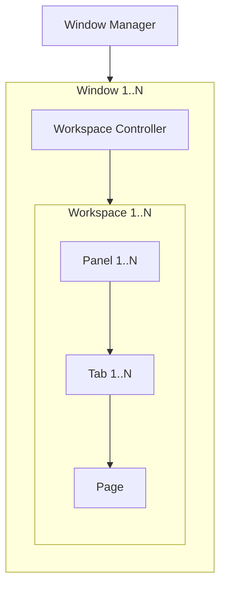

# Workspaces

## Concepts

The following is a list of components and their relationship:



- Globally, there is always a single instance of a Window Manager, `IWindowManager`, that manages all windows.
- A Window refers to an actual Avalonia Window. Using ReactiveUI, the View Model of this Window must implement `IWorkspaceWindow`.
- Every Window has its own instance of `IWorkspaceController` for handling workspace related actions and queries.
- The Workspace Controller keeps track of all instances of `IWorkspaceViewModel`. Multiple Workspaces can exist within the same Window, however, there can only be one active Workspace per Window.
- A Workspace is essentially just a grid of Panels where each Panel implements `IPanelViewModel`. A Workspace is guaranteed to contain at least one Panel.
- Each Panel can contain one or more Tabs that implement `IPanelTabViewModel`. There can only be one active Tab in a Panel.
- Tabs contain a single Page which represent the actual contents.

### Workspace Context

Every Workspace must have a context. This is literally just `IWorkspaceContext Context` on `IWorkspaceViewModel`. The interface is essentially just a marker interface, meaning it's completely empty:

```csharp
public interface IWorkspaceContext;
```

By design, the context must be unique across all Workspaces in a Window. It can be used to identify a Workspace while also providing information on what the Workspace is used for. Without this context, anything outside a Workspace won't be able to refer to it without using a computer generated GUID.

### Pages and Factories

The `Page` type is a simple record that contains the View Model and `PageData`. We have to be able to indirectly create Pages from anywhere, to achieve this, we use the factory pattern.

Implementations of `IPageFactory` have a hardcoded GUID and can create a `Page` given a context `IPageFactoryContext`. Consumers would want to use the more helpful `APageFactory` abstract class but that'll be covered later. Similar to `IWorkspaceContext`, `IPageFactoryContext` is just an empty interface that allows inheritors to provide context to the contents of a Page.

To create a `Page`, you only need to know the ID of the factory and the context you want to pass it. Both of these values are stored in the `PageData` property of the `Page` type. `PageData` gets serialized to save, and deserialized to restore, a Page.

## Examples

See the [Examples projects](https://github.com/Nexus-Mods/NexusMods.App/tree/main/src/Examples) on how to use these concepts and APIs.
