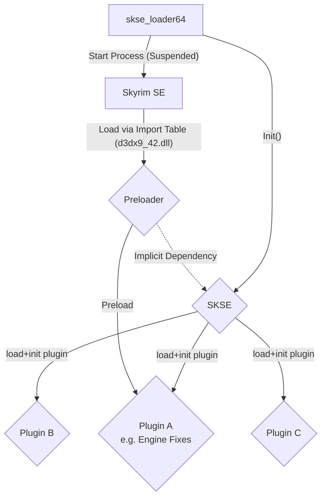

## General Info

- Name: Skyrim Special Edition
- Release Date: 2016
- Engine: Creation (Gamebryo)

## Code Injection Dependency Chart

For a typical modded game.



Game setup starts with SKSE doing DLL Injection into suspended process; calling Init, and unsuspending.

In some cases behaviour of engine needs to be augmented ahead of SKSE loading. In those cases the `preloader` dll hijacking stub is used.

For our purposes; no special functionality/integration is required here we can simply push files out to game directory; run `skse_loader64.exe` and call it a day.

## Uploaded Files Structure

!!! info "Using popular mods as examples."

Uploaded Skyrim SE mods can appear in the following form:

- Files Targeting Data Subfolder
    - [SkyUI](https://www.nexusmods.com/skyrimspecialedition/mods/12604?tab=files)
    - Root of archive maps to data.
    - e.g. `/SkyUI_SE.bsa` maps to `Data/SkyUI_SE.bsa`.

- Loose Files Targeting `Data` Subdirectory
    - [Skyrim 202X 9.0 to 9.4](https://www.nexusmods.com/skyrimspecialedition/mods/2347?tab=files)

- Files Targeting Game Root Directory
    - [Skyrim 202X 9.0](https://www.nexusmods.com/skyrimspecialedition/mods/2347?tab=files)

Mods can ship as 'loose files' or '.esp+.bsa' pairs

## Additional Considerations for Manager

### Plugins.txt

!!! info "Found in: `%LOCALAPPDATA%\Skyrim Special Edition`."

The `plugins.txt` file in Skyrim lists plugin files with the ".esp" and ".esm" extensions that are loaded after the game's own.

- `.esm` stands for "Elder Scrolls Master" and is mainly used for adding database data other plugins (`.esp`, `.esl`) rely upon; such as models, terrain, mechanics. Mainly used for large scale overhauls, and loaded first before `.esp`(s).
- `.esp` stands for "Elder Scrolls Plugin" and is used for most mods that add new content to the game, i.e. weapons, armor, or quests. They can have dependencies on `.esm`(s).
- `.esl` stands for "Elder Scrolls (Master) Light" and is exclusive to >= Special Edition. These are effectively `.esm`(s) with limitations.

Example of file looks like:
```txt
*Unofficial Skyrim Special Edition Patch.esp
*LegacyoftheDragonborn.esm
*MajesticMountains_Landscape.esm
*DwemerGatesNoRelock.esl
AbandonedPrisonTweaks.esp
*UHDAP - en0.esp
```

`*` denotes a file that is enabled; and will be loaded by the game, if missing, the game will ignore the plugin.
This makes the presence of loadorder.txt superfluous, but could still be used to keep track of ghosted plugins.


Each `.esp`/`.esm` has a 'Mod Index':

- Using naming convention `xxYYYYYY`, where `xx` is plugin slot.
- Therefore there is a 255 implicit item limit.
- However... slot `0xFE` is reserved for `.esl` files.

The newer `.esl` files have a limit of 4096 items; and have their own limit.

- They have naming convention `FExxxYYY` where `xxx` is plugin slot.
- Therefore there is a 4096 limit.
- i.e. They use the 0xFE slot previously reserved for `.esp` & `.esm`.

`.esm`(s) and `.esl`(s) are always loaded before `.esp`(s) by the engine.

Please note however. ***The game engine has a 512 open file handle limit;***
so you can never realistically consume all possible ~4350 items without hitting this cap.

This can however be increased with [engine-fixes](#engine-fixes).

### Masters (Dependencies)

Plugins (`.esp`, `.esl`), can have 'Masters'; these are effectively dependencies.

To load a given plugin, all masters present in the plugin file's header must also be enabled.
These masters are usually `.esm`, files but can also technically be other `.esp` files.

### BSA Archives

BSAs are a collection of archived files that are loaded either if there is a plugin with the same name

`Unofficial Skyrim Special Edition Patch.esp` -> `Unofficial Skyrim Special Edition Patch.bsa`

or same name followed by ellipsis: `<pluginName> - <something>.bsa`:

eg. `Unofficial Skyrim Special Edition Patch - Textures.BSA`

(Note: different bethesda games have different loading behaviour for BSA files)

or if the archive is listed in the `Archive` section of the `Skyrim.ini` file
(see [sResourceArchiveList](https://stepmodifications.org/wiki/Guide:Skyrim_INI/Archive#sResourceArchiveList)).

The files listed here are loaded first, and then the files from the plugins, in the order listed in plugins.txt.
Later archives overwrite earlier archives.

For list of BSA formats compatible with Skyrim see: [Bethesda mod archives](https://wiki.nexusmods.com/index.php/Bethesda_mod_archives).

### Loose Files Load Order

Files can include loose files that need to be pushed out to `Data` subfolder.
These files will take priority over those packed in `.bsa` archives.

Usually this is only done for texture mods and shouldn't cause issues with other mods;
but it is worth taking into account.

## Essential Mods & Tools

Tooling for this game is built ; i.e. users are expected to modify the game folder directly, and use tools on the game folder.

### [SKSE](https://skse.silverlock.org)

Adds additional scripting capabilities and engine changes not present in vanilla.
Also acts as code loader; loading DLLs from inside `Data/SKSE/Plugins`.

This mod is considered essential; as it is a required dependency for many mods out there.
It should ideally be preinstalled automatically for most mod setups.

### [Preloader](https://www.nexusmods.com/skyrimspecialedition/mods/17230?tab=files&file_id=181171)

A DLL stub (entry point: `d3dx9_42.dll`) which forces itself to load before SKSE using DLL Hijacking approach.
This is done as some mods, e.g. [Engine Fixes](#engine-fixes) need to kick in before SKSE loads to make engine changes.

### [Engine Fixes](https://www.nexusmods.com/skyrimspecialedition/mods/17230)

General suite of fixes for game code/logic.

This one is considered essential for large mod setups because the ***game engine has a 512 open file handle limit;*** which means in practice you're hard capped at around 400-500 mods. This mod can extend that limit to 2048.

### [LOOT](https://loot.github.io)

A Load Order Optimisation Tool (LOOT).
Inspects mod archives and figures out optimal order that plugins `.esp`(s) should be loaded in.

Very [Useful information about load ordering here](https://loot.github.io/docs/help/Introduction-To-Load-Orders.html#:~:text=In%20Skyrim%2C%20the%20load%20order,load%20order%20of%20all%20plugins.).

Considered essential in scope of Skyrim and requires implementation for MVP.

### [xEdit (SSEEdit)](http://tes5edit.github.io)

xEdit is a modding tool for Skyrim that allows you to edit masters, plugins and the
data structured contained within those files.

In the context of mod management, it includes various functions for comparing and merging mods
(merging mods helps preventing you from hitting plugin limits); resolving conflicts
between mods and cleaning up records.

This tool is essential for complex Skyrim mod setups.

### [FNIS](https://www.nexusmods.com/skyrim/mods/11811)

A third-party modding tool that allows for more advanced and complex animations to be used in the game.
Usually you would run this utility after deploying a new mod setup, but before running the game.

It detects supported mods in game folder; autogenerates new files and off it goes.
Ideally we should detect FNIS-supported mods and prompt the user if they want to run FNIS before starting the game.

## Deployment Strategy

Standard deployment: Push files out to game folder.

Not suitable for VFS; tools work on game folder directly, and thus having VFS would affect user experience; this is a no-go.

## Work To Do

[Refer to the relevant Epic for the game.](https://github.com/Nexus-Mods/NexusMods.App/issues/33)

## Misc Notes

Code injection approach is fundamentally flawed; there is a
lack of distinction between 'mod loader' and 'mod'. SKSE tries to be both;
but by being a 'mod' itself, it opens the need for components like preloader to
augment engine logic before the 'mod' part of SKSE kicks in.
