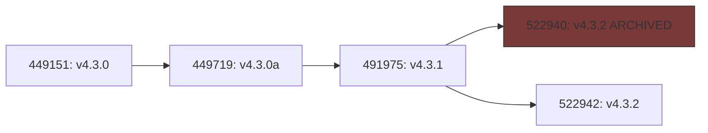
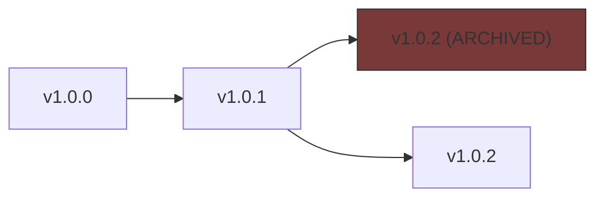
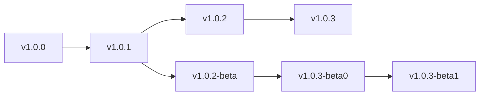
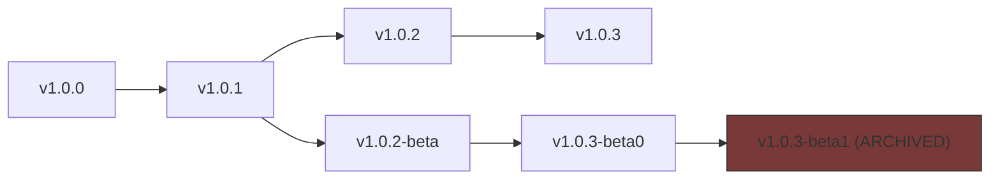
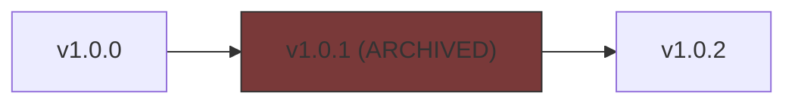

!!! info "This is a research document, listing the various caveats, edge cases and existing solutions for generic updates on *Nexus Mods*"

    Supporting ***generic*** mod updates on the Nexus today is a tricky subject.

## Problem Statement

!!! info "In other words, what is the context we're working with."

    As of 18th of September, 2024.

### No Standardization

!!! info "There is no 'standardized' way to support mod updates on Nexus."

Users typically:

- Upload some loose files
- Provide install instructions in descriptions
- Mod Managers are expected to make sense of these files

*Automation on the website side is not viable.*

Some modding frameworks like SMAPI or Reloaded have unique identifiers per mod; which
can be used to support reliable, robust update systems.

However, the vast majority of mods on the site use a varied amount of modding frameworks.
Many of these are not suitable to support mod updates natively.

Example: How do you update a DLL file with no additional context?

In other words, there is little 'business case' to request a more robust update system
on the website side of Nexus.

### Limited Update Metadata

!!! warning "Nexus has limited on-site support for mod updates (as of today)."

A generic, limited 'update' system is supported on the Nexus.

When a mod author uploads a new file to the site, they can specify a previous file
for which this file is an update for.

However, this system has limitations:

- You set the 'previous version' on upload.
- The 'previous version' cannot be overwritten once set.
- The `previous version` -> `next version` is a one-to-many relationship.
    - A user is allowed to set the same `previous version` on many files.

### No Plans for V2 API

!!! info "Plans for V2 API in regard to 'mod updates' are unclear."

More specifically, there are no plans yet in regard to what will happen with the
`file_updates` field (see below). The V2 API does not contain this field; it is unclear
whether V2 API will support this field, or whether the whole system of marking mod updates
will be replaced with a new on-site implementation.

## Existing Implementations

!!! info "Some existing implementations of ***generic*** mod updates over Nexus exist."

The most commonly used implementations are in [Mod Organizer 2] and [Vortex].
Below is a rough simplified breakdown on how they both operate.

### 1. Determine Updated Mod Pages

!!! info "First we must determine which mod pages have been updated."

Both [Mod Organizer 2] and [Vortex] rely on the V1 API for this.

We query `/v1/games/{game_domain_name}/mods/updated.json` to obtain the most recently
updated mods for a given game. This gives us mods updated in ***the last month*** (max API limit).

We can then check the `latest_file_update` timestamps.

Example response (truncated):

```json
[
  {
    "mod_id": 167,
    "latest_file_update": 1725035688,
    "latest_mod_activity": 1725035918
  },
  {
    "mod_id": 198,
    "latest_file_update": 1715015733,
    "latest_mod_activity": 1725386934
  },
  {
    "mod_id": 266,
    "latest_file_update": 1721451025,
    "latest_mod_activity": 1725213667
  }
]
```

We match the response against our locally installed mods;
performing the following actions:

#### Updating our Cached Data

If any of our mods:

- Are in the response and have a `latest_file_update` timestamp than our local cached one.
- Have not been checked in over 1 month (max API limit)

We [query the mod files for an update](#2-querying-mod-files).
We then update the locally cached data and set timestamp to current time.

#### Updating Cached Timestamp

For all other mods; including:

- Those sooner than 1 month old but with older or equal `latest_file_update` timestamp.
- Those sooner than 1 month old but not in the response.

We simply update the 'last checked timestamp' to the current time.

!!! tip "This means that on repeated calls to the `updated.json` API, we will incur a 'local cache hit'."

    Logically, a mod whose update you checked for sooner than 1 month ago, that has not been
    updated in 1 month could not have changed.

### 2. Querying Mod Files

!!! info "Traverse the `previous version` -> `next version` mappings defined by the user."

We query the mod page for its files using the V1 API.
`/v1/games/{game_domain_name}/mods/{mod_id}/files.json`

Example payload:

```json
"files": [
  {
    "file_id": 207864,
    "name": "Unofficial Skyrim Special Edition Patch",
    "version": "4.2.5a",
    "category_name": null,
    "file_name": "Unofficial Skyrim Special Edition Patch-266-4-2-5a-1623034459.7z",
    "uploaded_timestamp": 1623034459,
    "uploaded_time": "2021-06-07T02:54:19.000+00:00",
    "mod_version": "4.2.5a",
    "description": ""
  },
  {
    "file_id": 522942,
    "name": "Unofficial Skyrim Special Edition Patch",
    "version": "4.3.2",
    "category_name": "MAIN",
    "file_name": "Unofficial Skyrim Special Edition Patch-266-4-3-2-1721451025.7z",
    "uploaded_timestamp": 1721451025,
    "uploaded_time": "2024-07-20T04:50:25.000+00:00",
    "mod_version": "4.3.2",
    "description": "Meant for use ONLY with SSE v1.6.1130+."
  }],
"file_updates": [
  {
    "old_file_id": 449151,
    "new_file_id": 449719,
    "old_file_name": "Unofficial Skyrim Special Edition Patch-266-4-3-0-1701835628.7z",
    "new_file_name": "Unofficial Skyrim Special Edition Patch-266-4-3-0a-1702019266.7z",
    "uploaded_timestamp": 1702019266,
    "uploaded_time": "2023-12-08T07:07:46.000+00:00"
  },
  {
    "old_file_id": 449719,
    "new_file_id": 491975,
    "old_file_name": "Unofficial Skyrim Special Edition Patch-266-4-3-0a-1702019266.7z",
    "new_file_name": "Unofficial Skyrim Special Edition Patch-266-4-3-1-1713394824.7z",
    "uploaded_timestamp": 1713394827,
    "uploaded_time": "2024-04-17T23:00:27.000+00:00"
  },
  {
    "old_file_id": 491975,
    "new_file_id": 522942,
    "old_file_name": "Unofficial Skyrim Special Edition Patch-266-4-3-1-1713394824.7z",
    "new_file_name": "Unofficial Skyrim Special Edition Patch-266-4-3-2-1721451025.7z",
    "uploaded_timestamp": 1721451025,
    "uploaded_time": "2024-07-20T04:50:25.000+00:00"
  }
]
```

(Query: `https://api.nexusmods.com/v1/games/skyrimspecialedition/mods/266/files.json`)
Some fields removed and results trimmed.

The `previous version` -> `next version` mappings are defined in the `file_updates`
array. Suppose we downloaded a mod before which has an `old_file_id` of `449719`.

To find mod updates, we need to traverse the `file_updates`, find the entry with
`old_file_id` of `449719`, and save the `new_file_id` of that entry. Repeat this process
until there is no entry with the current `old_file_id`.

### Reference Source Code

- [Mod Organizer 2 Update Source][mo2-update-source]
- [Vortex Update Source][vortex-update-source]

## Technical Problems

!!! info "Some edge cases need to be worked around when handling updates."

### Archived Mods

!!! info "Mods on Nexus can be 'archived' which hides them from search results."

Recall the earlier example, there was an entry with `449151`, but
there is no item with `file_id` of `449151` in the `files` array.

This was not an omission from the original response when trimming in the example.
The response does not contain 'archived' files.

Since the introduction of 'collections' at Nexus Mods, mods can no longer be removed,
but they can be 'archived' to hide them. 


!!! tip "We must manually query the individual files with the V1 API."

    `/v1/games/{game_domain_name}/mods/{mod_id}/files/{file_id}.json`

```json
{
  "file_id": 449151,
  "name": "Unofficial Skyrim Special Edition Patch",
  "version": "4.3.0",
  "category_name": "ARCHIVED",
  "file_name": "Unofficial Skyrim Special Edition Patch-266-4-3-0-1701835628.7z",
  "uploaded_timestamp": 1701835628,
  "uploaded_time": "2023-12-06T04:07:08.000+00:00",
  "mod_version": "4.3.0",
  "description": ""
}
```

This gets us the info for hidden entries. Notice the `category_name` field says `ARCHIVED`.

!!! warning "It's possible that the downloaded mod has been 'archived'"

    For this reason, we should also support backtracking the Mod IDs, then forward
    tracking to find available versions.

### Rate Limits

!!! tip "Nexus API has generous API rate limits, but we must handle them nonetheless"

As of 19th of September 2024, the limits are:

```
hourly_limit: 500
daily_limit: 10000
```

Note that the hourly limit is 500. What this means is that ***we can only check 500
mods for updates per hour.***

If the user has a huge amount of mods, we may have to maintain a 'queue' of mods,
checking the ones we have not checked in the longest time first.

### One to Many Relationships

!!! info "The `previous version` -> `next version` relationships are one-to-many."

Note the previous API response for 
`https://api.nexusmods.com/v1/games/skyrimspecialedition/mods/266/files.json`

```json
"file_updates": [
  {
    "old_file_id": 449151,
    "new_file_id": 449719,
    "old_file_name": "Unofficial Skyrim Special Edition Patch-266-4-3-0-1701835628.7z",
    "new_file_name": "Unofficial Skyrim Special Edition Patch-266-4-3-0a-1702019266.7z",
    "uploaded_timestamp": 1702019266,
    "uploaded_time": "2023-12-08T07:07:46.000+00:00"
  },
  {
    "old_file_id": 449719,
    "new_file_id": 491975,
    "old_file_name": "Unofficial Skyrim Special Edition Patch-266-4-3-0a-1702019266.7z",
    "new_file_name": "Unofficial Skyrim Special Edition Patch-266-4-3-1-1713394824.7z",
    "uploaded_timestamp": 1713394827,
    "uploaded_time": "2024-04-17T23:00:27.000+00:00"
  },
  {
    "old_file_id": 491975,
    "new_file_id": 522940,
    "old_file_name": "Unofficial Skyrim Special Edition Patch-266-4-3-1-1713394824.7z",
    "new_file_name": "Unofficial Skyrim Special Edition Patch-266-4-3-2-1721450806.7z",
    "uploaded_timestamp": 1721450806,
    "uploaded_time": "2024-07-20T04:46:46.000+00:00"
  },
  {
    "old_file_id": 491975,
    "new_file_id": 522942,
    "old_file_name": "Unofficial Skyrim Special Edition Patch-266-4-3-1-1713394824.7z",
    "new_file_name": "Unofficial Skyrim Special Edition Patch-266-4-3-2-1721451025.7z",
    "uploaded_timestamp": 1721451025,
    "uploaded_time": "2024-07-20T04:50:25.000+00:00"
  }
]
```

You may notice that there are 2 entries with `old_file_id` of `491975`.
This is because the first upload for new version (`522940`) was archived due to being a broken upload.

To put this in a graph, it would look like this:



It is important that when traversing the graph, we ignore the `ARCHIVED` entry
if a non-archived entry exists.

A 'cheap' quick way to do this is to check the `files` array. If an ID is not
present in that array, the entry was 'archived', 'deleted' or otherwise.

!!! note "Some implementations manually query the files by ID in the V1 API"

    This is an optimization over that.

## Edge Cases

The following edge cases should be considered.

### Matching Version Names with one that has been Archived

!!! note "(ARCHIVED) is category name, they were both submitted with same version."



!!! tip "Should we offer the user an update?"

    We may want to offer the user to download `v4.3.2` if they are on
    `v4.3.2 (ARCHIVED)`.

In this scenario, when the user 'queries' for an update, the archived version should
be ignored; there should be 1 result.

### Multiple Updates for Single File

!!! info "There are two 'branches' of the same mod, both are valid, and contain non-archived files."



One of the branches can contain 'beta' versions, while another branch can contain 'stable' versions.

If the user has `v1.0.0` or `v1.0.1` installed, then both `v1.0.3` and `v1.0.3-beta1` are technically
the 'latest' version of the mod.

In the case of `SemVer`, this is easy to resolve.
However, Nexus allows arbitrary 'version' values, so the versions could be
`banana` and `orange`.

API for querying updates should return all the 'latest versions'.

### Multiple Updates for Single File With Archived Branch End

!!! info "There are two 'branches' of the same mod, one contains an archived file at end."



In this case the `Latest Version` is both `v1.0.3` and `v1.0.3-beta0`.

### Archived in the Middle

!!! info "There is an 'ARCHIVED' version in the middle of the version list."

    In this case, we should use the non-archived version.



In this case `v1.0.2` should be the latest version of the mod.

## Our Improved Approach to Updates [Legacy]

!!! warning "This was replaced by a [simpler design][current-adr] by request"

    This is the original design; which involved the use of the V1 API.
    Because we are moving away from V1 API, project lead requested to not
    proceed with this design. But [Multi Query Pages](#multi-query-pages) optimization
    will be reused.

For [1. Determining Updated Mod Pages](#1-determine-updated-mod-pages), we can improve
upon the existing implementation with [Multi Query Pages](#multi-query-pages) optimization.

For [2. Querying Mod Files](#2-querying-mod-files), we should use the V1 API that is used by the existing
implementation (`/v1/games/{game_domain_name}/mods/{mod_id}/files.json`); as the V2 API
does not contain the necessary information.

We represent the data as a *Directed Acyclic Graph (DAG)*.

### Multi-Query Pages

!!! info "The V2 API allows us to query multiple mod pages at once"

This is a more efficient way to check if mods were updated.

The V2 API has an `modsByUid` endpoint that can be used to query multiple mods at once.

Example query:

```graphql
query ModsByUid {
    modsByUid(uids: ["7318624401981"]) {
        nodes {
            updatedAt
        }
    }
}
```

Example result:

```json
{
    "data": {
        "modsByUid": {
            "nodes": [
                {
                    "updatedAt": "2024-09-18T23:01:09Z"
                }
            ]
        }
    }
}
```

Using the `uids` parameter we can query multiple mods at once.
Then we can compare the `updatedAt` timestamps.

!!! note "A `uid` is a tuple of `modId` and `gameId` at Nexus."

    First 4 bytes are modId, last 4 bytes are gameId; using little endian.

[Mod Organizer 2]: https://github.com/ModOrganizer2/modorganizer
[Vortex]: https://github.com/Nexus-Mods/Vortex
[mo2-update-source]: https://github.com/ModOrganizer2/modorganizer/blob/9c130cbf2fc7225fb2916e46419af50671772aa0/src/modinfo.cpp#L299
[vortex-update-source]: https://github.com/Nexus-Mods/Vortex/blob/85880b9f54df1cc4c1e29e0008755bda575573b0/src/extensions/nexus_integration/util/checkModsVersion.ts#L125
[current-adr]: ../../decisions/backend/0019-updating-mods.md
