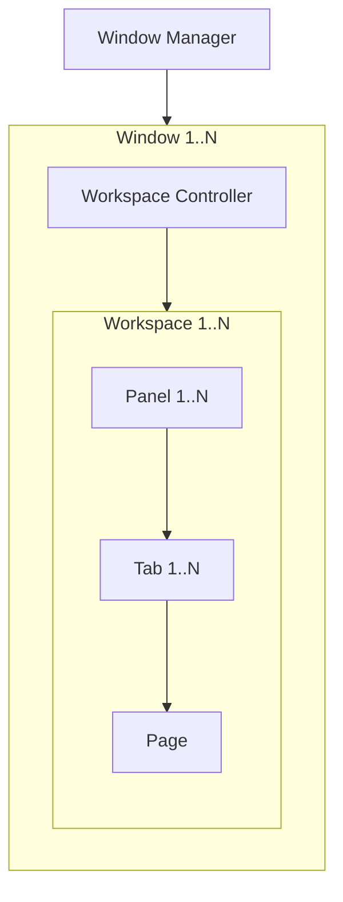

# Workspaces

## Concepts

The following is a list of components and their relationship:



- Globally, there is always a single instance of a Window Manager, `IWindowManager`, that manages all windows.
- A Window refers to an actual Avalonia Window. Using ReactiveUI, the View Model of this Window must implement `IWorkspaceWindow`.
- Every Window has its own instance of `IWorkspaceController` for handling workspace related actions and queries.
- The Workspace Controller keeps track of all instances of `IWorkspaceViewModel`. Multiple Workspaces can exist within the same Window, however, there can only be one active Workspace.
- A Workspace is essentially just a grid of Panels where each Panel implements `IPanelViewModel`. A Workspace is guaranteed to contain at least one Panel.
- Each Panel can contain one or more Tabs that implement `IPanelTabViewModel`. There can only be one active Tab in a Panel.
- Tabs contain a single Page which represent the actual contents. The `Page` type is a simple record that contains a reference to an instance of `IPageViewModelInterface`.

### Workspace Context

Every Workspace must have a context. This is literally just `IWorkspaceContext Context` on `IWorkspaceViewModel`. The interface is essentially just a marker interface, meaning it's completely empty:

```csharp
public interface IWorkspaceContext;
```

By design, the context must be unique across all Workspaces in a Window. It can be used to identify a Workspace while also providing information on what the Workspace is used for. Without this context, anything outside a Workspace won't be able to refer to it without using a computer generated GUID.
