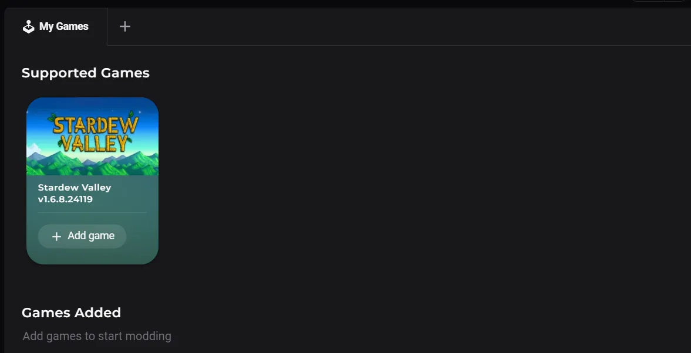
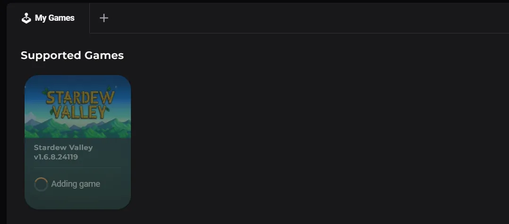
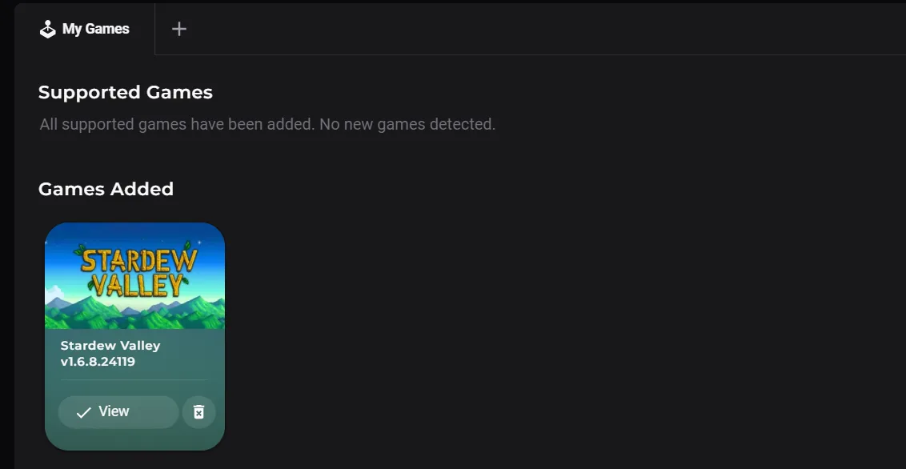

# Managing Games

In this guide, we'll cover adding and removing games in the app. 

## Adding a Game
To get started, head to the home screen of the app by clicking the Nexus Mods logo at the top of the spine on the left. From here, click the "My Games" option in the left menu. 

This page shows a list of games that are currently supported and those that are managed by the app currently. 

To add a game, simply click the "Add Game" button at the bottom of the game card.

While the spinner is displayed the app is taking a backup of the current state of the game files which will allow you to easily restore back to this state when you're finished modding. This can take a few seconds depending on the size of the game. 

Once the process is complete a new entry will be added to the spine menu on the left side. 

!!! tip "Multiple Loadouts"
    In a future release it will be possible to add multiple loadouts per game. This is currently unsupported.

## Removing a Game
!!! warning "Warning"
    Removing a game from the app will permanently delete any loadouts. This cannot be undone.

To stop managing a game with the app, click the home button at the top of the spine menu on the left, then select "My Games" in the left menu. This will open a screen with a list of both supported and managed games.

Under the "Games Added" section, click on the :material-delete-forever: icon on the game you wish to remove. This process may take a few second as the game is reverted back to the state it was in before you started modding it. Your mods are not deleted and will still be available in the Library section next time you manage the game. 

To completely remove the Nexus Mods app and all downloaded mods, please see [Uninstalling the app](./Uninstall.md).
