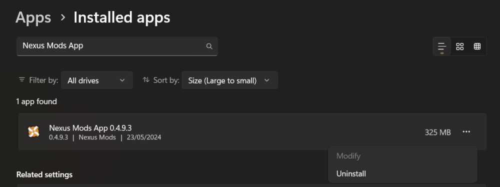

# How to Uninstall the Nexus Mods App

So you're done with testing the Nexus Mods App and want to remove it from your system? Here's a quick guide on how to do it.

Please keep in mind that the app will make the following changes to your system on uninstall.

- Your game folder(s) will be reset to how they were before managing them with the app.
- All mods you've downloaded will be deleted.
- All your preferences or other configuration settings for the app or any of your loadouts will be removed. 
 

## Uninstall on Windows 10/11

If you installed the Nexus Mods App from the installer (most common), you can remove it by doing the following. 

- Open your settings menu by pressing the Start button and clicking the ⚙️ icon next to the power button.
- Select "Apps", then "Installed apps".
- Type "Nexus Mods App" into the search bar.
- Click the menu at the end of the row.
- Select uninstall and click through the wizard.

## Uninstall via Command Line (Linux or portable installs)

This part only applies if you are using Linux, have a portable install or have built the app from source and are running a development build. 

- Open a terminal and run the following command (case-sensitive):
  - On Windows `./NexusMods.App.exe uninstall-app`
  - On Linux `./NexusMods.App uninstall-app`

## Manual Uninstall (Fallback)

!!! warning "Caution"
    Manual uninstall should only be used as a fallback if the normal installer is not available. You will need to manually remove any mod files from your game folder(s).

If something goes wrong during uninstall, it may be necessary to remove the app manually. The following steps must be performed manually by the user:

1. Inside the App, ensure that all mods for your loadouts in all games are disabled and these changes have been applied. This will remove any files added to the game folder and get the game back to a "vanilla" state. (When possible, you should delete your loadouts).</li>
2. Close the App. 
3. Delete the contents of `%LOCALAPPDATA%\NexusMods.App` on Windows or `$XDG_STATE_HOME/NexusMods.App/Logs` and `$XDG_DATA_HOME/NexusMods.App` on Linux to remove all downloaded mods and internal databases used by the app.
4. Delete the App itself (or uninstall it using the Windows system settings if possible). </li>
