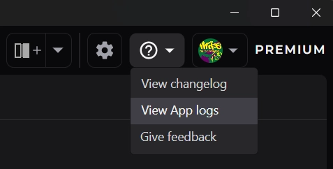
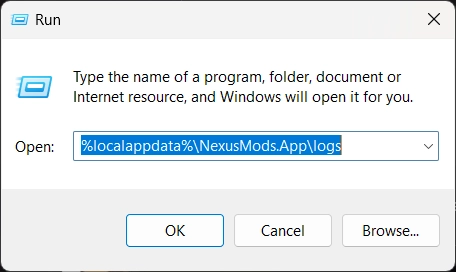
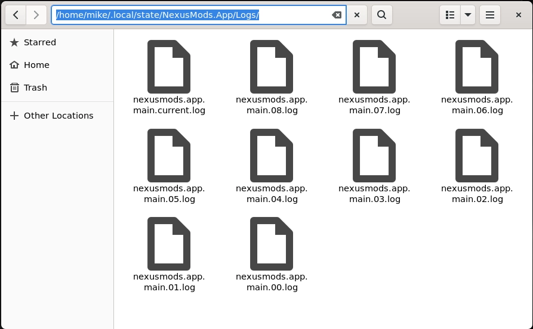

# How to find the log files

To help troubleshoot issues with the app, it's important to be able to find and share you log files. 

## Open the logs folder from the app
!!! note "This option requires v0.5.3 or later."
To quickly open your logs folder, simply click the "View app logs" button from the help menu located in the top-right of the main window. 

## :fontawesome-brands-windows: Windows
Log files for the app are located in `%LOCALAPPDATA%\NexusMods.App\Logs` on Windows. You can quickly find these files by following the steps below:

1. Press ++win+"R"++ to open the "Run" command box.
2. Paste `%LOCALAPPDATA%\NexusMods.App\Logs` into the Open field and press OK.

3. This will open the correct folder in a File Explorer window.
4. Identify that latest files starting with `nexusmods.app.main.` and ``nexusmods.app.slim.`. You can sort by "Date Modified" to make this easier.
5. Share these files in your Discord, GitHub or Forum post by dragging and dropping them into the text field.

## :fontawesome-brands-linux: Linux
??? tip "Using the terminal"
    If you're familiar with the Linux Terminal, simply type `xdg-open file://$HOME/.local/state/NexusMods.App/Logs/` to browse to the correct location. 

Log files for the app are located in `~/.local/state/NexusMods.App/Logs` on Linux. You can quickly find these files by following the steps below:

1. Open the file explorer and ensure you're at the "Home" directory.
2. Press ++ctrl+"L"++ to edit the file path.
3. In the input box, enter
+ `/.local/state/NexusMods.App/Logs/` to the end of the existing path. (e.g. `/home/mike/.local/state/NexusMods.App/Logs/`)

4. Identify that latest files starting with `nexusmods.app.main.` and ``nexusmods.app.slim.`. You can sort by "Date Modified" to make this easier.
5. Share these files in your Discord, GitHub or Forum post by dragging and dropping them into the text field.
