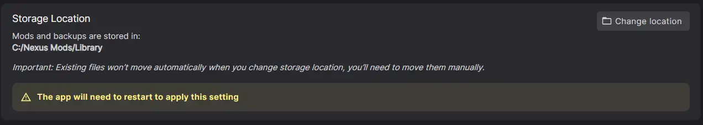

# How to Move the Storage Location for the Library

It is possible to change where the app stores backed up files and downloaded mods/collections. App version 0.13.4 or higher is required. 

!!! warning "Follow these instructions carefully"
    The process to move these files currently requires some specific actions and mistakes can lead to a corrupted setup. If you're not sure at any point, please ask on our [Discord](https://discord.gg/NexusMods) or [Forums](https://forums.nexusmods.com/forum/9052-nexus-mods-app/).

## Find Your Current Library Folder
You can find the current storage location in the app's **Settings** under "Storage Location" option. 

### If You Have Changed the Storage Location
Open the folder shown in Settings using your File Manager. 

### If You Have Never Changed the Storage Location (Default)
By default, the app stores your files in the following locations:

| OS      | Default Path                                                                 |
|---------|------------------------------------------------------------------------------|
| Windows | `C:\Users\<YourUsername>\AppData\Local\NexusMods.App\DataModel\Archives` |
| Linux   | `~/.local/state/NexusMods.App/DataModel/Archives`                            |

#### Windows
- Press <kbd>Win</kbd>+<kbd>R</kbd>, paste the following path, and press <kbd>Enter</kbd>: 
```
%localappdata%\NexusMods.App\DataModel\Archives
```
- Or, open File Explorer and navigate to 
```
C:\Users\<YourUsername>\AppData\Local\NexusMods.App\DataModel\Archives
```

#### Linux
- Using a terminal (such as Konsole) paste the following command, and press <kbd>Enter</kbd>:
```
xdg-open file://$HOME/.local/state/NexusMods.App/DataModel/Archives
```
- Alternatively, open the following path in your file manager:
```
~/.local/state/NexusMods.App/DataModel/Archives
```

## Update the Storage Location
!!! tip "Recommended Location"
    We recommended using a location on the root of your desired Hard Drive partition to avoid potential issues related to protected files. For example `D:\NexusMods\Library` on Windows. 

1. Open the app **Settings** page by clicking the :material-cog-outline: icon at the top of the main window. 
2. Under ":material-monitor: General", find the option **Storage Location** option.
3. Click "Change Location" and select or create the new location.

4. Press the "Save" button in the bottom-right of the Settings panel.
5. Close the app and do not re-open it until the archives have been moved.

## Moving the Archives

The final step is to move all the archives to the new folder. 

!!! danger "`.nx` Files Only"
    When moving the downloads, you should only be moving the `.nx` archive files. Any other files or folders should remain in place. 

1. Open the new folder in the File Explorer. 
2. Cut and paste all `.nx` files from the old location to the new one.
3. Wait for this process to complete before continuing.

Once all archives are in the new location, the app can be used as normal. 

## Troubleshooting

**Can't Find AppData**

On Windows, the `AppData` folder is hidden by default. You can show hidden folders in File Explorer by selecting **View -> Show -> Hidden items**.

**Other Issues**

If you cannot find your files or the app does not detect your mods after moving them, double-check that you have moved only the `.nx` files to the correct folder and that the app’s Settings points to the new location. If you need help, ask on our [Discord](https://discord.gg/NexusMods) or [Forums](https://forums.nexusmods.com/forum/9052-nexus-mods-app/).
