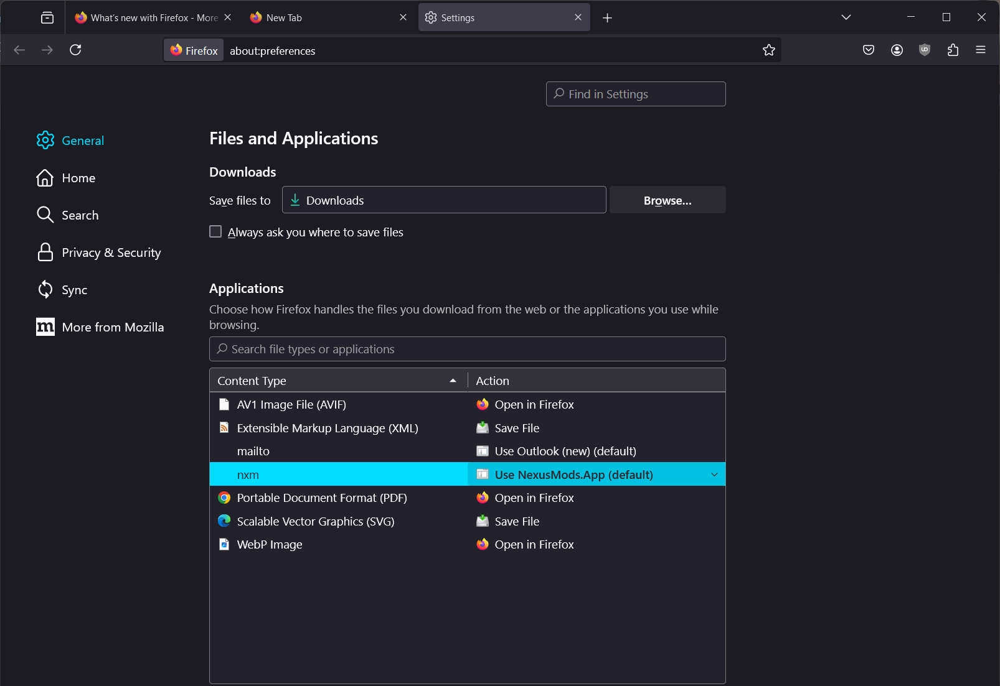

# Why can't I log in or download from Nexus Mods?

These issues most often occur when your PC is not correctly handling Nexus Mods `nxm://` links. These links are used for communication between your web browser and the app. To reset the connection, follow the instructions below.

## :fontawesome-brands-windows: Windows
On a Windows PC, you can re-register the app to handle `nxm://` links by simply logging out and back in again. If this isn't working it may be related to your browser configuration, please see [Browsers](#browsers) for more. 

## :fontawesome-brands-linux: Linux
On a Linux PC, you can check the default app for `nxm://` downloads and reset it following the instructions below:

- Check which app is currently set as the default by running `xdg-mime query default x-scheme-handler/nxm`.
- If this doesn't return `nexusmods-app-nxm.desktop` run this command:`xdg-settings set default-url-scheme-handler nxm nexusmods-app-nxm.desktop`.
- Restart any open web browser windows to ensure the change is applied.
- In your browser, when selecting what application should be used to open the nxm link, select **NexusMods.App NXM Handler**.

## Browsers
Depending on your choice of browser, there may be additional considerations when troubleshooting this issue. 

??? info ":fontawesome-brands-firefox: Setting the default protocol in Firefox"
    Mozilla browsers (such as Firefox) include their own protocol handler settings, which override those set by your operating system. 

    To access these settings click the menu button to the right of the address bar and select "Settings". Under the "General" category locate the section entitled "Files and Applications". 

    

    Here you will see the `nxm` protocol and the default app which will be used to open it. Using the drop-down you can select the default application for Firefox to use. Setting it to whichever option is set as "Default" will use the application specified by your operating system. 
