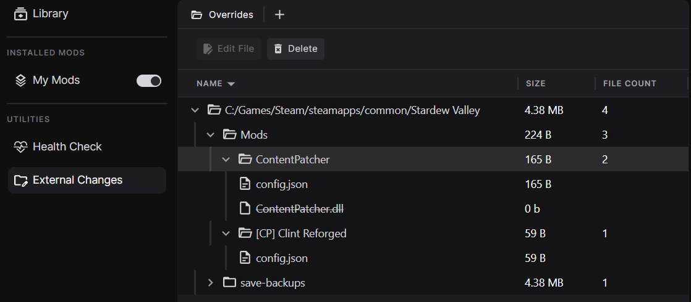

When changes are made to your mods or game folder outside of the file controlled by the app, we collect these in the "External Changes" section and give you options to manage them.

## How it works
At a high level, the app works by keeping track of all the files in your game folder(s). This includes files provided by the base game, DLCs, mods, etc. When changes are made to these files by something outside of the app, these actions are recorded as external changes and the user can decide if this was an intended edit to their modding loadout or not. Below are some examples of changes typically encountered during modding.

=== "Examples of Intended Changes"

    - A new config file for a mod was generated in the game folder.
    - A new mod has been added from another source (e.g. Steam Workshop).
    - A mod file being intentionally deleted as it was causing issues in the loadout.
    - A mod file being edited by the user with an external tool.
    - A new DLC has been installed - which the app doesn't yet recognise.

=== "Examples of Unintended Changes"

    - An file got deleted by mistake.
    - An external program modified a file in an undesirable way.
    - An unscheduled game update has made breaking changes to game files.

## How to manage External Changes

!!! tip "Overrides"
    Any changes recorded in External Changes will overwrite all conflicting files that come before them and therefore should be reviewed every so often to ensure they are not overriding anything important in your mod setup. 

The changes collected by this feature will be available in the External Changes option for your active loadout - this option may not be visible until you've applied your mods at least once. 

In this view, new files are displayed in their parents folders and deleted files are shown with a strike through. 

Files can be removed with the :material-delete-forever: Delete option on the toolbar. Deleting a file that is marked as "Deleted" will undeleted it and cause it to re-appear in the game folder next time changes are applied. 
