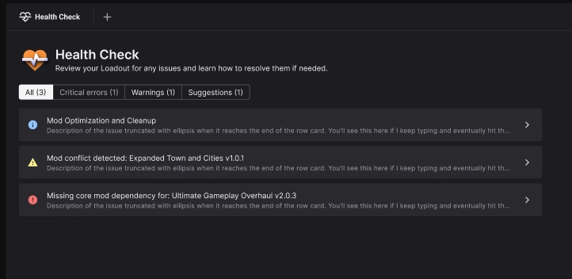

To help you get the most out of your modding experience, the app offers a Health Check system which runs diagnostics against your current loadout and presents potential problems along with recommended solutions. The extent of the diagnostics will vary by game. See [Games](../games/index.md) for details on specific diagnostics. 

# How does it work?
??? tip ":material-stethoscope: Suggest a diagnostic"
    If there's a diagnostic you think should be included with one of our supported games, please let us know on [GitHub](https://github.com/Nexus-Mods/NexusMods.App/issues/new/choose) or the [forums](https://forums.nexusmods.com/forum/9052-nexus-mods-app/). 

Each time you make any change to your loadout, the app will run a number of game-specific checks to help catch common modding issues and offer solutions. The aim of this feature is to help inform you of know or potential issues that would cause problems with your mods or game. This can includes known incompatibilities, dangerous edits to game files, outdated mods, recommendations for the best experience and more. 

Diagnostics are divided into several types:

| Type | Description |
| --- | --- |
| :material-help-circle:{style="color:#93C5FD"} Suggestion | Offers an improvement to the user. This is not indicating a problem with the loadout. |
| :material-alert:{style="color:#FEF08A"} Warning | Highlights something in the loadout which has an unintended adverse effect on the game. |
| :material-alert-circle:{style="color:#F87171"} Critical | Highlights an error in the loadout which will render the game unplayable. |

To get more information on the specific Health Check diagnostics for the game you are managing, please see the [Games](../games/index.md) section.

