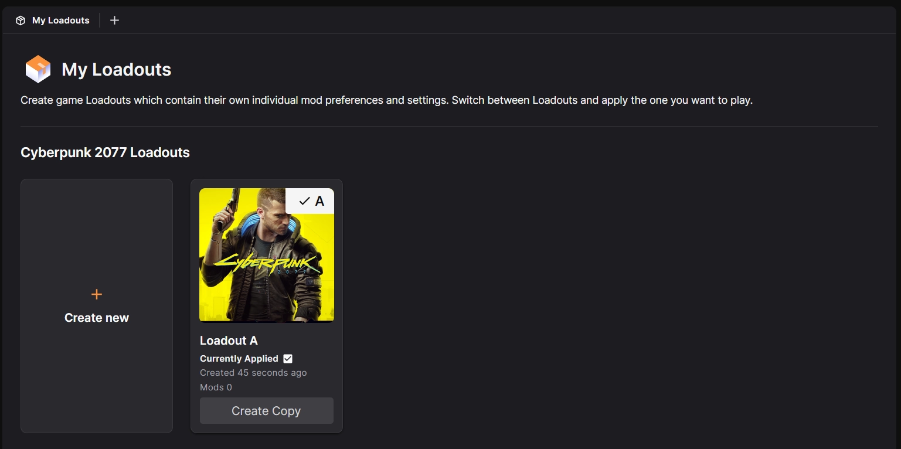
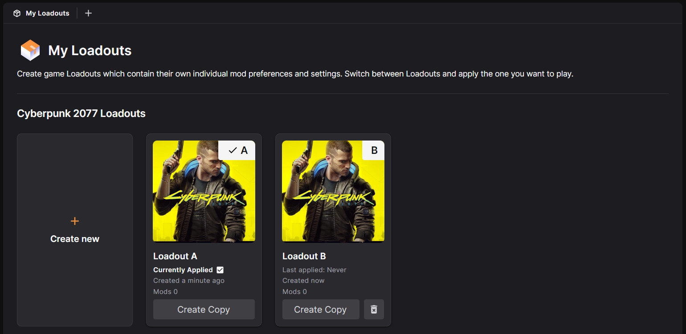

# Loadouts

Loadouts offer a convenient way to manage several different mod setups for a single game. Players can easily swap between simple or complex mod setups by creating multiple loadouts. Some examples of why you would use loadouts are:

- A single player and multiplayer loadout for Stardew Valley or Mount & Blade II: Bannerlord. 
- Different loadouts for different characters in Cyberpunk 2077.
- Separated loadouts for total conversion mods in Elder Scrolls or Fallout games. 
- Testing a new setup without impacting your stable mod setup. 

Loadouts always include a list of mods, but additional data included in a loadout differs by game. For more details on each title, see the [Games](../games/index.md) section. 

In this guide we'll cover adding, copying and removing loadouts.

## Adding a new Loadout
A loadout is automatically created when the game is managed for the first time. To add additional loadouts, open the :material-view-carousel: My Loadouts section which can be found by clicking the Home button at the top of the spine and selecting it from the left menu. 

??? tip "Can't see your game?"
    If you're managing several games, you may need to scroll down to find the loadouts. 

From this screen, simply click the "Create New Loadout" tile. A new loadout card will appear in the view and an icon will be added to the spine. 

New loadouts are completely empty and do not inherit any data from existing ones. 

## Copying an existing Loadout
To copy an existing loadout, simply use the "Create Copy" button located at the bottom of the loadout card in the :material-view-carousel: My Loadouts page. 

Copied loadouts contain the same list of mods (and any additional data) of the original loadout but can be modified without affecting it. 

## Removing a Loadout
!!! warning "Warning: Removing a loadout is irreversible."

To remove a loadout, use the :material-delete-forever: icon at the bottom of the loadout card.

The currently active loadout cannot be removed. To completely remove a game from the app, including all loadouts, please see [Removing a Game](../gettingstarted/AddGames.md#removing-a-game).
