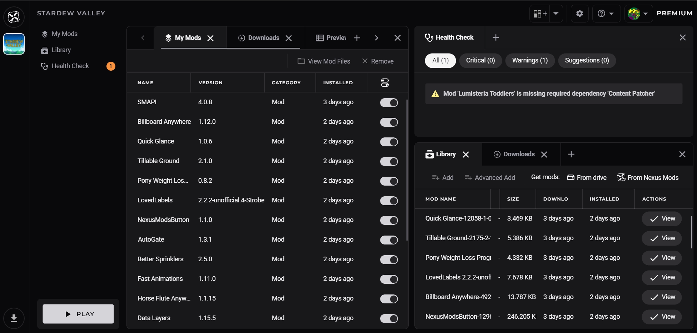
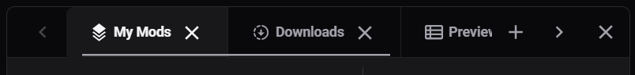
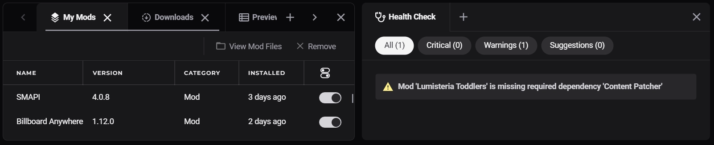

The Workspace feature allows increased flexibility and customisation when managing your mods. Different pages in the app can be opened in new tabs or panels to help arrange the most relevant information in the most useful way. 

## What are Workspaces?
Workspaces are a collection of arranged tabs and panels. A new workspace is created with each loadout added to the app, along with two additional workspaces on the home page and downloads page. The state of these workspaces is saved so you can continue from where you left off next time the app is opened. 

!!! tip "Did you know?"
    You can right-click on any toolbar button or left-menu item to open it in a new panel or tab.

### Tabs
At the top of the workspace, there is a tab bar. New tabs can be opened by pressing the :material-plus: icon and closed by pressing the :material-close: icon.

Each panel can have as many tabs as required. When the number of tabs exceed the available space, a scrollbar and arrows will appear to allow browse through the tab names. 

### Panels

A panel is section of the workspace which contains it's own set of tabs. The workspace can be divided into a maximum of 4 panels. 

To create a new panel, click on the Add Panel button ({ style="height:1.125em;" }) located on the right of the top bar.

Panels can be resized by dragging the edges and can be closed using the :material-close: button. 
