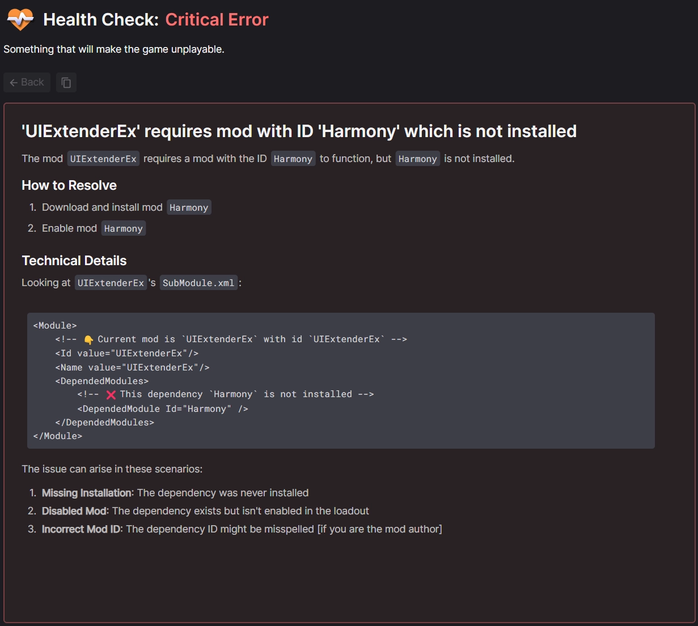

# Mount & Blade II: Bannerlord

!!! example "We're working on it"
    Bannerlord support is currently in development. Get involved by joining us on [GitHub](https://github.com/Nexus-Mods/NexusMods.App/issues/new/choose), [Discord](https://discord.gg/ReWTxb93jS) or the [forums](https://forums.nexusmods.com/forum/9052-nexus-mods-app/)!

## Features
In addition to basic mod management features, players also benefit from these dedicated features:

### Loadout Health Check
Get information on potential issues in your loadout(s). [Learn more about Health Checks.](../features/HealthCheck.md)

Diagnostics are shown in the following situations and uses the SubModule.xml file included with mods to generate these messages: 

- A mod is installed and requires another mod which is not installed or enabled.
- A mod is installed and requires a specific version of another mod which is not installed or enabled.
- Two mods are installed that are marked as incompatible or conflict with each other.
- The SubModule.xml file in the mod contains errors.
- The installed mods create a "circular dependency" meaning if you follow the dependencies for each mod you get into an infinite loop. 
- Load order items need attention. This could be that an entry should be loaded before or after another. 
- Bannerlord Software Extender is installed but the `BLSE.LoadingInterceptor` or `BLSE.AssemblyResolver` dependencies are missing.
- Bannerlord Software Extender is installed but Harmony is missing.

### Selective Game Backup
When managing Bannerlord the app will back up only the core game files (default) or the entire game folder. Backing up the whole game requires significantly more hard drive space. This option can be toggled in the :material-cog: Settings menu.

## Compatibility
This game can be managed via the app on the following operating systems and platforms. The application will automatically detect valid installations from supported game stores if possible. 

|| :fontawesome-brands-windows: Windows |  :fontawesome-brands-linux: Linux | :fontawesome-brands-apple: macOS |
|---|---|---|---|
| :fontawesome-brands-steam: [Steam](https://store.steampowered.com/app/261550/Mount__Blade_II_Bannerlord/) | :material-check-circle: | :material-check-circle: | :material-close-thick: |
|  [GOG](https://www.gog.com/en/game/mount_blade_ii_bannerlord) | :material-check-circle:[^1] | :material-close-thick: | :material-close-thick: |
|  [Epic Games Store](https://store.epicgames.com/en-US/p/mount-and-blade-2) | :material-check-circle: | :material-close-thick: | :material-close-thick: |
| :fontawesome-brands-xbox: [Xbox Game Pass (PC)](https://www.xbox.com/en-GB/games/store/mount-blade-ii-bannerlord/9pdhwz7x3p03) | :material-close-thick:[^2] | :material-close-thick: | :material-close-thick: |

[^1]: Offline backup installs from GOG.com cannot be detected automatically.
[^2]: Xbox Game Pass for PC is not yet supported. <a href="https://github.com/Nexus-Mods/NexusMods.App/issues/1476">More.</a>
