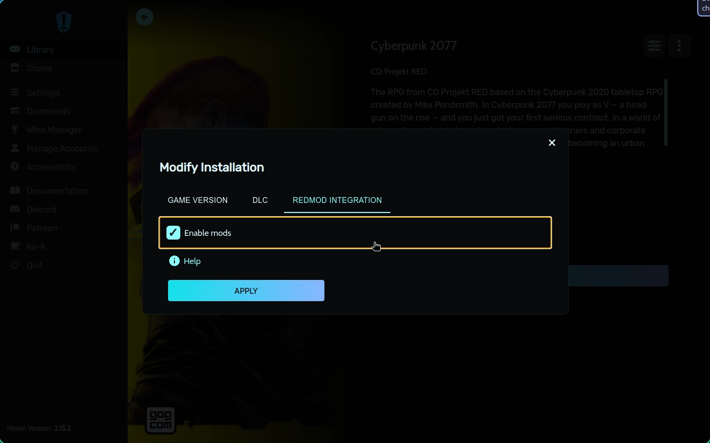

Use the Nexus Mods app to manage your Cyberpunk 2077 mods!

!!! example "We're working on it"
    Cyberpunk 2077 support is currently in development. Get involved by joining us on [GitHub](https://github.com/Nexus-Mods/NexusMods.App/issues/new/choose), [Discord](https://discord.gg/ReWTxb93jS) or the [forums](https://forums.nexusmods.com/forum/9052-nexus-mods-app/)!

## Features
In addition to basic mod management features, players also benefit from these dedicated features:

### Loadout Health Check
Get information on potential issues in your loadout(s). [Learn more about Health Checks.](../features/HealthCheck.md)

Diagnostics are shown in the following situations: 

- A mod requires the REDmod DLC ([Steam](https://store.steampowered.com/app/2060310/Cyberpunk_2077_REDmod/)/[GOG](https://www.gog.com/game/cyberpunk_2077_redmod)/[Epic](https://store.epicgames.com/p/cyberpunk-2077)) but it is not installed. 
- A mod is installed and requires any of the following dependencies by they are not installed or enabled:
    - [Codeware](https://www.nexusmods.com/cyberpunk2077/mods/7780) - Detected by `.reds` files or Lua scripts with the `Codeware` global. 
    - [Virtual Atelier](https://www.nexusmods.com/cyberpunk2077/mods/2987) - Detected by `.reds` files uses hooks for this mod.
    - [Appearance Menu Mode](https://www.nexusmods.com/cyberpunk2077/mods/790) - Detected by Lua scripts in the `bin/x64/plugins/cyber_engine_tweaks/mods/AppearanceMenuMod/Collabs` folder.
    - [RED4Ext](https://www.nexusmods.com/cyberpunk2077/mods/2380) - Detected by `.dll` files in the `red4ext/plugins` folder.
    - [TweakXL](https://www.nexusmods.com/cyberpunk2077/mods/4197) - Detected by `.tweak` files in the `r6/tweaks` folder.
    - [ArchiveXL](https://www.nexusmods.com/cyberpunk2077/mods/4198) - Detected by `.xl` files in the `archives` folder. 
    - [Cyber Engine Tweaks](https://www.nexusmods.com/cyberpunk2077/mods/107) - Detected by `.lua` files in the `bin/x64/plugins/cyber_engine_tweaks` folder. 

### REDmod Load Ordering
Some mods for Cyberpunk 2077 make use of the official REDmod format for loading content. The Load Order page allows users to decide on the order in which the game will load content from REDmods. By default, the mods at the **top** of the list will win if they have conflicting changes with another REDmod lower down in the order. 

You can learn more about the REDmod format on [community wiki](https://wiki.redmodding.org/cyberpunk-2077-modding/for-mod-users/users-modding-cyberpunk-2077/redmod/usage).

Changes in REDmods are always overwritten by similar changes inside archive mods.

### Automated deployment for REDmods

??? info "REDmod with Heroic Launcher (Linux)"
    The app cannot run REDmod deployment automatically for users who have installed Cyberpunk 2077 through Heroic Launcher on Linux. To run REDmod in Heroic, ensure the "Enable Mods" checkbox is enabled under "Modify Installation". This will mean REDmods are deployed by Heroic Launcher before the game starts.
    
     

When mods using the official REDmod system are installed, it may be necessary to run the the REDmod tool. The app will detect when this is necessary and run it automatically before starting the game. 

### Selective Game Backup
When managing Cyberpunk 2077, the app will back up only the core game files (default) or the entire game folder. Backing up the whole game requires significantly more hard drive space. This option can be toggled in the :material-cog: Settings menu.

## Compatibility
This game can be managed via the app on the following operating systems and platforms. The application will automatically detect valid installations from supported game stores if possible. 

|| :fontawesome-brands-windows: Windows |  :fontawesome-brands-linux: Linux | :fontawesome-brands-apple: macOS |
|---|---|---|---|
| :fontawesome-brands-steam: [Steam](https://store.steampowered.com/app/1091500/Cyberpunk_2077/) | :material-check-circle: | :material-check-circle: | :material-close-thick: |
|  [GOG](https://store.steampowered.com/app/1091500/Cyberpunk_2077/) | :material-check-circle:[^1] | :material-check-circle:[^1][^2] | :material-close-thick: |
|  [Epic Games Store](https://store.epicgames.com/en-US/p/cyberpunk-2077) | :material-check-circle: | :material-close-thick: | :material-close-thick: |

[^1]: Offline backup installs from GOG.com cannot be detected automatically.
[^2]: [Heroic Launcher](https://heroicgameslauncher.com/) is required. 
