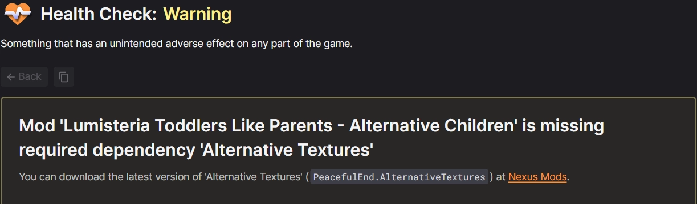
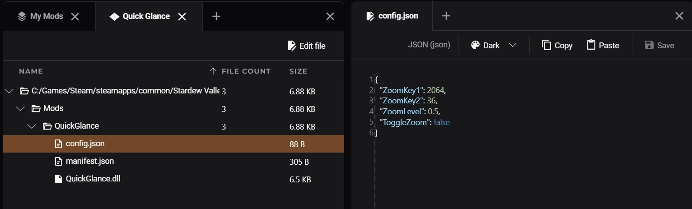

Use the Nexus Mods app to manage your Stardew Valley mods!

## Features
On top of the basic mod management features, players also benefit from these dedicated features:

### SMAPI Installer
Manage your installation of Stardew Modding API (SMAPI) by simply downloading and installing it as you would with any other mod. Once installed, your SMAPI version and game version are compared to ensure that they are compatible. 

### Loadout Health Check
Get information on potential issues in your loadout(s). [Learn more about Health Checks.](../features/HealthCheck.md)

Diagnostics are shown in the following situations: 

- SMAPI is recommended when no mods are installed yet.
- One or more mods requiring SMAPI are installed but SMAPI is missing.
- The installed SMAPI version is too old to work with the game version.
- The game version is too old to work with the installed SMAPI version.
- An installed mod's dependencies are installed, but they are outdated.
- An installed mod has missing dependencies.
- An installed mod's dependencies are installed, but they are disabled.
- A mod that requires SMAPI is installed but SMAPI is missing.
- A mod that requires SMAPI is installed but SMAPI is disabled.
- A mod is marked as obsolete or broken (according to SMAPI).
- A mod is overwriting the game files (XNB mod).

### Loadout-specific Config Files
Settings files for mods (e.g. `config.json`) are saved as part of a Loadout. This allows for different combinations of settings to be used in each loadout. Copying a loadout will duplicate all existing settings whereas creating a new loadout will start with the defaults. See [Loadouts](../features/Loadouts.md). 

### Edit Config Files
 When new config files are created after starting the game, the app will automatically assign them to the mod they correspond to. To edit these settings, select the mod in the "My Mods" view and click "View Mod Files" on the toolbar. Locate the config file (e.g. config.json) and click "Edit File" from the toolbar. Click save when you've finished editing, then apply the changes to your game. 

### Selective Game Backup
When managing Stardew Valley, the app will back up only the core game files (default) or the entire game folder. Backing up the whole game requires significantly more hard drive space. This option can be toggled in the :material-cog: Settings menu.

## Compatibility
This game can be managed via the app on the following operating systems and platforms. The application will automatically detect valid installations from supported game stores if possible. 

|| :fontawesome-brands-windows: Windows |  :fontawesome-brands-linux: Linux | :fontawesome-brands-apple: macOS |
|---|---|---|---|
| :fontawesome-brands-steam: [Steam](https://store.steampowered.com/app/413150/Stardew_Valley/) | :material-check-circle: | :material-check-circle:[^1] | :material-close-thick: |
|  [GOG](https://www.gog.com/en/game/stardew_valley) | :material-check-circle: | :material-check-circle:[^2][^4] | :material-close-thick: |
| :fontawesome-brands-xbox: [Xbox Game Pass (PC)](https://www.xbox.com/en-GB/games/store/stardew-valley/c3d891z6tnqm) | :material-close-thick:[^3] | :material-close-thick: | :material-close-thick: |
|  [WeGame (China only)](https://www.wegame.com.cn/store/2000064/Stardew_Valley) | :material-close-thick: | :material-close-thick: | :material-close-thick: |

[^1]: Native Linux only. Proton is not supported.
[^2]: Offline backup installs from GOG.com cannot be detected automatically.
[^3]: Xbox Game Pass for PC is not yet supported. <a href="https://github.com/Nexus-Mods/NexusMods.App/issues/1476">More.</a>
[^4]: [Heroic Launcher](https://heroicgameslauncher.com/) is required. 
