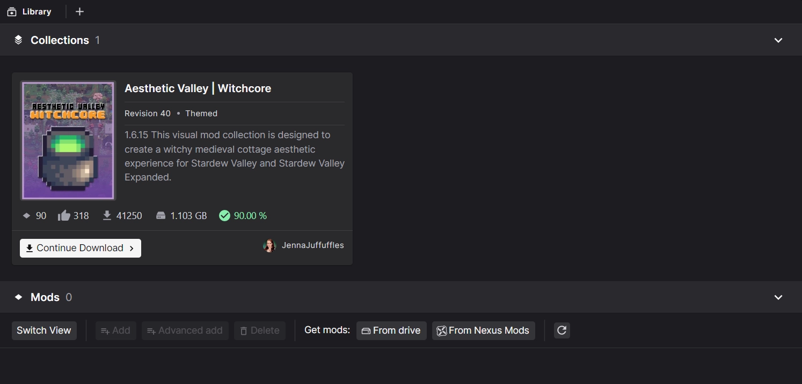
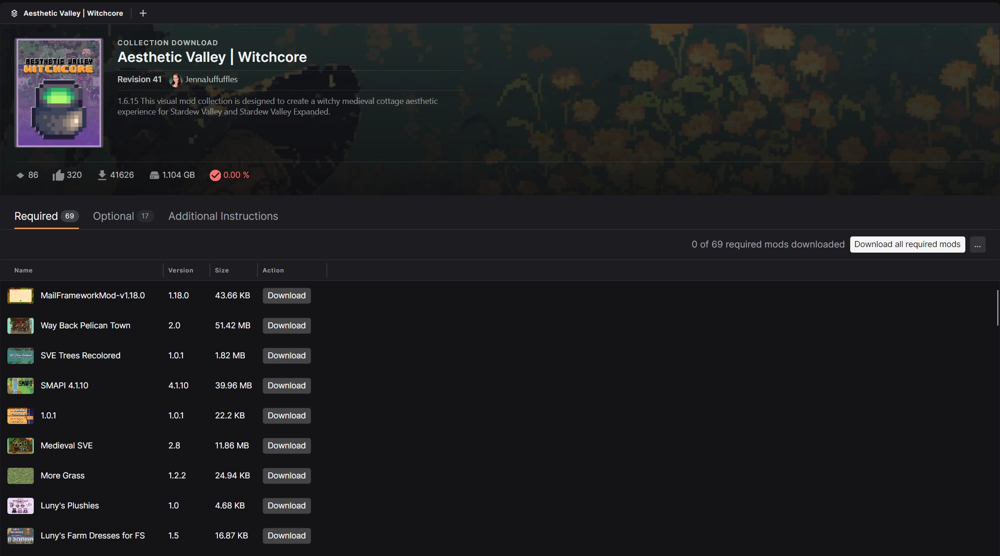
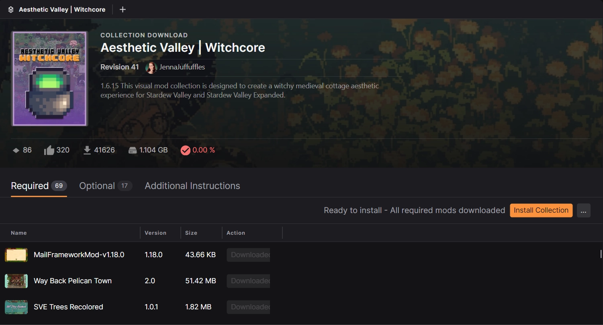
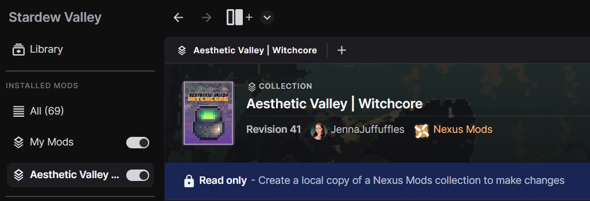

# Downloading a Collection

In this guide, we'll cover adding a collection to the Library by downloading it from Nexus Mods. 

## Browsing the website
To get started, head over the [Nexus Mods website](https://next.nexusmods.com/collections/) and find a collection you would like to try out.

Simply click the "Add collection" button to add the collection to your Library and begin the download process.

## Downloading a collection
!!! tip "Easier with Nexus Mods Premium"
    [Nexus Mods Premium](https://next.nexusmods.com/premium){:target="_blank"} enables uncapped download speeds and allows you to download all mods in a collection in one-click! 

After clicking through on the website, the collection will be downloaded into the app. This can take a few moments. An indicator will appear in the bottom left of the app to show in-progress downloads. Once downloaded, the collection will be available in your Library. 

When you are ready to download the mods, click "Continue Download" to open the Collection Download page. Here you can see the required mods, optional mods, and any additional instructions provided by the curator of the collection. 

To install the mods, click the "Download" button at the end of each row in the "Required" section. If you have a Nexus Mods Premium account, you can also click "Download all required mods" to automate this process. [Why do I as a Free user have to go to each mod page individually?](https://modding.wiki/en/nexusmods/collections/FAQ#why-do-i-as-a-free-user-have-to-go-to-each-mod-page-individually){:target="_blank"}

??? note "Mods from websites other than Nexus Mods"
    If a collection includes mods that are not hosted on Nexus Mods, they must be added to your Library manually. Here's an example.

Once all the mods have been downloaded into the app, the "Install Collection" button will be available above the mod list. 

After clicking "Install Collection", the mods will be added to your loadout to match the curator's setup. A new option will appear in the left menu which allows you to view the collection and toggle it on or off. 

Your collection is now installed. Don't forgot to click "Apply" before playing the game!

## Troubleshooting
Below are the common issues users report while installing collections and the solutions.

### Clicking the "Add Collection" button doesn't start the download

If the buttons on the collection page do not trigger a download, check the following:

- **Check other mod managers:** It's only possible for one application to handle downloads from Nexus Mods at once. Some applications automatically re-register to handle download links when starting up. Check if any other applications open when clicking the buttons on the website. The app will re-register as the primary download handler on startup, so restarting the app should fix this association. 
- **Troubleshoot common set up issues:** The common use cases for downloads not starting are covered [in the FAQ](../faq/NexusModsDownloads.md).
- **Still having issues?:** If your downloads still aren't working, consult the [Troubleshooting Website Issues](https://help.nexusmods.com/article/113-troubleshooting-website-issues) guide or reach out on the [forums](https://forums.nexusmods.com/) for additional support.

