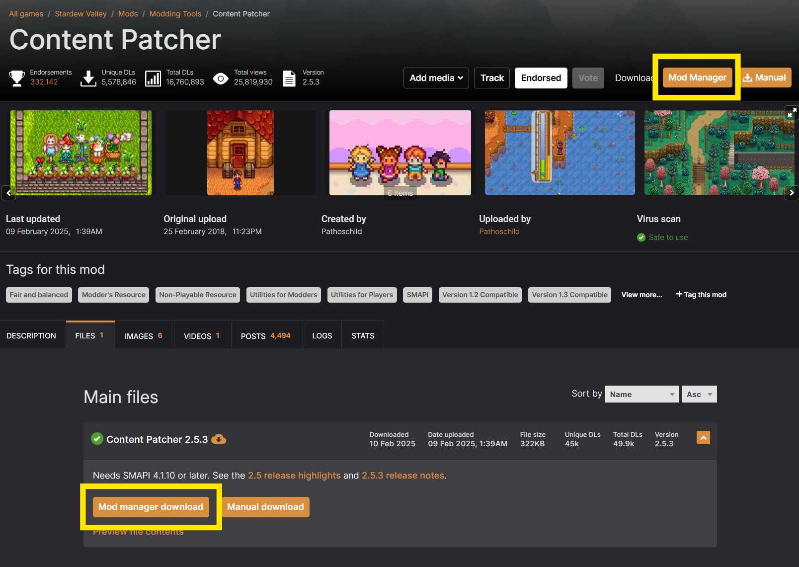
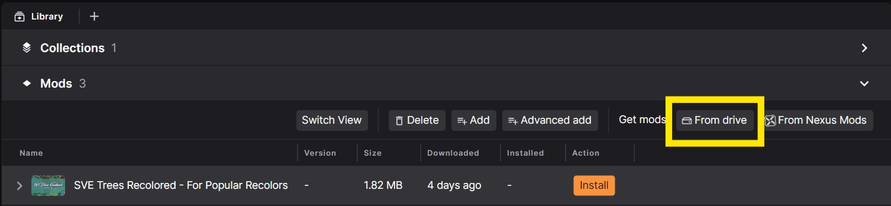

# Downloading a Mod

In this guide, we'll cover adding a mod to the Library by downloading it from Nexus Mods or importing a file from your PC. 

## Downloading directly from Nexus Mods
Mods shared on the Nexus Mods website can be downloaded quickly and easily with the app. On a Nexus Mods page for a supported game, look for the "Mod Manager" button in the top-right of the page or the "Mod Manager Download" button on each file in the files tab. Clicking these buttons will pass the mod to the app and begin the download. 

Once the mod is downloaded, it will appear in the Library for the relevant game. 

## Adding a mod to the Library manually
??? info "Downloading from websites other than Nexus Mods"
    The app can import mods from any website, however, the rich metadata (including images, titles, version info) is only available for files downloaded from Nexus Mods.

Mods that don't have a "Mod Manager" button can be downloaded to your PC using the "Manual Download" button. 

To add the file to the app, click the "From Drive" option on the Library page. You can select multiple files from the same folder to import at the same time.

Each imported file will be "grouped" as its own mod and does not have any Nexus Mods metadata associated with it. 

## Troubleshooting
Below are the common issues users report while downloading mods and the solutions.

### The mod doesn't have the "Mod Manager" buttons
If a mod page doesn't have the buttons to download directly into the app, this can be for one of two reasons:

1. The game you're trying to download files for is not supported by a mod manager that integrates with Nexus Mods.
2. The mod author has intentionally disabled the mod manager download options, this might be because the file cannot be installed with a mod manager - check the mod page for more information.

In both cases, you can still add mods to the Library as explained in [Adding a mod to the Library manually](#adding-a-mod-to-the-library-manually) above.

### Clicking the "Mod Manager" button doesn't start the download

If the buttons on the mod page do not trigger a download, check the following:

- **Check other mod managers:** It's only possible for one application to handle downloads from Nexus Mods at once. Some applications automatically re-register to handle download links when starting up. Check if any other applications open when clicking the buttons on the website. The app will re-register as the primary download handler on startup, so restarting the app should fix this association. 
- **Troubleshoot common set up issues:** The common use cases for downloads not starting are covered [in the FAQ](../faq/NexusModsDownloads.md).
- **Still having issues?:** If your downloads still aren't working, consult the [Troubleshooting Website Issues](https://help.nexusmods.com/article/113-troubleshooting-website-issues) guide or reach out on the [forums](https://forums.nexusmods.com/) for additional support.
