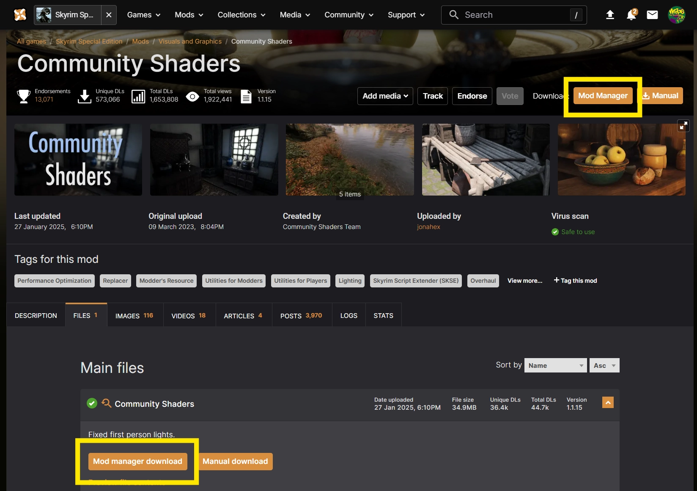

# Downloading a Mod

In this guide, we'll cover adding a mod to the Library by downloading it from Nexus Mods or importing a file from your PC. 

## Downloading directly from Nexus Mods
Mods shared on the Nexus Mods website can be downloaded quickly and easily into the app. On a Nexus Mods page for a supported game, look for the "Vortex" button in the top-right of the page and the "Mod Manager Download" button on each file in the files tab. Clicking these buttons will pass a the mod to the app and begin the download. 

Once the mod is downloaded, it will appear in the Library for the relevant game. 

## Adding a mod to the Library manually
??? info "Downloading from websites other than Nexus Mods"
    The app can import mods from any website, however, the rich metadata (including images, titles, version info) is only available for files downloaded from Nexus Mods.

Mods that don't have a "Vortex" or "Mod Manager Download" button can be downloaded to your PC using the "Manual Download" buttons and then added to the app from the Library page. 

## Troubleshooting
Below are the common issues users report while downloading mods and the solutions.

### The mod doesn't have the "Vortex" or "Mod Manager Download" buttons
If a mod page doesn't have the buttons to download directly into the app, this can be for one of two reasons:

1. The game you're trying to download files from is not supported by a mod manager.
2. The mod author has intentionally disabled the mod manager download options - check the mod page for more information.

In both cases, you can still add mods to the Library as explained in [Adding a mod to the Library manually](#adding-a-mod-to-the-library-manually) above.

### Clicking the "Vortex" button doesn't start the download

If the buttons oon the mod page do not trigger a download, check the following:

- Another mod manager is handling downloads
- NXM handler issue
- Website issue
