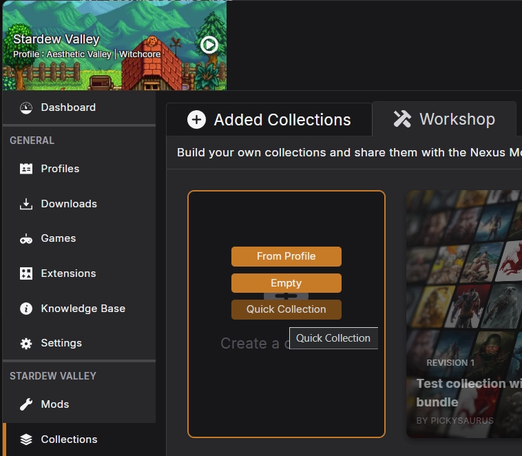
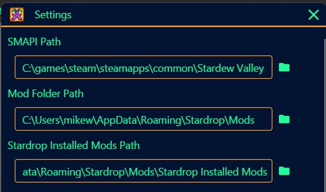
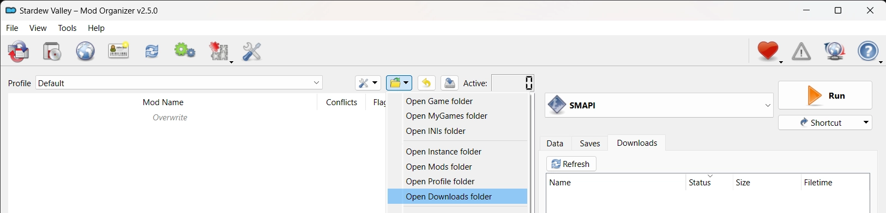

# Transferring Existing Stardew Valley Mods to the App

In this guide, we will cover the basics of importing existing mods from other mod managers into the app. This information is primarily intended for Stardew Valley players but may have applications in other games. 

!!! danger "Clean Installation Recommended"
    We highly recommend that you start modding with the Nexus Mods app using a completely clean game installation. Mods added prior to use of the app may cause issues managing your content.

## Vortex
[Vortex](https://www.nexusmods.com/site/mods/1) is the predecessor to the app and is a popular choice among Stardew Valley modders. With full Nexus Mods integration, there are two options for importing your mods to the app. 

=== "Option 1 - Making a Collection"
    ??? note "Note - Customised and Off-site Mods"
        If you have altered a mod in any way after installing it, these changes may not be preserved when importing into the app. Mods installed from sources other than Nexus Mods may not be exported. 

    Using the collections feature, your existing mod setup can be exported and re-downloaded through the app. To make a collection from your active profile in Vortex, follow the instructions below:

    1. Open the "Collections" tab from the side menu in Vortex.
    2. Click on the "Workshop" tab at the top of the page. 
    3. Hover over "Create a collection" and select "From Profile". Give your collection a name and press "Create". 
    
        - (Optional) In the collection edit screen, we recommend selecting all the mods with ++ctrl+"A"++, clicking "Set version" on the bottom toolbar and choose "Exact only". This will ensure that the exact same mod file is downloaded into the app, rather than an updated version. 
    4. Click "Upload New" at the top of the page to upload your collection to the Nexus Mods website. There may be some warnings to resolve, if you need help with these errors please post on the [Vortex forums](https://forums.nexusmods.com/forum/4306-vortex-support/).
    5. Once the upload has completed, click "Open in Browser" in the notification.
    6. On the collection webpage, set a title, summary, category, image and description. This can be anything as the collection isn't intended to be shared publicly. 
    7. At the top of the page, click "Save & publish revision 1" and in the pop-up select "Unlisted" and click "Publish". 
    8. Navigate to the "Mods" tab, select all your mods with ++ctrl+"A"++ and click "Disable" on the bottom toolbar, then click "Deploy Mods" on the top toolbar to confirm the changes. This will remove the mod files from the game.
    9. Close Vortex.
    10. Open the app and press the "Add collection" button on the collection page to begin the download/install process.

    Once you are confident all your mods are installed in the app, you can re-open Vortex and remove all the mods from there.

=== "Option 2 - Importing downloads"
    This method does not use the collections feature, but uses the files already downloaded to your PC. 

    ??? note "Note - Mod Updates"
        Importing mods using this method means they do not have any Nexus Mods data associated with them and cannot be checked for updates.

    1. In Vortex, head to the "Mods" tab, select all mods with ++ctrl+"A"++, then disable them.
    2. Click "Deploy Mods" to ensure all Vortex-managed files are removed from the game folder. 
    3. Select on the "Downloads" option in the side menu, the click "Open Folder" on the toolbar. 
    4. Take note of the download folder location - you'll need this shortly. You may now close Vortex.
    5. Open the Nexus Mods app and [add Stardew Valley](../gettingstarted/AddGames.md).
    6. In the Library, select "Get Mods: From Drive".
    7. Navigate to the download folder location found in Step 2.
    8. Press ++ctrl+"A"++ to select all mod archives in the folder.
    9. Click "Open" and wait for the app to import all the mods (this can take several minutes).
    10. You can now start adding these mods to your loadout.

## Stardrop
[Stardrop](https://www.nexusmods.com/stardewvalley/mods/10455) is a community-created cross-platform mod manager that is also a popular choice for Stardew Valley modders. 

??? note "Note - Mod Updates"
    Importing mods using this method means they do not have any Nexus Mods data associated with them and cannot be checked for updates.

By default, Stardrop uses a subfolder of "Mods" in the game directory. To preserve the mods you already have installed with Stardrop, we suggest follow these instructions to relocated Stardrop's mod files. This means you can easily swap back to Stardrop, if you like:

1. Create a folder called "Mods" somewhere on your computer outside of the Stardew Valley game folder. Inside that folder create a "Stardrop Installed Mods" folder.
    - On Windows :fontawesome-brands-windows:, we recommend using `%localappdata%\Stardrop\Mods` and `%localappdata%\Stardrop\Mods\Stardrop Installed Mods`.
    - On Linux :fontawesome-brands-linux:,we recommend using `$XDG_CONFIG_HOME\Stardrop\Mods` and `$XDG_CONFIG_HOME\Stardrop\Mods\Stardrop Installed Mods`
2. In Stardrop, select View -> Settings from the top bar.

3. Open the folder listed as "Mod Folder Path" in the Stardrop Settings.
4. Move all the files and folders from the Mod Folder path to the new "Mods" folder you created in Step 1. 
5. Update the folder in the Stardrop settings menu to match the new location.
6. Repeat steps 3-5 for the "Stardrop Installed Mods" folder.
7. Uninstall SMAPI from your game folder (Uninstall instructions [:fontawesome-brands-windows:](https://stardewvalleywiki.com/Modding:Installing_SMAPI_on_Windows#Uninstall) [:fontawesome-brands-linux:](https://stardewvalleywiki.com/Modding:Installing_SMAPI_on_Linux#Uninstall)).
8. For each folder in the new "Stardrop Installed Mods" folder, create a zipped folder containing it. These can then be [imported into the app](./DownloadAMod.md#adding-a-mod-to-the-library-manually).

## Mod Organizer 2
[Mod Organizer 2](https://www.nexusmods.com/skyrimspecialedition/mods/6194) is an alternative community-created mod manager used primarily for Bethesda games but also offers support for Stardew Valley. To add your mods downloaded into MO2 to the app, follow the steps below:

??? note "Note - Mod Updates"
    Importing mods using this method means they do not have any Nexus Mods data associated with them and cannot be checked for updates.

1. In Mod Organizer 2, verify you are managing Stardew Valley, then click the folder icon above the mod list and select "Open Downloads Folder".
    
2. Take note of the download folder location - you'll need this shortly.
3. Uninstall SMAPI from your game folder ([Uninstall instructions](https://stardewvalleywiki.com/Modding:Installing_SMAPI_on_Windows#Uninstall)).
4. Open the Nexus Mods app and [add Stardew Valley](../gettingstarted/AddGames.md).
5. In the Library, select "Get Mods: From Drive".
6. Navigate to the download folder location found in Step 2.
7. Press ++ctrl+"A"++ to select all mod archives in the folder.
8. Click "Open" and wait for the app to import all the mods (this can take several minutes).
9. You can now start adding these mods to your loadout.

## Manually Installed Mods
Some users choose to install their mods by manually copying and pasting the downloaded mod files into their game folder. This method doesn't have a clean way to import files so the best we can do is clean up your game folder read for use with the app.

1. Open your game installation folder.
2. Move the "Mods" folder so that it is no longer inside the Stardew Valley game folder (you can also delete it, but that is not recommended).
3. Uninstall SMAPI from your game folder (Uninstall instructions [:fontawesome-brands-windows:](https://stardewvalleywiki.com/Modding:Installing_SMAPI_on_Windows#Uninstall) [:fontawesome-brands-linux:](https://stardewvalleywiki.com/Modding:Installing_SMAPI_on_Linux#Uninstall)).
4. To start modding with the app, install your mods again by [importing the downloaded archives into the app](./DownloadAMod.md#adding-a-mod-to-the-library-manually).
