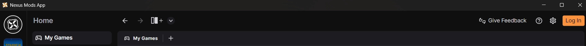
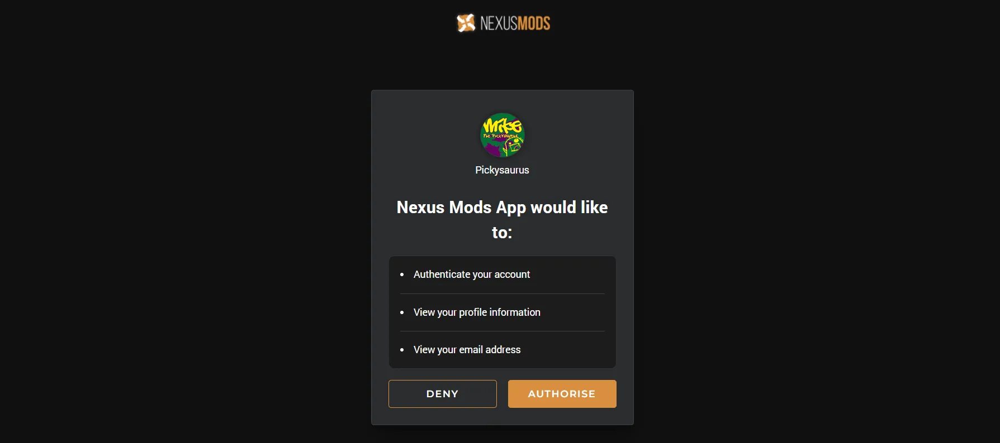
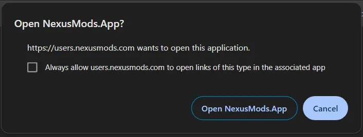

# Getting Started
<!-- !!! warning "Important Notice"
    The Nexus Mods app is still in development and is not recommend to be used as your primary mod manager. For the latest supported mod manager please see [Vortex](https://www.nexusmods.com/site/mods/1). -->

Before installing the app, please ensure that your PC meets the system requirements for both [this app](../SystemRequirements.md) and the game you are modding.

## Installation

Download the latest version of the app and run the installer on your system.

[:fontawesome-brands-windows: Windows Installer](https://github.com/Nexus-Mods/NexusMods.App/releases/latest/download/NexusMods.App.x64.exe){ .md-button .md-button--primary }
[:fontawesome-brands-linux: Linux AppImage](https://github.com/Nexus-Mods/NexusMods.App/releases/latest/download/NexusMods.App.x86_64.AppImage){ .md-button }

[Other releases](https://github.com/Nexus-Mods/NexusMods.App/releases/latest)

## Connect your Nexus Mods account

To get the most out of the app, we highly recommend signing in with your Nexus Mods account. If you don't have one yet, you can make one for free [here](https://users.nexusmods.com/register). 

When you first open the app, you will have the option to sign in. If you skipped this step you can always get started by clicking the "Log In" button in the top-right of the application. 

On clicking the button, a new page will open in your default web browser where you will be asked to authorise the Nexus Mods app to access your account. 

You will then be prompted to open the app to complete the log in process. Most popular browsers have a "don't ask me again" option to avoid having to accept this message each time the website sends data to the app.

Congratulations, you are now logged in!
